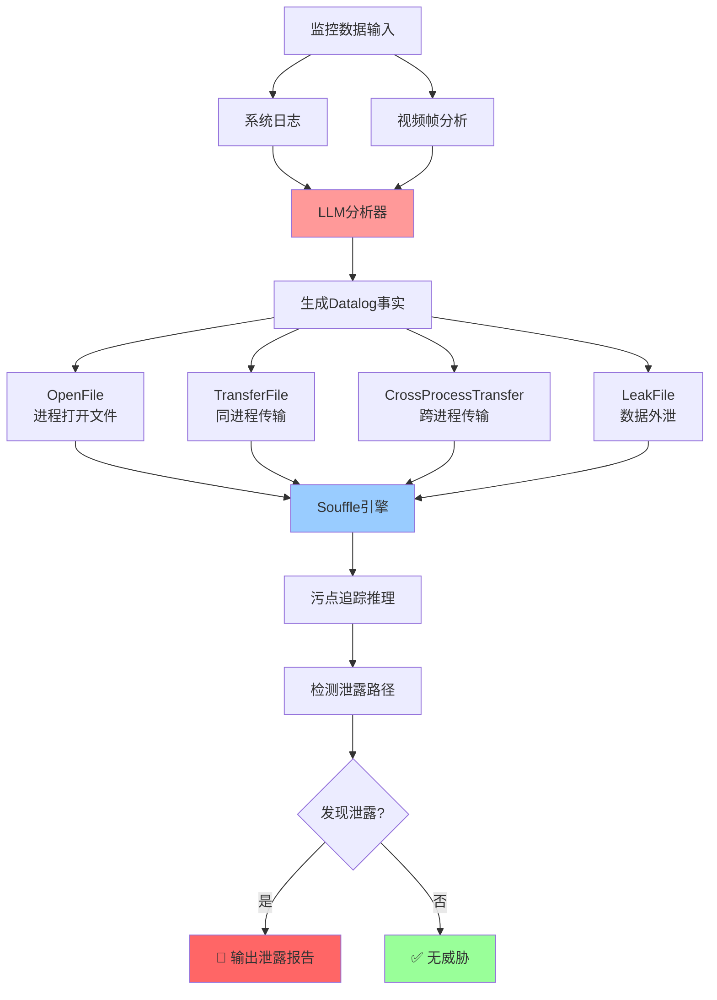

# ThreatDetector - 基于LLM的Datalog威胁检测

使用LLM分析日志和视频帧，生成Datalog事实，通过Souffle引擎进行污点追踪检测数据泄露

## 📁 文件结构

```
4-ThreatDetector/
├── datalog/
│   ├── __init__.py
│   ├── datalog_engine.py    # Souffle引擎封装
│   └── taint_rules.dl       # 污点追踪规则
├── prompts.py               # LLM Prompt模板系统
├── test.py                  # 完整工作流测试 ⭐
├── requirements.txt         # Python依赖
├── .env                     # LLM配置（需自行创建）
└── README.md               # 本文件
```

## 🚀 快速开始

### 1. 安装依赖

```bash
# Python依赖
pip install -r requirements.txt

# Souffle Datalog引擎（macOS）
brew install souffle
```

### 2. 配置LLM

创建 `.env` 文件（必需）：
```bash
LLM_API_KEY=your_api_key_here
LLM_MODEL_NAME=qwen-plus
LLM_BASE_URL=https://dashscope.aliyuncs.com/compatible-mode/v1
```

### 3. 运行测试

```bash
python test.py
```

## 🔄 完整工作流程



## 📊 测试数据示例

### 输入数据

#### 系统日志（4条）
```json
[
  {
    "timestamp": "2026-01-10T10:00:00.000",
    "event_type": "opened",
    "file_path": "/Users/admin/Documents/机密工资表.xlsx",
    "process_info": {"process_name": "Excel", "pid": "1234"},
    "description": "用户使用Excel打开了机密工资表文件"
  },
  {
    "timestamp": "2026-01-10T10:00:15.000",
    "event_type": "clipboard_copy",
    "file_path": "/Users/admin/Documents/机密工资表.xlsx",
    "process_info": {"process_name": "Excel", "pid": "1234"},
    "description": "用户从Excel复制了工资表内容到剪贴板"
  },
  {
    "timestamp": "2026-01-10T10:00:20.000",
    "event_type": "clipboard_paste",
    "file_path": "",
    "process_info": {"process_name": "WeChat", "pid": "5678"},
    "description": "用户将剪贴板内容粘贴到微信聊天窗口"
  },
  {
    "timestamp": "2026-01-10T10:00:25.000",
    "event_type": "network_send",
    "file_path": "",
    "process_info": {"process_name": "WeChat", "pid": "5678"},
    "description": "微信将消息发送到网络"
  }
]
```

#### 视频帧分析（4帧）
```json
[
  {
    "timestamp": "2026-01-10T10:00:00.000",
    "app_name": "Excel",
    "operation_type": "文件打开",
    "behavior_category": "正常操作",
    "description": "Excel打开机密工资表，显示员工薪资数据"
  },
  {
    "timestamp": "2026-01-10T10:00:15.000",
    "app_name": "Excel",
    "operation_type": "复制数据",
    "behavior_category": "潜在风险",
    "description": "用户选中数据并Ctrl+C复制"
  },
  {
    "timestamp": "2026-01-10T10:00:20.000",
    "app_name": "WeChat",
    "operation_type": "粘贴数据",
    "behavior_category": "高风险",
    "description": "微信窗口激活，Ctrl+V粘贴"
  },
  {
    "timestamp": "2026-01-10T10:00:25.000",
    "app_name": "WeChat",
    "operation_type": "发送消息",
    "behavior_category": "数据泄露",
    "description": "微信显示消息已发送"
  }
]
```

### LLM生成的Datalog事实

```
1. OpenFile(op_1_2026-01-10T10:00:00.000, Excel, /Users/admin/Documents/机密工资表.xlsx)
2. TransferFile(op_2_2026-01-10T10:00:15.000, Excel, /Users/admin/Documents/机密工资表.xlsx → Clipboard)
3. CrossProcessTransfer(op_3_2026-01-10T10:00:20.000, Excel → WeChat, Clipboard)
4. LeakFile(op_4_2026-01-10T10:00:25.000, WeChat, Clipboard)
```

## ✅ 测试结果

### 控制台输出

```
╔══════════════════════════════════════════════════════════════════════╗
║                                                                      ║
║           🧪 ThreatDetector 完整工作流测试                            ║
║                                                                      ║
║   流程:                                                              ║
║   1. Mock 日志 + 视频帧                                              ║
║   2. LLM 分析生成 Datalog 事实                                        ║
║   3. Souffle Datalog 推理                                            ║
║   4. 泄露路径检测                                                     ║
║                                                                      ║
╚══════════════════════════════════════════════════════════════════════╝

================================================================================
📋 阶段1: 准备测试数据
================================================================================

✅ 已加载测试场景: 剪贴板泄露
   - 系统日志: 4 条
   - 视频帧: 4 帧

================================================================================
🤖 阶段2: LLM 分析生成 Datalog 事实
================================================================================
✅ LLM 规则生成器初始化成功 (qwen-plus)

🤖 调用 LLM 分析日志和视频帧...
   发送请求到 LLM (qwen-plus)...
   ✅ LLM 返回结果

✅ 生成了 4 条 Datalog 事实:
   1. OpenFile(op_1_2026-01-10T10:00:00.000, Excel, /Users/admin/Documents/机密工资表.xlsx)
   2. TransferFile(op_2_2026-01-10T10:00:15.000, Excel, /Users/admin/Documents/机密工资表.xlsx → Clipboard)
   3. CrossProcessTransfer(op_3_2026-01-10T10:00:20.000, Excel → WeChat, Clipboard)
   4. LeakFile(op_4_2026-01-10T10:00:25.000, WeChat, Clipboard)

================================================================================
⚖️  阶段3: Datalog 推理引擎
================================================================================
✅ Datalog 引擎初始化成功

📝 添加事实到 Souffle 引擎...

� 开始 Datalog 推理...
   写入 1 条 OpenFile 事实
   写入 1 条 TransferFile 事实
   写入 1 条 CrossProcessTransfer 事实
   写入 1 条 LeakFile 事实
   执行: souffle taint_rules.dl -F /tmp/datalog -D /tmp/datalog
   ✅ 推理完成

✅ 发现 1 条泄露路径

================================================================================
📊 阶段4: 检测结果
================================================================================

�🚨 检测到 1 条泄露路径

泄露路径 #1:
  📁 泄露文件: Clipboard
  📤 泄露进程: WeChat
  🌐 泄露渠道: network
  🛤️  完整路径: op_1 → op_2 → op_3 → op_4

================================================================================
✅ 测试完成
================================================================================

统计:
  - 输入日志: 4 条
  - 生成事实: 4 条
  - 检测泄露: 1 条

⚠️  发现数据泄露风险！
```

### 泄露路径可视化


## 🔑 核心功能

### 1. **LLM分析**
- 使用LLM从日志和视频帧生成Datalog事实
- 支持千问、GPT等模型
- 自动识别跨进程数据传输

### 2. **Datalog推理**
- 使用Souffle引擎进行污点追踪
- 支持跨进程数据传播（CrossProcessTransfer）
- 检测完整泄露路径

## � Datalog关系定义

| 关系 | 含义 | 示例 |
|------|------|------|
| **OpenFile** | 进程打开文件 | OpenFile("op_1", "Excel", "工资表.xlsx") |
| **TransferFile** | 同进程内数据传输 | TransferFile("op_2", "Excel", "工资表.xlsx", "Clipboard") |
| **CrossProcessTransfer** | 跨进程数据传输 | CrossProcessTransfer("op_3", "Excel", "WeChat", "Clipboard") |
| **LeakFile** | 数据外泄 | LeakFile("op_4", "WeChat", "Clipboard", "network") |

## 🎯 检测原理

### 污点追踪流程

1. **污点源头**: OpenFile 标记敏感文件
2. **同进程传播**: TransferFile 追踪文件→剪贴板
3. **跨进程传播**: CrossProcessTransfer 追踪Excel→WeChat
4. **泄露检测**: LeakFile 检测到网络发送

### 关键技术点

- ✅ **跨进程传播** - 通过 CrossProcessTransfer 实现
- ✅ **时间序列** - 保留timestamp确保传播顺序
- ✅ **污点链** - 完整记录从源到泄露的路径

## 🔧 依赖项

- **Python 3.8+** - 运行环境
- **Souffle 2.5+** - Datalog引擎
- **openai** - LLM API调用
- **python-dotenv** - 环境配置管理

## 📖 相关文档

- 系统日志格式参考：[ScreenMonitor](../ScreenMonitor/)
- 视频帧分析格式参考：[FrameAnalyzer](../1-FrameAnalyzer/)
- Datalog规则详解：[datalog/taint_rules.dl](datalog/taint_rules.dl)
- Prompt模板：[prompts.py](prompts.py)
