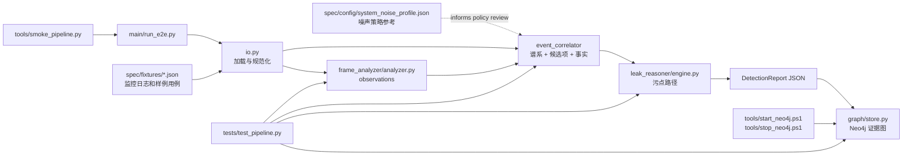
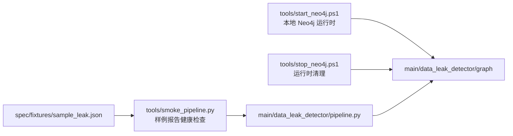

# DataLeakDetector

DataLeakDetector 是一个单包、三阶段的数据泄露检测流水线。
它读取桌面监控日志，可选消费帧/OCR/VLM 观察，关联敏感文件流转，
基于符号污点事实进行推理，并且可以把最终证据图持久化到 Neo4j。

实现位于 `main/data_leak_detector`。

## 安装

```powershell
python -m pip install -e ".[dev]"
```

项目依赖官方 Neo4j Python 驱动。除非启用图写入，否则 Neo4j 本身在运行时是可选的。

## 包结构

```text
main/data_leak_detector/
  models.py                  共享的报告与证据数据类
  io.py                      JSON 加载、时间戳解析、路径辅助函数
  policy.py                  敏感性、传输和汇聚点策略词汇
  pipeline.py                端到端编排
  graph/
    config.py                Neo4j 环境配置
    store.py                 Neo4j 图写入器
  frame_analyzer/
    analyzer.py              帧/日志观察提取
  event_correlator/
    correlator.py            关联工作流编排
    lineage.py               派生文件谱系图
    observations.py          帧观察规范化和匹配
    candidates.py            上传候选项生成
    facts.py                 Datalog 事实生成
    classification.py        应用/动作/类别辅助函数
    output.py                报告载荷整形
  leak_reasoner/
    engine.py                污点传播引擎
    relations.py              关系名称和内部污点状态
    prompts.py               未来 LLM 事实提取的提示边界
```

## 文件职责

仓库现在只有一个实现根目录，再加上聚焦的 spec、test 和 tool 目录。每个文件都对应一个明确边界：

| 文件 | 角色 | 为什么需要 |
| --- | --- | --- |
| `main/run_e2e.py` | 流水线 CLI 包装器 | 把命令行解析和 JSON 打印留在可复用库代码之外。 |
| `main/data_leak_detector/__init__.py` | 公共包入口 | 导出稳定导入，不再复刻旧的阶段目录。 |
| `main/data_leak_detector/models.py` | 共享数据类 | 让每个阶段都使用同一套日志、观察、事实和报告类型契约。 |
| `main/data_leak_detector/io.py` | 日志加载与规范化 | 在输入边界隔离编码、JSON/JSONL、时间戳和路径差异。 |
| `main/data_leak_detector/policy.py` | 敏感/传输/汇聚点词汇 | 让启发式策略可审计且易于调优。 |
| `main/data_leak_detector/pipeline.py` | 端到端编排器 | 串联各阶段、输出写入和可选 Neo4j，而不把逻辑藏进脚本。 |
| `main/data_leak_detector/evidence_semantics.py` | 风险与确认语义 | 说明可疑证据和已确认泄露路径之间的区别。 |
| `main/data_leak_detector/frame_analyzer/analyzer.py` | 帧/日志观察构建器 | 现在提供确定性观察，并为未来 OCR/VLM 接入留好位置。 |
| `main/data_leak_detector/event_correlator/*.py` | 关联阶段模块 | 拆分工作流、配置、谱系、观察匹配、分类、候选项提取、事实生成和输出整形。 |
| `main/data_leak_detector/leak_reasoner/*.py` | 符号污点推理 | 定义关系并计算已确认的源到汇聚点泄露路径。 |
| `main/data_leak_detector/graph/*.py` | 可选 Neo4j 适配器 | 将完成的报告持久化到图中，而不让检测依赖 Neo4j。 |
| `tests/test_pipeline.py` | 契约测试 | 验证规范包行为和 Neo4j Cypher 生成。 |
| `tools/smoke_pipeline.py` | 快速健康检查 | 运行样例 fixture，只打印摘要和图状态。 |
| `tools/start_neo4j.ps1` | 本地 Neo4j 启动器 | 在 Windows 上安装并启动仓库本地的 Neo4j 运行时。 |
| `tools/stop_neo4j.ps1` | 本地 Neo4j 停止器 | 只停止从本仓库启动的 Neo4j 运行时。 |

## 模块关系



`spec` 提供稳定示例和架构参考，`tests` 保护规范包行为，而 `tools` 只包含调用同一包入口点的运维辅助脚本。

## Spec 文件

`spec` 不再是文档子树。它只包含用于解释或验证检测器的稳定输入和配置。大型数据集仍保留在
`spec/data` 中，这里故意不逐个文件说明。

| 文件 | 角色 | 为什么保留 | 被谁使用 |
| --- | --- | --- | --- |
| `spec/config/system_noise_profile.json` | 良性系统活动和常见噪声源的参考配置。 | 让噪声假设保持可见，而不是埋进代码里。 | 策略和关联调优。 |
| `spec/fixtures/sample_leak.json` | 含源文件、派生文件和上传动作的最小端到端泄露日志。 | 为 CLI、烟雾测试和 Neo4j 检查提供最小可运行 fixture。 | `main/run_e2e.py`、`tools/smoke_pipeline.py`。 |
| `spec/fixtures/realistic_log_cases.json` | 代表性场景集合。 | 保留更接近产品的用例，而不只是一份很小的烟雾 fixture。 | 未来的回归扩展。 |
| `spec/fixtures/qwen_vlm_response_cases.json` | VLM 响应样例载荷，包括带围栏的 JSON 和重复事件。 | 在不依赖在线模型的情况下，记录未来 OCR/VLM 解析器的期望。 | 未来的 FrameAnalyzer 解析器测试。 |
| `spec/fixtures/currently_unrecognized_violation_cases.json` | 确定性规则的已知盲点。 | 让缺失覆盖显式地成为需求，而不是变更历史。 | 未来的解析器和关联改进。 |

JSON fixture 保持纯数据。解释应放在这个 README 中，这样样例输入就不会额外增加人为的注释字段。

## 工具文件

`tools` 只包含调用规范包的运维辅助脚本。



- `tools/smoke_pipeline.py` 运行样例 fixture，并且只打印摘要和图状态。
- `tools/start_neo4j.ps1` 下载并启动仓库本地的 Neo4j 运行时，供 Windows 开发使用。
- `tools/stop_neo4j.ps1` 只停止那个本地运行时。

Public imports:

```python
from data_leak_detector import run_pipeline
from data_leak_detector.event_correlator import EventCorrelator
from data_leak_detector.frame_analyzer import analyze_video_behavior
from data_leak_detector.leak_reasoner import DatalogEngine
```

## 流水线

```text
logs + 可选观察
  -> FrameAnalyzer
    创建审查窗口和结构化行为观察
  -> EventCorrelator
    绑定敏感文件、谱系、应用、窗口和汇聚点候选项
  -> LeakReasoner
    运行 Datalog 风格的污点传播并输出泄露路径
  -> 可选 Neo4j 图写入
  -> JSON 证据报告
```

## 推理关系

`LeakReasoner` 消费由 `EventCorrelator` 生成的确定性符号事实：

- `OpenFile(operation, process, file, timestamp)`
- `TransferFile(operation, process, source, destination, timestamp)`
- `CrossProcessTransfer(operation, from_process, to_process, data, timestamp)`
- `ClipboardWrite(operation, process, data, timestamp)`
- `ClipboardRead(operation, process, data, timestamp)`
- `LeakFile(operation, process, file, channel, timestamp)`

最终的泄露结果是从敏感源到外部汇聚点的连通污点路径，而不仅仅是一个可疑的日志关键字。

## 无 Neo4j 运行

```powershell
python main/run_e2e.py --log spec/fixtures/sample_leak.json --output-dir spec/output
```

有用的选项：

- `--video`：在报告元数据中保存视频路径。
- `--sensitive-file`：添加一个配置好的敏感文件；可按需重复。
- `--observations`：加载预计算的 FrameAnalyzer 观察。

当 Neo4j 被禁用时，报告会包含：

```json
{"graph": {"enabled": false, "status": "skipped"}}
```

## Neo4j 配置

复制示例环境文件：

```powershell
Copy-Item .env.example .env
```

在 Windows 上使用项目辅助脚本启动 Neo4j：

```powershell
tools\start_neo4j.ps1
```

该辅助脚本会把本地 JRE 和 Neo4j Community 发行版下载到 `.runtime/`，
把本地 Neo4j 设置写入 `.env`，并在 `bolt://localhost:7687` 上启动 Neo4j。

如果可用，也可以用 Docker 启动 Neo4j：

```powershell
docker compose -f docker-compose.neo4j.yml up -d
```

来自 `.env.example` 的默认本地凭据：

```text
DLD_NEO4J_URI=bolt://localhost:7687
DLD_NEO4J_USER=neo4j
DLD_NEO4J_PASSWORD=data-leak-detector
DLD_NEO4J_DATABASE=neo4j
```

可以通过 `.env` 启用图写入：

```text
DLD_NEO4J_ENABLED=1
```

或者针对单次 CLI 运行：

```powershell
python main/run_e2e.py --log spec/fixtures/sample_leak.json --neo4j
```

当 CI 或部署应在图写入错误时失败，就使用严格模式：

```powershell
python main/run_e2e.py --log spec/fixtures/sample_leak.json --neo4j --neo4j-strict
```

停止本地辅助运行时：

```powershell
tools\stop_neo4j.ps1
```

如果严格模式关闭，Neo4j 连接错误会记录到 `report["graph"]` 中，
而 JSON 报告仍然会生成。

## Neo4j 图结构

写入器会保存以下标签：

- `DLDReport`
- `DLDSession`
- `DLDLogEvent`
- `DLDFrameObservation`
- `DLDCorrelatedEvent`
- `DLDUploadCandidate`
- `DLDDatalogFact`
- `DLDLeakPath`
- `DLDFile`

重要关系：

- `(:DLDReport)-[:FOR_SESSION]->(:DLDSession)`
- `(:DLDReport)-[:HAS_LOG_EVENT]->(:DLDLogEvent)`
- `(:DLDReport)-[:HAS_FRAME_OBSERVATION]->(:DLDFrameObservation)`
- `(:DLDReport)-[:HAS_CORRELATED_EVENT]->(:DLDCorrelatedEvent)`
- `(:DLDReport)-[:HAS_UPLOAD_CANDIDATE]->(:DLDUploadCandidate)`
- `(:DLDReport)-[:HAS_DATALOG_FACT]->(:DLDDatalogFact)`
- `(:DLDReport)-[:HAS_LEAK_PATH]->(:DLDLeakPath)`
- `(:DLDFile)-[:DERIVED_FROM]->(:DLDFile)`
- evidence nodes connect to files through `ORIGINAL_FILE`, `CURRENT_FILE`,
  `TOUCHES_FILE`, `OBSERVES_FILE`, or `LEAKED_FILE`.

示例查询：

```cypher
MATCH (r:DLDReport)-[:HAS_LEAK_PATH]->(p:DLDLeakPath)-[:LEAKED_FILE]->(f:DLDFile)
RETURN r.id, p.full_path, f.path
ORDER BY r.generated_at DESC
LIMIT 20;
```

## 测试

```powershell
python -m pytest
```

测试覆盖 JSON 加载、确定性的帧观察、事件关联、感知谱系的泄露推理、剪贴板传输推理、
端到端报告写入，以及无需真实 Neo4j 服务器的 Cypher 生成。
