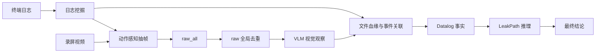

# DataLeakDetector

DataLeakDetector 从终端日志和录屏中收集可审计证据，识别敏感文件或其派生载体是否进入外部汇聚点。系统不以单条日志或单帧画面直接裁决，而是构建文件血缘、关联事件和确定性事实链，再输出可回溯的检测结论。

## 核心流程



当前实现边界：

- `raw_all -> raw` 已实现全局视觉去重，结合像素差、感知哈希、信息熵、时间范围和动作语义保护；
- `raw -> VLM frames` 当前仅做时间预算采样；ROI、OCR 和语义去重属于后续规划；
- Neo4j 是可选的日志窗口挖掘后端，最终事实推理由本地 `DatalogEngine` 完成；
- ground truth 只用于评测，不参与敏感源发现、事实生成或最终推理。

## 结论口径

| 结论 | 条件 |
| --- | --- |
| `data_leak_risk_detected` | 存在从敏感源到外部汇聚点的完整 `LeakPath` |
| `suspicious_behavior_detected` | 存在敏感源绑定的可疑事实，但路径不完整 |
| `no_confirmed_data_leak` | 没有完整路径，也没有敏感源绑定的可疑事实 |

完整定义见 [00口径.md](spec/docs/00口径.md)。

## 最小开始

需要 Python 3.10+；视觉分析额外依赖 OpenCV 和 Pillow。

```bash
python -m venv .venv
python -m pip install --upgrade pip
python -m pip install -e ".[dev,vision]"
```

复制 `.env.example` 为 `.env`，填写真实 VLM 密钥和端点。先用干跑验证一个 case：

```bash
python main/run_e2e.py \
  --case "spec/data/nas_samples/stage1/1-email-fastmail-1" \
  --output-dir "artifacts/smoke_fastmail" \
  --vision \
  --vlm-dry-run \
  --max-vlm-frames 4 \
  --no-neo4j-log-miner
```

Windows、Linux、单 case、批量、Release 和续跑命令见 [00运行命令.md](spec/docs/00运行命令.md)。

## 输入与输出

标准 case 至少包含日志；启用视觉时还需要录屏：

```text
<case>/
  logs/logs.json
  video/recording.mp4
  INDEX.md                 # 推荐，用于日志时间与录屏对齐
  groundtruth.json         # 可选，仅评测
```

初始敏感源通过 `spec/config/sensitive_files..json` 或 `--sensitive-files-config` 指定。只配置原始敏感文件，不配置截图、压缩包、导出 PDF 等派生载体；派生关系由血缘模块推理。

单 case 的详细输出包含：

```text
<report_id>/
  keyframes_raw_all/
  keyframes_raw/
  keyframe_duplicates.json
  frame_observations.json
  event_correlator_details.json
  leak_paths.json
  verdict_check.json
```

排障时依次检查 `file_lineage`、`correlated_events`、`upload_candidates`、`datalog_facts` 和 `leak_paths.json`。

## 文档导航

| 文档 | 内容 |
| --- | --- |
| [运行命令](spec/docs/00运行命令.md) | Windows/Linux、Debug/Release、单 case/批量/全量运行 |
| [项目架构](spec/docs/00项目架构.md) | 模块边界与端到端调用关系 |
| [日志挖掘策略](spec/docs/01日志挖掘策略.md) | 证据窗口和日志候选生成 |
| [关键帧策略](spec/docs/02关键帧策略.md) | 动作感知抽帧与 VLM 选帧规划 |
| [帧去重具体实现](spec/docs/02帧去重具体实现.md) | `raw_all -> raw` 当前实现和 `raw -> VLM` 后续方案 |
| [VLM 策略及实现](spec/docs/03vlm策略及实现.md) | 请求、结构化输出、解析和校验 |
| [事实收集及证据链推理](spec/docs/04事实收集及证据链推理) | 血缘、关联、Datalog 事实和 `LeakPath` |
| [口径](spec/docs/00口径.md) | 外发、传播、可疑行为和最终结论定义 |

## 开发验证

```bash
python -m compileall -q main tests tools
python -m pytest
```

运行真实 VLM 前可执行：

```bash
python tools/vlm_preflight.py
```
