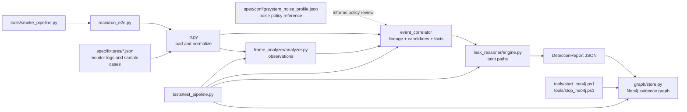

# DataLeakDetector

DataLeakDetector is a single-package, three-stage data leak detection pipeline.
It reads desktop monitor logs, optionally consumes frame/OCR/VLM observations,
correlates sensitive file movement, reasons over symbolic taint facts, and can
persist the final evidence graph to Neo4j.

The implementation lives under `main/data_leak_detector`.

## Install

```powershell
python -m pip install -e ".[dev]"
```

The project depends on the official Neo4j Python driver. Neo4j itself is
optional at runtime unless graph writing is enabled.

## Package Layout

```text
main/data_leak_detector/
  models.py                  shared report and evidence dataclasses
  io.py                      JSON loading, timestamp parsing, path helpers
  policy.py                  sensitivity, transfer, and sink policy tokens
  pipeline.py                E2E orchestration
  graph/
    config.py                Neo4j env configuration
    store.py                 Neo4j graph writer
  frame_analyzer/
    analyzer.py              frame/log observation extraction
  event_correlator/
    correlator.py            correlation workflow orchestration
    lineage.py               derived-file lineage graph
    observations.py          frame observation normalization and matching
    candidates.py            upload candidate generation
    facts.py                 Datalog fact generation
    classification.py        app/action/category helpers
    output.py                report payload shaping
  leak_reasoner/
    engine.py                taint propagation engine
    relations.py             relation names and internal taint state
    prompts.py               future LLM fact-extraction prompt boundary
```

## File Responsibilities

The repository now has one implementation root plus focused spec, test, and
tool directories. Each file exists for a specific boundary:

| File | Role | Why it is necessary |
| --- | --- | --- |
| `main/run_e2e.py` | CLI wrapper around the pipeline | Keeps command-line parsing and JSON printing out of reusable library code. |
| `main/data_leak_detector/__init__.py` | Public package surface | Exports stable imports without recreating the old stage directories. |
| `main/data_leak_detector/models.py` | Shared dataclasses | Gives every stage the same typed contract for logs, observations, facts, and reports. |
| `main/data_leak_detector/io.py` | Log loading and normalization | Isolates encoding, JSON/JSONL, timestamp, and path quirks at the input boundary. |
| `main/data_leak_detector/policy.py` | Sensitive/transfer/sink vocabulary | Keeps heuristic policy auditable and easy to tune. |
| `main/data_leak_detector/pipeline.py` | End-to-end orchestrator | Wires stages, output writing, and optional Neo4j without hiding logic in scripts. |
| `main/data_leak_detector/evidence_semantics.py` | Risk versus confirmation semantics | Documents the distinction between suspicious evidence and confirmed leak paths. |
| `main/data_leak_detector/frame_analyzer/analyzer.py` | Frame/log observation builder | Provides deterministic observations now and a clean future OCR/VLM insertion point. |
| `main/data_leak_detector/event_correlator/*.py` | Correlation stage modules | Split workflow, config, lineage, observation matching, classification, candidate extraction, fact generation, and output shaping. |
| `main/data_leak_detector/leak_reasoner/*.py` | Symbolic taint reasoning | Defines relations and computes confirmed source-to-sink leak paths. |
| `main/data_leak_detector/graph/*.py` | Optional Neo4j adapter | Persists finished reports to a graph without making detection depend on Neo4j. |
| `tests/test_pipeline.py` | Contract tests | Verifies the canonical package behavior and Neo4j Cypher generation. |
| `tools/smoke_pipeline.py` | Quick health check | Runs the sample fixture and prints only summary plus graph status. |
| `tools/start_neo4j.ps1` | Local Neo4j starter | Installs and starts a repository-local Neo4j runtime on Windows. |
| `tools/stop_neo4j.ps1` | Local Neo4j stopper | Stops only the Neo4j runtime launched from this repository. |

## Module Relationship



`spec` provides stable examples and architecture references, `tests` protects
the behavior of the canonical package, and `tools` contains only operational
helpers that call the same package entry points.

Public imports:

```python
from data_leak_detector import run_pipeline
from data_leak_detector.event_correlator import EventCorrelator
from data_leak_detector.frame_analyzer import analyze_video_behavior
from data_leak_detector.leak_reasoner import DatalogEngine
```

## Pipeline

```text
logs + optional observations
  -> FrameAnalyzer
       creates review windows and structured behavior observations
  -> EventCorrelator
       binds sensitive files, lineage, apps, windows, and sink candidates
  -> LeakReasoner
       runs Datalog-style taint propagation and emits leak paths
  -> optional Neo4j graph write
  -> JSON evidence report
```

## Run Without Neo4j

```powershell
python main/run_e2e.py --log spec/fixtures/sample_leak.json --output-dir spec/output
```

Useful options:

- `--video`: stores a video path in report metadata.
- `--sensitive-file`: adds a configured sensitive file; repeat as needed.
- `--observations`: loads precomputed FrameAnalyzer observations.

When Neo4j is disabled, the report contains:

```json
{"graph": {"enabled": false, "status": "skipped"}}
```

## Neo4j Setup

Copy the example environment file:

```powershell
Copy-Item .env.example .env
```

Start Neo4j with the project helper on Windows:

```powershell
tools\start_neo4j.ps1
```

The helper downloads a local JRE and Neo4j Community distribution into
`.runtime/`, writes local Neo4j settings into `.env`, and starts Neo4j on
`bolt://localhost:7687`.

Alternatively, start Neo4j with Docker if Docker is available:

```powershell
docker compose -f docker-compose.neo4j.yml up -d
```

Default local credentials from `.env.example`:

```text
DLD_NEO4J_URI=bolt://localhost:7687
DLD_NEO4J_USER=neo4j
DLD_NEO4J_PASSWORD=data-leak-detector
DLD_NEO4J_DATABASE=neo4j
```

Enable graph writing either through `.env`:

```text
DLD_NEO4J_ENABLED=1
```

or for a single CLI run:

```powershell
python main/run_e2e.py --log spec/fixtures/sample_leak.json --neo4j
```

Use strict mode when CI or deployment should fail on graph write errors:

```powershell
python main/run_e2e.py --log spec/fixtures/sample_leak.json --neo4j --neo4j-strict
```

Stop the local helper runtime:

```powershell
tools\stop_neo4j.ps1
```

If strict mode is off, Neo4j connection errors are recorded in `report["graph"]`
and the JSON report is still produced.

## Neo4j Graph Shape

The writer stores these labels:

- `DLDReport`
- `DLDSession`
- `DLDLogEvent`
- `DLDFrameObservation`
- `DLDCorrelatedEvent`
- `DLDUploadCandidate`
- `DLDDatalogFact`
- `DLDLeakPath`
- `DLDFile`

Important relationships:

- `(:DLDReport)-[:FOR_SESSION]->(:DLDSession)`
- `(:DLDReport)-[:HAS_LOG_EVENT]->(:DLDLogEvent)`
- `(:DLDReport)-[:HAS_FRAME_OBSERVATION]->(:DLDFrameObservation)`
- `(:DLDReport)-[:HAS_CORRELATED_EVENT]->(:DLDCorrelatedEvent)`
- `(:DLDReport)-[:HAS_UPLOAD_CANDIDATE]->(:DLDUploadCandidate)`
- `(:DLDReport)-[:HAS_DATALOG_FACT]->(:DLDDatalogFact)`
- `(:DLDReport)-[:HAS_LEAK_PATH]->(:DLDLeakPath)`
- `(:DLDFile)-[:DERIVED_FROM]->(:DLDFile)`
- evidence nodes connect to files through `ORIGINAL_FILE`, `CURRENT_FILE`,
  `TOUCHES_FILE`, `OBSERVES_FILE`, or `LEAKED_FILE`.

Example query:

```cypher
MATCH (r:DLDReport)-[:HAS_LEAK_PATH]->(p:DLDLeakPath)-[:LEAKED_FILE]->(f:DLDFile)
RETURN r.id, p.full_path, f.path
ORDER BY r.generated_at DESC
LIMIT 20;
```

## Test

```powershell
python -m pytest
```

The tests cover JSON loading, deterministic frame observations, event
correlation, lineage-aware leak reasoning, clipboard transfer reasoning, E2E
report writing, and Neo4j Cypher generation without requiring a live Neo4j
server.
