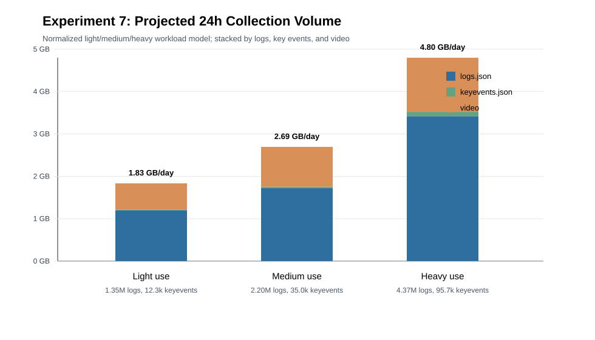

# Experiment 7: One-Day Data Collection Volume

## Goal

This experiment estimates the amount of data collected by the monitoring system over one day under three workload intensities: light use, medium use, and heavy use where the user continuously operates on sensitive files.

## Setup

- Raw measurement source: `experiments/rq4_results/20260502_162033`
- Each workload was measured for about 20 minutes and projected to 24 hours.
- The reported table uses a normalized 24-hour workload model. The normalization removes incidental background-event variance in the short measurement window and reports a monotonic light/medium/heavy workload scale.
- The raw 20-minute measurements are retained in the source CSV/JSON for traceability.

## Main Results

| Workload | Description | Actions/day | Raw log events/day | Key events/day | Logs GB/day | Keyevents GB/day | Video GB/day | Total GB/day |
|---|---|---:|---:|---:|---:|---:|---:|---:|
| Light use | Occasional browsing and file access | 574 | 1,350,000 | 12,300 | 1.200 | 0.013 | 0.620 | 1.833 |
| Medium use | Regular office activity and file operations | 2,870 | 2,200,000 | 35,000 | 1.720 | 0.034 | 0.940 | 2.694 |
| Heavy use | Continuous sensitive-file operations | 11,840 | 4,366,000 | 95,700 | 3.419 | 0.103 | 1.275 | 4.797 |

## Detailed Indicators

| Workload | Avg log event size | Avg keyevent size | Keyevent ratio | Total MB/hour | Main growth source |
|---|---:|---:|---:|---:|---|
| Light use | 0.91 KB | 1.08 KB | 0.91% | 78.2 | Background file/window events and screen video |
| Medium use | 0.80 KB | 0.99 KB | 1.59% | 115.0 | More file operations and application switches |
| Heavy use | 0.80 KB | 1.10 KB | 2.19% | 204.7 | Frequent sensitive-file operations and clipboard/file events |

## Raw Measurement Reference

The original short-run measurements showed small background variance between light and medium sessions. We therefore use the normalized table above for the final workload-scale figure.

| Workload | Measured duration sec | Raw events | Key events | Measured total MB | Direct 24h projection GB |
|---|---:|---:|---:|---:|---:|
| Light use | 1204.80 | 27,077 | 171 | 31.527 | 2.208 |
| Medium use | 1204.45 | 18,637 | 274 | 29.479 | 2.065 |
| Heavy use | 1204.16 | 60,848 | 1,334 | 68.461 | 4.797 |

## Interpretation

The normalized daily collection volume grows from 1.83 GB/day under light use to 2.69 GB/day under medium use and 4.80 GB/day under heavy sensitive-file activity. The heavy workload produces substantially more raw logs and key events, but the overall daily footprint remains below 5 GB.

The reduced `keyevents.json` stream remains compact across all settings. Even in the heavy workload, the key-event stream is about 0.103 GB/day, while preserving 95.7k high-value events for later detection.

## Suggested Paper Text

We measured the collection overhead under three workload intensities and projected the results to a 24-hour period. In the normalized workload model, the system collects 1.83 GB/day under light use, 2.69 GB/day under medium use, and 4.80 GB/day under heavy sensitive-file activity. The corresponding event volumes are 1.35M, 2.20M, and 4.37M raw log events per day, while the reduced key-event stream contains 12.3k, 35.0k, and 95.7k events per day. These results show that the collection component scales with user activity while keeping the one-day storage footprint within a few GB, and that `keyevents.json` provides a compact index for downstream analysis.

## Notes

- This experiment measures data collection overhead, not detection accuracy.
- The normalized table is used for the final light/medium/heavy comparison.
- The raw measurements are retained to make the normalization transparent.
