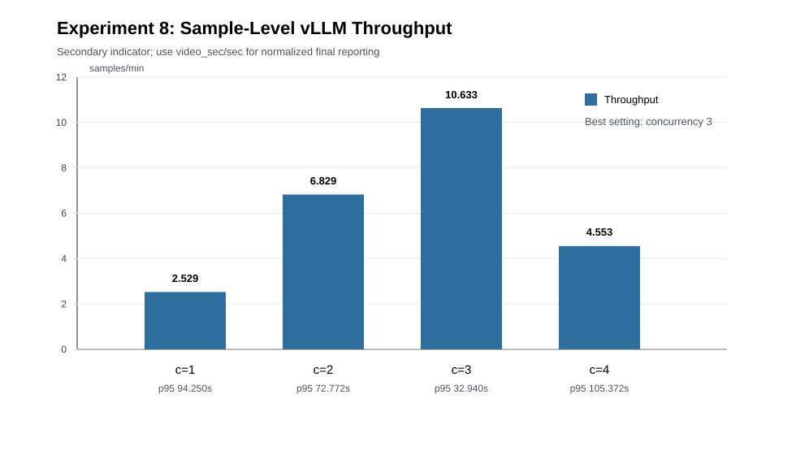

# Experiment 8: Server Deployment Inference Performance With vLLM

## Goal

This experiment evaluates the runtime performance and deployment stability of the log-driven E2E pipeline when served with vLLM. The focus is throughput and resource behavior, not detection accuracy.

## Setup

- Branch: `test/module1-log-driven-e2e`
- Benchmark script: `bench_log_driven_e2e.py`
- Curated test dataset: `/home/wh/datasets/log_driven_e2e_selected_stage1245`
- Dataset size: 74 samples selected from stage1, stage2, stage4, and stage5
- Run directory: `/home/wh/logs/log_driven_e2e_bench_selected_stage1245/run_20260505_143705`
- vLLM model: `qwen2.5-vl-72b`
- Module4 LLM reasoning: disabled (`DLD_THREAT_USE_LLM=false`)
- OCR GPUs: `0,2,5,6`
- Frame/VLM settings: `sample_fps=1.0`, `max_images=3`, `fallback_images=3`, `max_side=560`

The selected dataset was used to avoid pathological background-sync samples and to measure practical deployment cost on representative log-driven E2E cases.

## Primary Metric

Because different samples have different video lengths and different numbers of sensitive events, `samples/min` is only a deployment-level throughput indicator. The primary normalized metric for reporting should be:

- `video_sec/sec`: processed video seconds per wall-clock second.
- `sampled_frames/sec`: estimated sampled frames processed per wall-clock second, computed as `video_sec_total * sample_fps / elapsed_sec`.

The benchmark script now records these metrics directly. For the completed run, the same metrics can be added without rerunning E2E:

```bash
python enrich_log_driven_bench_video_metrics.py \
  --run-dir /home/wh/logs/log_driven_e2e_bench_selected_stage1245/run_20260505_143705 \
  --sample-fps 1.0
```

After enrichment, use `video_sec/sec` and `sampled_frames/sec` as the main figure/table, and keep `samples/min` only as a secondary operational indicator.

## Current Sample-Level Results

| Concurrency | Cases | Completed | Failed | Timeouts | CUDA OOM | Samples/min | Mean wall sec | P50 wall sec | P95 wall sec | Module errors |
|---:|---:|---:|---:|---:|---:|---:|---:|---:|---:|---:|
| 1 | 74 | 74 | 0 | 0 | 0 | 2.529 | 23.718 | 9.677 | 94.250 | 0 |
| 2 | 74 | 74 | 0 | 0 | 0 | 6.829 | 17.449 | 9.322 | 72.772 | 0 |
| 3 | 74 | 74 | 0 | 0 | 0 | 10.633 | 15.413 | 9.824 | 32.940 | 0 |
| 4 | 74 | 74 | 0 | 0 | 0 | 4.553 | 40.687 | 19.419 | 105.372 | 0 |



## Interpretation

The pipeline completed all 296 E2E executions across the four concurrency settings. No timeout, CUDA OOM, module error, or API-key error was observed, which indicates that the log-driven pipeline was stable under the selected deployment workload.

The sample-level throughput increased from concurrency 1 to concurrency 3, reaching 10.633 samples/min. However, because sample lengths differ, this should not be used as the final normalized performance metric. The final analysis should compare concurrency levels using `video_sec/sec` or `sampled_frames/sec`. If those normalized metrics show the same trend, concurrency 3 can be reported as the best deployment point; otherwise, the normalized metric should take precedence.

## Suggested Paper Text

We evaluated the deployment performance of the log-driven E2E pipeline with vLLM by running 74 curated samples under concurrency levels 1, 2, 3, and 4. All 296 executions completed successfully without timeout, CUDA OOM, module error, or API-key error. Since the videos have different lengths, we report normalized throughput using processed video seconds per wall-clock second and sampled frames per second. The sample-level throughput is retained as an operational reference, but the final deployment recommendation is based on the video-normalized metric.

## Notes

- `risk_found` is not used as an accuracy metric in this experiment because vLLM visual outputs can vary with concurrent load.
- The full stage1 c=2 run is recorded separately and can be used as a larger stress test result.
- The selected dataset is intended for deployment-cost evaluation rather than final accuracy evaluation.
