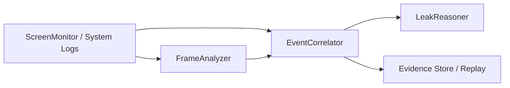
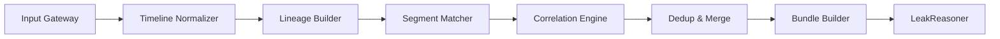
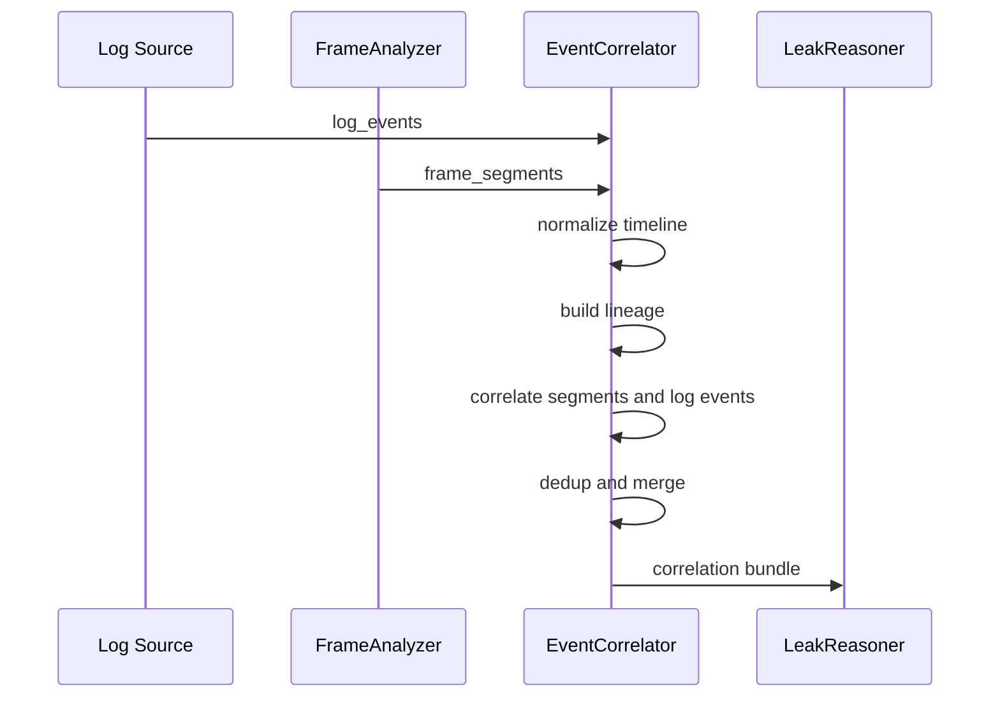

# 02-EventCorrelator

> 类型：Module Spec  
> 版本：v2  
> 说明：本文档描述的是对旧项目中 `EventTracker / FileTracker / FileTracer` 相关能力的重组与收口。在新的三模块架构里，模块 2 统一命名为 `EventCorrelator`，负责把系统日志、文件 lineage 与 `FrameAnalyzer` 输出的操作片段关联成可回放、可去重、可供下游推理消费的结构化事件流。旧项目中的 worklist、路径解析、文件映射和上传候选补链逻辑可作为实现参考，但不再按“四模块时代”的原始边界照搬。

---

## 1. 模块概述

EventCorrelator 是系统中的行为关联模块，负责将日志侧文件事件与 `FrameAnalyzer` 输出的界面操作片段进行时间、对象和上下文关联，生成面向下游推理的会话级关联事件流。

它的核心价值不是“再次识别风险”，而是把离散证据补成连续行为链。

负责：

- 接收日志侧原始文件事件与 `FrameAnalyzer` 的 segment 结果
- 维护敏感文件及其派生文件的 lineage
- 发现与补全跨进程、跨文件名、跨时间窗的关联关系
- 对重复、等价或低质量候选事件进行去重与合并
- 输出稳定、可解释的 `CorrelatedEvent` / `FileLineage` / `CorrelationBundle`

不负责：

- 视频录制、抽帧、OCR、多模态界面识别
- 最终风险定级、告警升级和阻断建议
- Datalog 规则推理本身

---

## 2. 模块目标

- 将“日志里看到的文件行为”和“视频里看到的界面操作”统一到同一条会话时间轴上。
- 将旧实现中分散在 `2-FileTracker`、`3-RiskHunter` 和 `run_e2e.py` 里的补链逻辑收口为模块内职责。
- 输出稳定 schema，而不是由编排层临时拼接字段。
- 显式管理事件去重、派生文件映射、时间窗扩展和候选补链规则。
- 保证同一输入快照下输出结果确定、可回放、可调试。

---

## 3. 核心职责

EventCorrelator 负责以下五类事情：

### 3.1 时间轴关联

- 规范化日志时间戳、录屏起始时间、视频 segment 时间范围
- 建立统一的 session timeline
- 支持按时间窗把日志事件和 `FrameAnalyzer.segments` 对齐

### 3.2 对象补链

- 识别原始敏感文件、当前文件、派生文件之间的关系
- 根据日志、路径推断和界面证据恢复完整 lineage
- 维护 `source -> derived -> current target` 的映射链

### 3.3 事件归并

- 将同一分钟、同一对象、同一应用中的等价外发候选事件视为同一事实
- 当后续证据更完整时，用高质量事件覆盖低质量事件
- 防止单个上传事实在结果层膨胀成多条重复记录

### 3.4 关联输出

- 生成下游可直接消费的关联事件流
- 输出文件映射、操作记录、候选外发事件和关联元数据
- 为 `LeakReasoner` 提供事实构造所需的最小完备输入

### 3.5 运行保障

- 管理配置快照、字段版本和降级策略
- 记录关联过程中的冲突、缺失和模糊匹配结果
- 为回归测试保留稳定的边界和可断言字段

边界说明：

- `FrameAnalyzer` 只负责“看见了什么”，`EventCorrelator` 负责“这些看见的东西如何和日志里的文件行为连起来”。
- `LeakReasoner` 只负责“是否构成泄露及其推理依据”，`EventCorrelator` 不直接下最终结论。

---

## 4. 理想架构

### 4.1 模块定位

在新的三模块架构中，EventCorrelator 位于中间层：



更细的内部理想结构如下：



### 4.2 阶段说明

#### 1. Input Gateway

- 接收日志事件、视频分析结果、会话元数据和配置快照
- 校验 schema 版本与必填字段

#### 2. Timeline Normalizer

- 统一时间格式
- 规范化 `start/end/timestamp/time_range`
- 生成全局可比较时间轴

#### 3. Lineage Builder

- 维护原始文件、当前文件、派生文件的映射关系
- 输出 `direct mappings` 和 `full lineage chains`

#### 4. Segment Matcher

- 将 `FrameAnalyzer` 片段与日志事件做时间窗和对象级匹配
- 识别“日志没有明确说明，但视频片段给出强证据”的关联候选

#### 5. Correlation Engine

- 综合时间、文件名、路径、应用名、操作类型、上下文片段构建 `CorrelatedEvent`
- 记录关联得分和证据来源

#### 6. Dedup & Merge

- 对等价候选事件去重
- 当后到事件更完整时执行替换或合并

#### 7. Bundle Builder

- 输出结构化 `CorrelationBundle`
- 为下游推理和审计回放准备稳定产物

---

## 5. 输入与输出

### 5.1 输入

#### 输入来源

- `ScreenMonitor / System Logs`
- `FrameAnalyzer`
- 编排层提供的 session 元数据
- 配置中心或本地配置文件提供的策略快照

#### 输入对象

```python
class EventCorrelatorInput(TypedDict):
    session_id: str
    record_id: str
    log_events: list[dict]
    frame_segments: list[dict]
    sensitive_files: list[str]
    recording_start_time: str
    session_metadata: dict
    correlation_config: dict
```

#### 最小输入契约

- `session_id`
- `log_events`
- `frame_segments`
- `sensitive_files`

#### 关键字段语义

- `log_events`
  - 原始系统日志事件列表
  - 至少包含 `timestamp`、`event_type`、`file_path`
- `frame_segments`
  - 来自 `FrameAnalyzer` 的 segment 级结果
  - 至少包含 `time_range`、`app_name`、`operation_type`
- `sensitive_files`
  - 初始敏感文件列表，用于启动 lineage 跟踪
- `recording_start_time`
  - 用于把视频片段换算为统一时间轴
- `correlation_config`
  - 决定时间窗容忍度、路径回填、去重策略和降级行为

### 5.2 输出

#### 输出对象

```python
class CorrelatedEvent(TypedDict):
    event_id: str
    session_id: str
    timestamp: str
    event_type: str
    source_type: str
    original_file: str
    current_file: str
    app_name: str
    operation_type: str
    behavior_category: str
    evidence_refs: list[str]
    confidence: float
    correlation_score: float
    status: str


class FileLineage(TypedDict):
    direct_file_mappings: dict[str, str]
    full_file_mapping_chains: dict[str, str]


class CorrelationBundle(TypedDict):
    session_id: str
    analysis_status: str
    correlated_events: list[CorrelatedEvent]
    operation_records: list[dict]
    upload_candidates: list[dict]
    file_lineage: FileLineage
    statistics: dict
    errors: list[dict]
```

#### 输出说明

- `correlated_events`
  - 模块 2 的主输出，供 `LeakReasoner` 构造事实流
- `operation_records`
  - 面向调试、审计和人工复核的可读记录
- `upload_candidates`
  - 不是最终风险案件，而是已完成去重和补链的候选外发事实
- `file_lineage`
  - 对应旧实现中的 `direct_file_mappings` 与 `full_file_mapping_chains`
- `statistics`
  - 记录处理规模、去重效果、冲突数量和降级次数

---

## 6. 接口契约

### 6.1 对外接口

#### 接口 1：提交关联分析

```python
submit_correlation(payload: EventCorrelatorInput) -> dict
```

返回：

```python
{
    "accepted": True,
    "session_id": "string",
    "analysis_id": "string"
}
```

#### 接口 2：执行关联

```python
run_correlation(analysis_id: str) -> CorrelationBundle
```

#### 接口 3：查询文件 lineage

```python
get_file_lineage(session_id: str) -> FileLineage
```

#### 接口 4：增量补证

```python
append_correlation_evidence(session_id: str, delta_payload: dict) -> dict
```

用途：

- 上游补交日志
- `FrameAnalyzer` 追加 segment
- 配置重放验证

### 6.2 与上游 FrameAnalyzer 的契约

`FrameAnalyzer` 至少应输出如下 segment 字段：

```python
{
    "time_range": "2026-03-27 12:31:48 - 2026-03-27 12:32:17",
    "app_name": "QQ邮箱",
    "operation_type": "邮件附件外发",
    "primary_resource": "part1.xlsx",
    "related_resources": ["part2.xlsx"],
    "action_description": "用户在邮箱界面添加多个附件",
    "visible_evidence": ["附件名列表", "发送按钮"],
    "supporting_timestamps": ["2026-03-27 12:31:48"],
    "confidence": 0.86
}
```

模块 2 不要求 `FrameAnalyzer` 直接理解 lineage，但要求它输出足够多的可观察对象，便于后续关联。

### 6.3 与下游 LeakReasoner 的契约

`LeakReasoner` 不应再自己回头解析原始日志或原始 segment。

模块 2 至少应保证提供：

- 已去重的候选外发事件
- 可追溯的 `original_file -> derived_file -> uploaded_file` 链
- 时间上可排序的操作记录
- 必要的应用、行为、证据引用字段

---

## 7. 数据流向

### 7.1 总体数据流



### 7.2 模块内关键流转

1. 输入网关接收日志、视频片段和配置快照。
2. 时间标准化阶段统一时间格式，并解析 `time_range`。
3. lineage 构建阶段从初始敏感文件出发维护映射关系。
4. segment 匹配阶段依据时间窗、对象名、应用上下文建立候选关联。
5. 关联引擎为每个候选生成 `correlation_score` 和证据引用。
6. 去重阶段消除重复事件，并保留证据更完整的版本。
7. 结果构建阶段输出 `CorrelationBundle` 给 `LeakReasoner` 和回放存储。

### 7.3 旧实现可参考的数据资产

旧代码中已有可复用的几个稳定概念：

- `SensitiveFileEvent`
- `WorklistManager`
- `direct_file_mappings`
- `full_file_mapping_chains`
- `operation_records`

这些概念仍可保留，但在新架构中应由 `EventCorrelator` 统一拥有，不再拆散在多个模块和脚本中。

---

## 8. 关键算法

### 8.1 事件关联逻辑

候选关联至少考虑以下特征：

- 时间接近
- 文件名或资源名命中
- 派生链是否连通
- 应用名是否一致
- 操作类型是否兼容
- 界面可见证据是否支持该行为

建议关联评分：

```text
correlation_score =
    time_score
  + resource_match_score
  + lineage_score
  + app_context_score
  + visual_evidence_score
```

当 `correlation_score` 低于阈值时，不直接丢弃，可进入 `ambiguous_candidates`，供下游选择性降级处理。

### 8.2 文件 lineage 构建逻辑

目标：

- 维护直接父子关系
- 可回溯到最初敏感文件
- 防止映射环导致无限扩张

建议规则：

- `derived_file -> direct_parent`
- `derived_file -> root_sensitive_file`
- 每次更新映射后刷新未处理事件的 `original_file`
- 对映射链设置最大回溯深度，避免环路

### 8.3 事件去重逻辑

这是模块 2 必须明确写清楚的一条规则。

去重目标：

- 消除同一上传事实的重复膨胀
- 允许“低质量候选被高质量候选覆盖”

推荐去重键：

```text
dedup_key =
    normalize(file_path)
  + normalize(app_name)
  + minute_bucket(start_time)
```

其中：

- `normalize(file_path)` 统一路径分隔符和大小写
- `minute_bucket(start_time)` 将同一分钟内的等价候选视作同一事实

#### 去重判定规则

满足以下条件的候选视为等价事件：

- 文件目标相同或可归并到同一派生文件
- 应用相同
- 时间桶相同
- 操作语义同类

#### 覆盖策略

若新事件与旧事件命中同一去重键，则比较质量分数：

```text
event_quality_score =
    alert_weight
  + evidence_link_weight
  + upload_content_weight
  + time_range_weight
  + description_weight
  + timestamp_count_weight
```

质量更高者保留。质量更低者不新增记录，但可把其证据引用合并到现有事件。

#### 为什么这样设计

- 旧实现中已经出现“同一分钟内同一上传事实重复生成多条告警”的问题
- 回归测试也已经固化了“更完整的候选覆盖较弱候选”的行为
- 因此去重逻辑必须是模块契约，而不是临时补丁

### 8.4 路径解析与补全

当 `FrameAnalyzer` 仅识别出文件名而无完整路径时：

1. 优先查日志中的完整路径
2. 若日志存在同名多文件，则按时间窗优先
3. 若仍无法唯一确定，则回退到当前目录推断
4. 若仍存在歧义，则标记 `path_resolution = ambiguous`

### 8.5 关联冲突处理

常见冲突：

- 同一片段匹配多个候选文件
- 同一日志事件匹配多个 segment
- lineage 发生分叉

处理原则：

- 先保留多候选，不强行拍板
- 在输出中显式记录 `ambiguity_reason`
- 高风险结论交由下游 `LeakReasoner` 结合推理规则再定

---

## 9. 配置管理方式

EventCorrelator 不应把配置写死在代码里。

### 9.1 配置分层

建议采用三层配置：

1. 默认配置  
   文件：`config/event_correlation.default.json`

2. 环境配置  
   文件：`config/event_correlation.<env>.json`

3. 运行时覆盖  
   来源：CLI、测试或编排层注入

### 9.2 推荐配置项

```json
{
  "schema_version": "v2",
  "time_window_tolerance_seconds": 60,
  "dedup_bucket_granularity": "minute",
  "max_lineage_depth": 10,
  "path_resolution_strategy": "log_first",
  "allow_ambiguous_candidates": true,
  "merge_evidence_on_dedup": true,
  "min_correlation_score": 0.55
}
```

### 9.3 配置原则

- 配置和样例数据分离
- 路径、敏感文件清单、黑白名单不直接硬编码在模块源码中
- 输出结果中应记录本次使用的配置版本
- 测试用例可按配置快照回放，确保回归结果稳定

---

## 10. 风险与异常处理

### 10.1 输入异常

- 缺少 `log_events` 或 `frame_segments`：拒绝执行
- 时间字段无法解析：写入 `errors` 并进入降级模式
- schema 版本不兼容：返回 `invalid_schema`

### 10.2 数据质量问题

- `FrameAnalyzer` 无命中：允许只基于日志构建弱关联结果
- 日志缺失完整路径：允许同目录推断，但要记录降级原因
- 同名文件冲突：输出多候选，不直接覆盖
- 映射链成环：中断向上追溯并记录 `lineage_cycle_detected`

### 10.3 运行时异常

- 单条事件处理失败不应拖垮整批会话
- 去重失败时保守保留原始候选，并打 `dedup_failed`
- 输出阶段失败时保留中间快照，便于重放

---

## 11. 回归测试用例集

这一部分建议直接对齐你们当前代码里已经暴露出的真实风险点。

### 11.1 核心回归用例

1. 多输出文件拆分  
   输入：`modified_filename` 为分号分隔的多个文件名  
   期望：拆分为多个派生文件事件，而不是一条字符串事件

2. 已知派生敏感文件不重复入队  
   输入：派生文件已在敏感文件集合中  
   期望：更新 lineage，但不重复加入待处理队列

3. 同一分钟等价上传事件去重  
   输入：同一文件、同一应用、同一分钟内两条等价上传候选  
   期望：最终只保留一条

4. 更完整证据覆盖较弱证据  
   输入：后到事件拥有更完整的 `upload_content`、`mapping_link` 和更多时间戳  
   期望：旧事件被新证据更新，而不是新添一条重复事件

5. 派生文件上传能补全可连接事实链  
   输入：原文件打开、派生文件创建、派生文件上传  
   期望：能导出完整 lineage，供 `LeakReasoner` 推出泄露路径

6. lineage 环路不无限扩张  
   输入：`A -> B` 与 `B -> A` 的循环映射  
   期望：输出有界，不出现无限推理链

7. 路径回填优先命中日志  
   输入：`FrameAnalyzer` 仅给出文件名  
   期望：优先从日志恢复完整路径，而不是直接猜当前目录

8. 无 `FrameAnalyzer` 命中时的降级路径  
   输入：`frame_segments = []`，但日志存在敏感文件外发  
   期望：模块仍能生成弱关联事件，并在状态中标记降级

### 11.2 建议测试分层

- 单元测试  
  覆盖路径规范化、时间标准化、去重键构造、质量评分

- 边界测试  
  覆盖 `submit/run/get_lineage` 等标准接口契约

- 回归测试  
  固定 10-2 样例和典型上传场景

- 联调测试  
  验证 `FrameAnalyzer -> EventCorrelator -> LeakReasoner` 的字段兼容

### 11.3 最小验收基线

至少应保证以下行为可稳定通过自动化测试：

- `direct_file_mappings` 和 `full_file_mapping_chains` 可导出
- 去重后统计值与最终输出数量一致
- 相同输入快照运行两次得到相同输出
- 模块输出可直接被 `LeakReasoner` 使用，而无需脚本层手工补链

---

## 12. 当前状态与落地建议

### 12.1 当前状态

- 旧实现中的相关能力目前散落在 `2-FileTracker`、`3-RiskHunter` 和 `run_e2e.py`
- 代码里已经存在若干可复用的核心语义：
  - `SensitiveFileEvent`
  - `WorklistManager`
  - 文件映射链导出
  - 上传候选去重
- 但这些能力还没有被正式定义为“模块 2 的统一契约”

### 12.2 本轮文档建议

本轮不强求与其他文档立即完全一致，也不要求一次性改完代码实现。优先目标是先把模块 2 的职责、输入输出和算法边界写清楚，便于后续三份文档统一交给 AI 做一致性检查。

### 12.3 后续实现优先级

1. 先把模块 2 的标准输出 schema 固定下来  
2. 再把去重逻辑、lineage 构建和路径补全从脚本层收口进模块  
3. 最后再处理增量补证和更复杂的冲突消解

---

## 13. 一句话总结

EventCorrelator 的职责不是“判断泄露”，而是把原本分散、重复、易断裂的日志事件与界面证据补成一条稳定、可推理、可测试的行为链。
