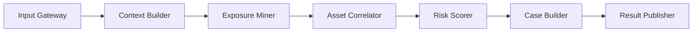

# 03-RiskHunter / LeakReasoner Transition Note

> Status note: this document still describes the older target-state RiskHunter design.
> The active implementation in this repository is the new Module 3 `LeakReasoner`
> under `03-LeakReasoner/`, which already participates in the `main_v2.py --mode full`
> acceptance path but has not yet absorbed the full target architecture described below.

> 类型：Module Spec  
> 版本：Target Architecture v2  
> 说明：本文档描述全新设计的 RiskHunter 模块，不沿用旧项目中的 LangGraph、脚本式编排、worklist 驱动和跨模块路径注入方案。

## 1. 模块概述

RiskHunter 是系统中的风险决策模块，负责把上游产生的多源证据转化为可执行的风险结论。

它不负责原始视觉分析，也不负责文件事件采集，而是专注于三件事：

- 识别可能的外发出口；
- 将外发行为与敏感资产 lineage 关联起来；
- 生成结构化风险案件、证据包和处置建议。

在新架构中，RiskHunter 是一个确定性分析模块，而不是一个 Agent 图编排器。它基于明确的数据契约、阶段化流水线和可回放的证据快照运行，目标是让行为判定过程可解释、可测试、可复现。

## 2. 模块目标

- 将 FrameAnalyzer 和 FileTracer 的输出统一收敛为标准风险分析输入。
- 用确定性流水线替代隐式状态机和递归式工作流。
- 将“风险判断”与“证据提取”解耦，降低模块间耦合度。
- 对外输出稳定的 `RiskCase`，而不是零散的中间结果集合。
- 保证每次分析都可回放、可审计、可增量更新。
- 为后续告警中心、审计中心和策略平台提供统一风险接口。

## 3. 核心职责

- 接收并校验上游提交的会话级证据包。
- 构建统一的会话上下文和时间轴。
- 从行为证据中发现候选外发出口。
- 将外发候选与敏感文件 lineage、用户上下文和策略快照进行关联。
- 计算风险分数、风险等级和判定理由。
- 生成 `RiskCase`、`EvidenceBundle` 和处置建议。
- 将分析结果写入案件存储，并发布给下游告警或审计系统。

边界说明：

- 不负责视频帧提取、OCR、多模态识别。
- 不负责文件读写监控、系统事件采集。
- 不负责底层消息队列或存储实现。
- 不负责最终页面展示，但要保证输出对象可直接被展示层消费。

## 4. 输入与输出

### 4.1 输入

#### 输入来源

- `FrameAnalyzer`：提供行为切片、窗口上下文、操作语义和置信度。
- `FileTracer`：提供文件事件流、文件 lineage、派生关系和时间线。
- `Policy Service`：提供敏感级别、信任通道、应用策略和告警阈值。
- `Session Context`：提供用户、设备、会话、时间范围等上下文。

#### 输入对象

```python
class RiskHunterInput(TypedDict):
    session_id: str
    tenant_id: str
    user_id: str
    device_id: str
    started_at: str
    ended_at: str
    frame_findings: list[dict]
    file_traces: list[dict]
    policy_snapshot: dict
    sensitivity_catalog: dict
    session_metadata: dict
```

#### 必填字段

- `session_id`
- `frame_findings`
- `file_traces`
- `policy_snapshot`

#### 可选字段

- `sensitivity_catalog`
- `session_metadata`
- `tenant_id`
- `user_id`
- `device_id`

### 4.2 输出

#### 输出对象

```python
class RiskCase(TypedDict):
    case_id: str
    session_id: str
    severity: str
    score: int
    confidence: float
    disposition: str
    primary_asset_id: str
    asset_lineage: list[str]
    sink_type: str
    sink_target: str
    actor: dict
    reasons: list[str]
    evidence_bundle_id: str
    recommended_actions: list[str]
    created_at: str


class RiskHunterOutput(TypedDict):
    session_id: str
    analysis_status: str
    risk_cases: list[RiskCase]
    evidence_bundles: list[dict]
    metrics: dict
    errors: list[dict]
```

#### 输出格式

- 内存态对象：供编排层和测试直接消费。
- 存储态对象：写入 `CaseStore` 和 `EvidenceStore`。
- 发布态对象：推送给告警中心、审计系统或人工复核队列。

#### 核心字段说明

- `severity`：`low | medium | high | critical`
- `score`：0 到 100 的风险分数
- `confidence`：证据一致性置信度
- `disposition`：`inform | review | alert | block_recommend`
- `asset_lineage`：从源文件到外发对象的完整 lineage
- `sink_type`：外发出口类型，如 `chat_upload`、`mail_attachment`、`cloud_sync`、`web_post`
- `reasons`：机器可读且可展示的判定理由

#### 输出去向

- DataLeakDetector 编排层
- 告警中心
- 审计存储
- 人工复核工作台

## 5. 核心流程

### 5.1 总体设计

RiskHunter 采用“快照输入 + 阶段化流水线 + 案件输出”的设计，不使用 LangGraph，也不采用递归图执行。

模块内部由 6 个确定性阶段组成：



### 5.2 各阶段职责

#### 1. Input Gateway

- 校验输入字段完整性
- 生成本次分析快照 ID
- 将输入冻结为不可变快照，避免分析过程中数据漂移

#### 2. Context Builder

- 统一时间格式和时区
- 规范化文件 ID、资产 ID、应用 ID、用户 ID
- 将 `frame_findings` 与 `file_traces` 合并为会话级时间轴
- 生成标准 `SessionContext`

#### 3. Exposure Miner

- 从行为切片中提取候选外发动作
- 识别外发出口类型：
  - 聊天发送
  - 邮件附件
  - 网页上传
  - 云盘同步
  - 外部介质导出
  - 截图转发
  - 剪贴板外带
- 生成 `ExposureCandidate`

#### 4. Asset Correlator

- 把 `ExposureCandidate` 与文件 lineage 对齐
- 判断外发对象是否来自敏感资产或其派生资产
- 解析“源文件 -> 派生文件 -> 外发对象”的证据链
- 若关联不唯一，则生成“待确认关联”而不是强行下结论

#### 5. Risk Scorer

- 根据策略快照计算风险分数
- 核心评分因子：
  - 资产敏感级别
  - 外发通道信任级别
  - 外发动作显式程度
  - 证据一致性
  - 是否经过格式转换、压缩、截图、复制等掩饰动作
  - 是否命中策略禁令
- 输出 `RiskDecision`

#### 6. Case Builder

- 将 `RiskDecision` 组装为标准 `RiskCase`
- 合并同一会话内重复或相邻案件
- 生成证据包索引 `EvidenceBundle`
- 输出处置建议，如：
  - 仅记录
  - 人工复核
  - 立即告警
  - 建议阻断

#### 7. Result Publisher

- 写入 `CaseStore`
- 写入 `EvidenceStore`
- 推送至下游消费者
- 记录分析指标和异常信息

### 5.3 风险评分模型

RiskHunter 不使用开放式 Agent 推理来决定最终风险，而采用“规则矩阵 + 权重评分”的双层模型。

第一层：规则矩阵  
- 用于判定是否命中硬性策略，如：
  - 绝密资产进入不可信通道
  - 未授权应用访问高敏资产并伴随外发
  - 截图或剪贴板行为后紧接对外传输

第二层：权重评分  
- 用于细分严重程度和复核优先级

建议评分区间：

- `0-29`：`low`
- `30-59`：`medium`
- `60-84`：`high`
- `85-100`：`critical`

### 5.4 关键设计原则

- 先证据，后结论
- 先关联，后评分
- 先快照，后计算
- 同一输入必须得到同一输出
- 所有高风险结论必须能回溯到证据链

## 6. 依赖与接口

### 6.1 上游依赖

- `FrameAnalyzer`
  - 提供行为语义结果
  - 输出对象必须是标准化 `frame_findings`
- `FileTracer`
  - 提供文件时间线和 lineage
  - 输出对象必须是标准化 `file_traces`
- `Policy Service`
  - 提供策略快照
- `Session Metadata Service`
  - 提供用户、设备、会话元数据

### 6.2 下游依赖

- `CaseStore`
  - 存储 `RiskCase`
- `EvidenceStore`
  - 存储证据包索引和引用
- `AlertCenter`
  - 消费高优先级案件
- `Audit API`
  - 提供查询和追溯能力

### 6.3 对外接口

#### 接口 1：提交分析任务

```python
submit_analysis(payload: RiskHunterInput) -> dict
```

- 功能：提交一次会话级风险分析
- 返回：

```python
{
    "analysis_id": "string",
    "session_id": "string",
    "accepted": True
}
```

#### 接口 2：执行分析

```python
run_analysis(analysis_id: str) -> RiskHunterOutput
```

- 功能：基于已冻结的分析快照执行完整流水线
- 返回：标准 `RiskHunterOutput`

#### 接口 3：查询案件

```python
get_case(case_id: str) -> RiskCase
```

- 功能：查询单个风险案件
- 返回：标准 `RiskCase`

#### 接口 4：追加证据重算

```python
append_evidence(session_id: str, delta_payload: dict) -> dict
```

- 功能：当上游补充证据时，追加到会话快照并触发增量重算
- 返回：新的 `analysis_id`

### 6.4 模块内部接口约束

- 只允许通过标准 schema 交换数据
- 不允许跨模块直接读取彼此私有状态
- 不允许在分析阶段动态修改输入快照
- 不允许将流程控制逻辑委托给 LLM 或 Agent 框架

## 7. 风险与异常处理

### 7.1 输入异常

- 必填字段缺失：拒绝接收，返回结构化错误
- 字段格式错误：进入 `invalid_payload` 分支，不启动分析
- 上游数据版本不匹配：拒绝分析，并记录 schema 版本冲突

### 7.2 数据质量风险

- 时间戳漂移：允许窗口对齐，但必须记录偏移量
- lineage 不完整：可降级分析，但案件必须标记 `partial_lineage`
- 行为证据与文件证据冲突：进入 `ambiguous_case`，降低自动告警等级
- 多个敏感资产共用同一外发对象：拆分为多个候选案件，禁止直接合并

### 7.3 误报与漏报风险

- 单一信号不得直接生成 `critical`
- 高等级案件必须至少满足“双证据成立”
  - 行为证据成立
  - 资产关联证据成立
- 低置信度结果默认进入人工复核，不直接建议阻断

### 7.4 运行时异常

- 策略服务不可用：使用最近一次有效快照，并标记 `stale_policy`
- 存储写入失败：结果先落本地事务日志，异步重试
- 发布失败：案件状态置为 `publish_pending`
- 分析阶段内部异常：保留已完成阶段产物，输出部分结果和错误清单

### 7.5 安全与审计要求

- 所有分析输入必须有快照 ID
- 所有输出案件必须能追溯到原始证据引用
- 所有策略版本必须写入案件结果
- 任何自动化阻断建议都必须记录完整判定理由

## 8. 当前状态与后续计划

### 8.1 当前状态

- 本文档描述的是全新目标架构，不是对旧项目的局部修补。
- 旧项目中的以下设计不再沿用：
  - LangGraph 编排
  - worklist 递归处理
  - 跨模块 `sys.path` 注入
  - 脚本中拼接事实链
  - 运行时同时承担流程控制和推理控制的混合模式

### 8.2 当前落地优先级

第一阶段：

- 定义标准 schema：
  - `RiskHunterInput`
  - `ExposureCandidate`
  - `RiskDecision`
  - `RiskCase`
- 实现快照机制和阶段化流水线骨架
- 搭建 `CaseStore` 与 `EvidenceStore` 抽象接口

第二阶段：

- 实现 `Exposure Miner`
- 实现 `Asset Correlator`
- 建立规则矩阵和评分模型
- 完成案件合并与证据包生成

第三阶段：

- 支持增量重算
- 接入告警中心和审计查询
- 引入策略配置中心
- 增加回放测试、联调测试和对抗样本测试

### 8.3 后续计划

- 将 RiskHunter 建成系统中唯一的风险决策入口
- 上游模块只负责“提取事实”，不再做风险判断
- 下游模块只消费标准 `RiskCase`，不再自行拼装推理输入
- 所有风险判断逻辑收敛到统一的策略与评分层，避免逻辑分散在脚本、模型提示词和临时工具中

