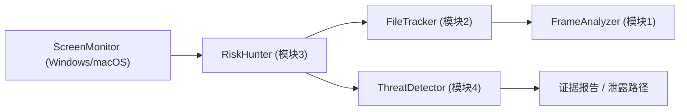

# DataLeakDetector-main 代码实现审查与架构文档

## 1. 结论摘要

- 当前仓库里真正成型、具备端到端故事线的实现仍然是 `DataLeakDetector-main`；顶层 `main/main.py` 与 `spec/01-03` 目前基本为空，说明 “v2 重制版” 还没有完成对旧实现的结构化承接。
- 旧版已经跑通了一条有价值的链路：`ScreenMonitor -> 模块3 RiskHunter -> 模块2 FileTracker -> 模块1 FrameAnalyzer -> 模块4 ThreatDetector -> 证据报告`。
- 真正的架构问题不在于“模块太少”，而在于“敏感文件流转 / 上传判断 / 证据补链”这个核心概念被拆散在多个浅模块里，导致边界脆弱、测试困难、迁移困难。
- 如果只做一个优先级最高的架构动作，我建议先深挖一个新的中心模块：`Sensitive Flow Analyzer`。它应该统一拥有 worklist、文件映射、上传判断和证据补链，而不是让这些逻辑分别散落在模块2、模块3和 `run_e2e.py` 中。

## 2. 审查范围与方法

- 审查对象以 `DataLeakDetector-main` 为主，同时检查了顶层 `tools/ScreenMonitor` 与当前 v2 根目录的落地情况。
- 阅读了模块 1-4、`run_e2e.py`、Windows/macOS 监控入口和现有测试。
- 额外执行了：

```bash
python3 -m unittest DataLeakDetector-main/tests/test_e2e_regressions.py
```

- 测试结果：6 个测试里 4 个通过，2 个失败。失败点不是业务判定错误，而是导入链把 `cv2` / `torch` / `easyocr` 这类重依赖一并拖了进来；同时模块3导入还提示本地缺少 `langgraph`。这说明当前模块边界对测试环境极不友好。

## 3. 仓库现状快照

| 区域 | 主要路径 | 粗略规模 | 现状判断 |
| --- | --- | ---: | --- |
| 顶层 v2 壳 | `main/`、`spec/` | 几乎为空 | 还未承接旧实现 |
| E2E 编排 | `DataLeakDetector-main/run_e2e.py` | 1492 行 | 单文件承担过多职责 |
| 模块1 FrameAnalyzer | `DataLeakDetector-main/1-FrameAnalyzer` | 693 行 | 视频/OCR/VLM 一体化 |
| 模块2 FileTracker | `DataLeakDetector-main/2-FileTracker` | 2072 行 | worklist、路径推断、模块1 调用混杂 |
| 模块3 RiskHunter | `DataLeakDetector-main/3-RiskHunter` | 1416 行 | 上传判定、状态流转、结果汇总混杂 |
| 模块4 ThreatDetector | `DataLeakDetector-main/4-ThreatDetector` | 1195 行 | 推理内核相对清晰 |
| 监控层 | `DataLeakDetector-main/ScreenMonitor` | 10098 行 | 平台实现完整但 Windows/macOS 分叉明显 |

额外观察：

- `tools/ScreenMonitor` 与 `DataLeakDetector-main/ScreenMonitor` 基本是同一套实现，仅有 `Mac_monitor` / `mac_monitor` 的目录大小写差异。这意味着当前仓库已经出现“旧实现被复制一份、但没有统一归属”的迁移中间态。
- 顶层 `README.md` 很短，而 `spec/01-03` 仍为空，说明“设计文档”与“可运行实现”目前是脱节的。

## 4. 当前实现的数据流



这条链路在概念上是对的，但边界上有两个明显问题：

- 模块3名义上是“上传检测器”，实际还承担了 worklist 驱动、模块2调用、录屏起始时间兜底、敏感操作记录、上传分类和统计汇总。
- 模块4名义上是“推理模块”，实际并没有直接消费一个稳定的“事实流”接口，而是依赖 `run_e2e.py` 在编排层里做一大段补事实逻辑，才能让污点链连起来。

## 5. 已有实现里值得保留的部分

### 5.1 `PythonDatalogEngine` 已经接近深模块

`DataLeakDetector-main/4-ThreatDetector/datalog/python_datalog_engine.py` 是当前仓库里最像“深模块”的一块：

- 对外接口很小：`add_fact()` / `run_inference()`
- 内部把剪贴板传播、跨进程传播、不动点迭代都藏起来了
- 还能在 Souffle 不可用时作为本地降级方案继续工作

这部分建议保留并作为未来推理边界的内核。

### 5.2 `prompt_loader.py` 是一个小但正确的边界修补

`DataLeakDetector-main/1-FrameAnalyzer/prompt_loader.py` 用 `importlib` 显式加载本地 `prompts.py`，规避了模块名冲突。这个做法说明团队已经遇到过包结构问题，也做过局部修补。

问题在于：现在只有 prompt 加载被“深挖”了，整体包结构并没有被修复。

## 6. 核心架构摩擦

### 6.1 目录结构不是包结构，导致全局 `sys.path` 黑魔法

证据：

- `DataLeakDetector-main/run_e2e.py:38-42` 通过 `sys.path.insert()` 注入四个模块目录
- `DataLeakDetector-main/3-RiskHunter/upload_detector_nodes.py:10`
- `DataLeakDetector-main/2-FileTracker/behavior_analysis_tools.py:14-15`

问题：

- `1-FrameAnalyzer`、`2-FileTracker` 这类目录名不能自然作为 Python 包使用，因此整个系统被迫依赖路径注入。
- 一旦 import 链拉长，任意一个轻量测试都可能被重依赖拖死。
- 这也是为什么 `test_extract_hidden_operations...` 和 `test_update_worklist...` 明明只是想测模块2，却因为 `behavior_analysis_tools -> relavance_frame -> agent.py` 的链条，最终在缺少 `cv2` 时失败。

结论：

- 当前最基础的问题不是“缺少更多抽象”，而是“没有一个可信的包边界”。

### 6.2 模块2和模块3围绕同一个领域概念拆得太浅

涉及文件：

- `DataLeakDetector-main/2-FileTracker/worklist_manager.py`
- `DataLeakDetector-main/2-FileTracker/behavior_analysis_nodes.py`
- `DataLeakDetector-main/2-FileTracker/behavior_analysis_tools.py`
- `DataLeakDetector-main/3-RiskHunter/upload_detector_nodes.py`

共享概念：

- 敏感文件事件
- 原始文件与派生文件映射
- 时间窗口
- 路径推断
- 上传判定
- 敏感操作记录

表面上这些职责分别在不同文件里，实际上它们共同拥有的是同一个概念：`sensitive file lineage`。

当前症状：

- 模块2生成 `new_events`
- 模块3再决定如何重扫日志、如何记操作、如何判断外发
- `run_e2e.py` 又把这些结果重新解释一遍，补 Datalog 事实

这不是“职责分离”，而是“同一概念被切碎”。

### 6.3 `run_e2e.py` 是事实上的超级编排器

证据：

- `DataLeakDetector-main/run_e2e.py` 长达 1492 行
- `_inject_connected_facts_from_module3()` 位于 `run_e2e.py:385` 附近
- 模块4入口逻辑位于 `run_e2e.py:1110-1190`

问题：

- 它既做模块导入，又做日志加载、索引生成、模块3配置拼接、模块4事实构造、补事实、推理执行和报告输出。
- 模块4无法直接消费一个稳定的上游产物，只能依赖 `run_e2e.py` 在编排层里“修补事实链”。
- 这意味着真正关键的领域逻辑不是封装在模块内，而是散在编排脚本中。

结论：

- 只要 `run_e2e.py` 还是“补链中心”，模块边界就永远是假的。

### 6.4 配置、样例数据和秘密信息耦合进代码

证据：

- `DataLeakDetector-main/3-RiskHunter/upload_detection_config.py:14-44` 直接写入大量个人机器路径
- 同文件 `:48-112` 直接写入黑白名单和规则词
- `DataLeakDetector-main/1-FrameAnalyzer/vlm_analysis.py:54-58` 存在硬编码 API Key
- `DataLeakDetector-main/2-FileTracker/behavior_analysis_graph.py:51-58` 构造图时直接实例化 `ChatOpenAI`

问题：

- 运行时配置、测试样例、个人数据和安全凭证混在一起，迁移环境时几乎必然要改代码。
- 模块构造函数存在副作用，导致“只是导入模块”也可能触发对外部环境的要求。

结论：

- 当前代码更像“研究原型 + 本地样例仓库”，还不是可迁移的产品级实现。

### 6.5 Windows/macOS 监控层实现重复，API 形状也未真正统一

证据：

- Windows 入口：`DataLeakDetector-main/ScreenMonitor/windows_monitor/web_server.py`
- macOS 入口：`DataLeakDetector-main/ScreenMonitor/Mac_monitor/server/main.go`

观察：

- Windows 端用 Flask + 单例 `Engine`
- macOS 端用 Go 全局变量 + `http.HandleFunc`
- 两端都在做“会话控制 + 监控器管理 + API 暴露 + 文件服务”，但没有共享的会话模型或 API 契约
- macOS 代码里还有多处被注释掉的 `windowMonitor` / `clipboardMonitor`

结论：

- 监控后端目前是“同名能力的两份独立产品”，还不是一套可替换的平台适配层。

### 6.6 测试边界过浅，且没有覆盖最昂贵的集成缝

当前可见测试基本只有：

- `DataLeakDetector-main/tests/test_e2e_regressions.py`
- `DataLeakDetector-main/4-ThreatDetector/test.py`

问题：

- 现有测试多聚焦于私有 helper 或回归补丁
- 监控层几乎没有自动化保护
- 模块2/3 由于导入链问题，连“纯逻辑测试”都容易被重依赖阻断

这说明仓库还没有形成“围绕稳定边界写测试”的习惯。

## 7. 深挖候选模块

下面按 `improve-codebase-architecture` 的方式，给出最值得做深模块化的候选项。

### 7.1 候选 1：`Sensitive Flow Analyzer`

- Cluster: `worklist_manager.py`、`behavior_analysis_nodes.py`、`behavior_analysis_tools.py`、`upload_detector_nodes.py`、`run_e2e.py` 中的补事实逻辑
- Why they're coupled: 这些文件共同拥有“敏感文件从原始文件到派生文件，再到外发证据链”的概念，只是分别保管了 worklist、映射、路径推断、上传判定和证据补链
- Dependency category: `Local-substitutable`
- Test impact: 未来可以用边界测试替换对 `update_worklist_node()`、路径解析 helper、上传判定碎片逻辑和 `_inject_connected_facts_from_module3()` 私有函数的测试

这是我最推荐先做的候选项。

### 7.2 候选 2：`Frame Analyzer Port`

- Cluster: `1-FrameAnalyzer/agent.py`、`1-FrameAnalyzer/relavance_frame.py`、`2-FileTracker/behavior_analysis_tools.py`
- Why they're coupled: 模块2只是想“请求一次视频窗口分析”，却不得不在 import 时绑定 OpenCV、Torch、EasyOCR 和外部 VLM
- Dependency category: `True external (Mock)`
- Test impact: 未来可以用契约测试替换“导入模块就需要装完整视觉栈”的现状；模块2和模块3可以对一个 mock port 做测试，而不需要真的加载 `cv2` 或模型

### 7.3 候选 3：`Threat Fact Builder + Inference`

- Cluster: `run_e2e.py` 中的事实生成/补链逻辑、`4-ThreatDetector/threat_prompts.py`、`4-ThreatDetector/datalog/*.py`
- Why they're coupled: ThreatDetector 当前没有稳定的上游事实接口，只能依赖编排脚本把模块3结果重新解释成 Datalog 事实
- Dependency category: `In-process`
- Test impact: 可以把 `_inject_connected_facts_from_module3()` 这类私有回归测试升级为“输入一组模块3领域事件，输出完整事实链”的边界测试；推理内核继续单测即可

### 7.4 候选 4：`Capture Session Service`

- Cluster: Windows `web_server.py` / `engine.py` 与 macOS `server/main.go` / `session_manager.go` / `file_monitor.go`
- Why they're coupled: 两端都在做会话创建、监控器编排、日志落盘和对外 API，但没有共享契约，只能靠人工保持行为相似
- Dependency category: `Local-substitutable`
- Test impact: 可以用 fake OS adapter 和 fake recorder 写边界测试，替换大量人工点接口、看目录产物的手动验证

## 8. 推荐优先级

我建议按下面的顺序推进，而不是直接把旧代码逐文件搬到 v2：

1. 先抽 `Sensitive Flow Analyzer`
2. 再抽 `Frame Analyzer Port`
3. 然后把模块4前面的“事实构造”从 `run_e2e.py` 中移出去
4. 最后统一监控层的会话 API 和平台适配边界

原因很简单：

- 候选 1 决定了“中台领域模型”是否成立
- 候选 2 决定了测试和运行时依赖是否能解耦
- 候选 3 决定了证据链是不是模块内能力，而不是脚本补丁
- 候选 4 适合在上层领域边界稳定后再做统一

## 9. 面向 v2 的迁移建议

### 9.1 不建议直接把旧目录平移到新目录

因为当前问题不是“代码还没搬完”，而是“稳定边界还没有定义出来”。

如果现在直接把 `DataLeakDetector-main` 里的文件继续拷到顶层 v2：

- `sys.path` 问题会原封不动地带过去
- `run_e2e.py` 仍然会成为新架构的隐形核心
- 新目录只会得到一份更大的旧结构

### 9.2 更合理的迁移形态

- 让 `DataLeakDetector-main` 继续作为“行为来源”和回归样本库
- 在 v2 顶层先定义稳定边界和文档
- 只把深挖后的模块迁入 v2，而不是整批平移

一个更稳妥的落地顺序是：

1. 把纯工具拆到独立包，至少先把路径规范化、时间规范化、文件谱系结构从 `behavior_analysis_tools.py` 中拿出来
2. 用 port 方式包住模块1，让模块2/3 不直接 import `agent.py`
3. 定义统一的领域对象，例如“敏感事件”“派生文件”“外发证据”“事实流”
4. 用新边界重写 `run_e2e.py` 的编排，只保留 orchestration，不保留业务修补

## 10. 本次审查的直接结论

- `DataLeakDetector-main` 不是“不可用旧代码”，而是“已经验证过思路、但边界仍偏研究型”的原型实现。
- 目前最危险的不是算法精度，而是模块浅耦合导致的不可测试、不可迁移和不可持续演进。
- 当前仓库里最值得保留的深模块是 `PythonDatalogEngine`；最值得优先新建的深模块是 `Sensitive Flow Analyzer`。

如果后续继续推进，我建议下一步直接围绕候选 1 做接口设计，而不是再补更多脚本层逻辑。
