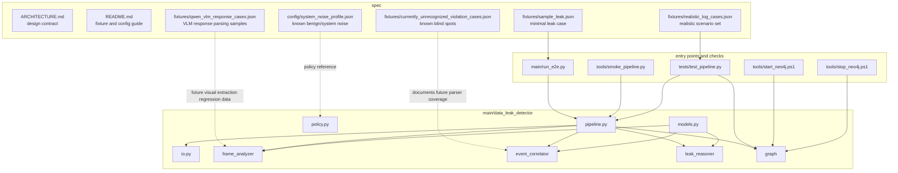

# Architecture

## Overview

DataLeakDetector has one implementation root:

```text
main/data_leak_detector/
```
The package exposes a three-stage detection pipeline plus an optional graph
writer:

```text
logs + optional frame observations
  -> FrameAnalyzer
  -> EventCorrelator
  -> LeakReasoner
  -> Neo4jGraphStore
  -> JSON report
```

## Stages

### FrameAnalyzer

`data_leak_detector.frame_analyzer` converts log context and optional
precomputed OCR/VLM observations into `FrameObservation` records. The current
implementation is deterministic and log-anchored, so the pipeline remains
testable without requiring a vision service.

### EventCorrelator

`data_leak_detector.event_correlator` binds sensitive files, derived files,
foreground applications, frame observations, and sink-like actions. It emits:

- correlated events;
- direct and full file lineage;
- upload candidates;
- Datalog facts for downstream reasoning.

### LeakReasoner

`data_leak_detector.leak_reasoner` runs a Python taint-propagation engine over
these relations:

- `OpenFile(operation, process, file, timestamp)`
- `TransferFile(operation, process, source, destination, timestamp)`
- `CrossProcessTransfer(operation, from_process, to_process, data, timestamp)`
- `ClipboardWrite(operation, process, data, timestamp)`
- `ClipboardRead(operation, process, data, timestamp)`
- `LeakFile(operation, process, file, channel, timestamp)`

The output is a list of `LeakPath` records.

### Neo4jGraphStore

`data_leak_detector.graph` optionally writes the report into Neo4j. Detection
does not require Neo4j; graph write errors are captured in `report["graph"]`
unless strict mode is enabled.

## Stable Data Contracts

The shared dataclasses in `main/data_leak_detector/models.py` are the primary
contracts between stages:

- `LogEvent`
- `FrameObservation`
- `CorrelatedEvent`
- `UploadCandidate`
- `DatalogFact`
- `LeakPath`
- `DetectionReport`

## Runtime Entry Points

CLI:

```powershell
python main/run_e2e.py --log spec/fixtures/sample_leak.json
```

Python:

```python
from data_leak_detector import run_pipeline

report = run_pipeline("spec/fixtures/sample_leak.json")
```

Neo4j:

```powershell
python main/run_e2e.py --log spec/fixtures/sample_leak.json --neo4j
```

## Component Graph



The arrows show runtime dependencies. Dotted arrows are specification or
regression references: they are intentionally not imported by the runtime, but
they explain cases the implementation should preserve or improve.

## Code File Map

| Area | Files | Responsibility |
| --- | --- | --- |
| Entry point | `main/run_e2e.py` | Parses CLI options and delegates all analysis to `run_pipeline`. |
| Core contracts | `models.py`, `io.py`, `policy.py`, `evidence_semantics.py` | Define data shapes, normalize input, centralize heuristic vocabulary, and define outcome semantics. |
| Pipeline wiring | `pipeline.py` | Connects analysis stages and optional graph writing into one canonical flow. |
| FrameAnalyzer | `frame_analyzer/__init__.py`, `frame_analyzer/analyzer.py` | Produces deterministic visual/log observations and exposes the stage boundary. |
| EventCorrelator | `event_correlator/*.py` | Binds logs, observations, source lineage, upload candidates, and Datalog facts. |
| LeakReasoner | `leak_reasoner/*.py` | Holds relation vocabulary, optional prompt boundary, and the Python taint engine. |
| Neo4j | `graph/__init__.py`, `graph/config.py`, `graph/store.py` | Reads graph settings and persists completed reports into Neo4j. |
| Tests | `tests/__init__.py`, `tests/test_pipeline.py` | Enforces the rewritten architecture's behavior without depending on old paths. |
| Tools | `tools/smoke_pipeline.py`, `tools/start_neo4j.ps1`, `tools/stop_neo4j.ps1` | Provide local verification and optional graph-runtime management. |
