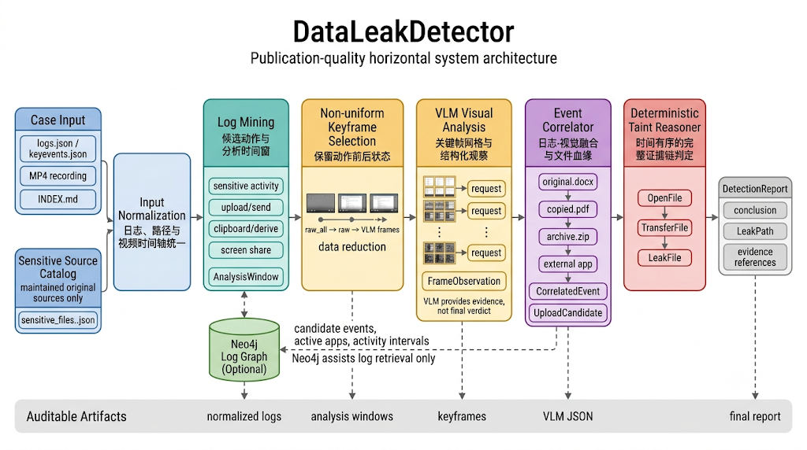
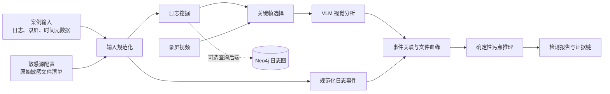

# DataLeakDetector 项目架构

## 1. 项目背景与意义

终端数据外泄通常不是一次孤立的上传操作，而是一条跨文件、跨应用、跨时间的行为链。用户可能先打开敏感文档，再复制内容、导出 PDF、压缩文件或生成截图，最后通过邮件、即时通信、AI 对话、网盘、代码托管、屏幕共享或外接设备将数据带离受控环境。

仅依赖文件名、单条日志或单张截图，难以同时判断敏感数据的来源、传播过程和最终去向。DataLeakDetector 面向终端日志与录屏联合分析场景，以维护的原始敏感文件清单为起点，结合日志、视觉证据和确定性推理，输出可审计的泄露结论与证据链。

系统的主要价值包括：

- 通过日志定位高价值时间段，降低长视频直接分析的成本；
- 通过 VLM 识别 GUI 中难以从日志直接获得的操作状态；
- 通过文件血缘与污点传播恢复原始文件、派生载体和外发汇聚点之间的关系；
- 输出结构化报告、关键帧和证据引用，支持人工复核、复现实验与错例分析。

> 说明：`groundtruth.json` 只用于事后评测，不参与敏感源发现、检测或推理。

## 2. 总体架构

系统由输入规范化、日志挖掘、视觉证据、事件关联和泄露推理五个阶段组成。Neo4j 是日志挖掘的可选加速后端；最终结论始终由事件关联和确定性污点推理生成。

## 3. 主流程

1. **输入规范化**：读取日志、录屏、`INDEX.md` 和敏感源配置，将日志绝对时间映射到视频时间轴，并统一路径、事件类型和应用信息。
2. **日志挖掘**：围绕敏感文件访问、复制粘贴、派生文件生成、上传发送和屏幕共享等行为，生成少量 `AnalysisWindow`。
3. **关键帧与 VLM 分析**：在分析窗口内选择有代表性的动作前后帧，发送给 VLM，得到结构化的界面行为观察，例如已选择附件、已粘贴内容或正在共享屏幕。
4. **事件关联与文件血缘**：结合日志和视觉观察，识别原始文件到复制件、导出文件、压缩包、剪贴板内容等派生载体的传播关系，并生成外发候选。
5. **泄露推理与报告**：从受控敏感源开始进行时间有序的污点传播；只有形成“敏感源 -> 中间传播步骤 -> 外部汇聚点”的完整路径，才输出确认的泄露路径和最终结论。

## 4. 模块边界

| 模块           | 职责                                           | 主要输出                                 |
| -------------- | ---------------------------------------------- | ---------------------------------------- |
| 输入与案例管理 | 发现案例、读取日志和视频、时间对齐、加载敏感源 | `LogEvent`、案例元数据                 |
| 日志挖掘       | 从原始事件流中定位候选操作与时间窗             | `AnalysisWindow`                       |
| 关键帧与 VLM   | 选取视觉证据帧、批量调用模型、解析结构化结果   | `FrameObservation`                     |
| 事件关联       | 融合日志和视觉证据、恢复文件血缘、构造外发候选 | `CorrelatedEvent`、`UploadCandidate` |
| 泄露推理       | 基于逻辑事实进行污点传播和完整路径判定         | `LeakPath`、检测结论                   |
| Neo4j（可选）  | 加速日志候选检索和上下文查询                   | 候选事件、活跃应用、敏感活动区间         |

各模块的具体策略与实现分别在后续文档展开：

- 日志挖掘：`01日志挖掘策略.md`、`01纯日志挖掘具体实现.md`、`01neo4j具体实现.md`
- 抽帧与去重：`02关键帧策略.md`、`02抽帧具体实现.md`、`02帧去重具体实现.md`
- VLM：`03vlm策略及实现.md`
- 事实收集与推理：`04事实收集及证据链推理`

## 5. 关键设计原则

- **敏感源可控**：初始敏感文件只来自维护的配置，派生文件通过血缘推导，不从标注或模型猜测中引入。
- **日志引导视觉**：日志负责缩小视频范围，VLM 负责补充 GUI 语义，避免整段视频逐帧送入模型。
- **模型观察、规则裁决**：VLM 输出的是结构化证据，不直接决定是否泄露；最终结论必须由可回溯的推理路径支撑。
- **可降级运行**：Neo4j 不可用时回退到 Python 内存日志挖掘；VLM 关闭时仍可输出日志锚定的风险观察。
- **全程可审计**：报告保留输入、窗口、关键帧、模型结果、关联事件、逻辑事实和最终路径。

## 6. 代码对应关系

| 架构部分           | 主要代码位置                                  |
| ------------------ | --------------------------------------------- |
| 端到端编排与报告   | `main/data_leak_detector/pipeline.py`       |
| 日志挖掘           | `main/data_leak_detector/log_mining.py`     |
| 关键帧与视觉分析   | `main/data_leak_detector/frame_analyzer/`   |
| 事件关联与文件血缘 | `main/data_leak_detector/event_correlator/` |
| 污点推理           | `main/data_leak_detector/leak_reasoner/`    |
| Neo4j 导入与查询   | `main/data_leak_detector/neo4j/`            |
