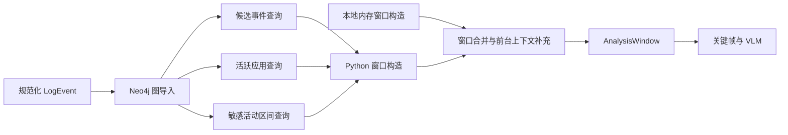

# Neo4j 日志挖掘具体实现

## 1. 作用与边界

Neo4j 是 DataLeakDetector 的**可选日志挖掘后端**。启用后，它将规范化日志导入为可索引的事件图，用于快速获取候选事件、候选附近的活跃应用和敏感活动区间。

Neo4j 不承担以下职责：

- 不保存或查询 VLM 视觉事件；
- 不构造文件血缘或最终 `LeakPath`；
- 不直接输出 `data_leak_risk_detected`；
- 不替代 Python 中的窗口语义和最终污点推理。

图查询的结果只用于辅助生成 `AnalysisWindow`。最终窗口仍会与 Python 内存挖掘结果合并，以保证两种后端的检测语义一致。



## 2. 启用与配置

默认不启用 Neo4j。可通过环境变量或命令行启用：

```powershell
$env:DLD_NEO4J_LOG_MINER = "1"
python main\run_e2e.py --case "spec\data\nas_samples\stage1\my-case" --vision --neo4j-log-miner
```

常用配置如下：

| 环境变量 | 默认值 | 含义 |
| --- | --- | --- |
| `DLD_NEO4J_URI` | `bolt://localhost:7687` | Bolt 连接地址 |
| `DLD_NEO4J_USER` | `neo4j` | 数据库用户名 |
| `DLD_NEO4J_PASSWORD` | `data-leak-detector` | 数据库密码，应通过 `.env` 保存 |
| `DLD_NEO4J_DATABASE` | `neo4j` | 使用的数据库名 |
| `DLD_NEO4J_LOG_MINER` | `0` | 是否启用图日志挖掘 |
| `DLD_NEO4J_LOG_MINER_STRICT` | `0` | 图服务出错时是否直接失败；关闭时回退内存路径 |
| `DLD_NEO4J_REUSE_IMPORT` | `1` | 是否复用同 case 的相同日志导入 |
| `DLD_NEO4J_LOG_MINER_SCHEMA_VERSION` | `1` | 图导入 schema 版本，用于失效旧缓存 |
| `DLD_NEO4J_LOG_MINER_BATCH_SIZE` | `2000` | 单次 `UNWIND` 写入的事件数 |

仓库提供 `docker-compose.neo4j.yml` 启动 Neo4j 5 Community，默认暴露 HTTP `7474` 和 Bolt `7687`。`main/run_e2e.py` 中的 `--neo4j-log-miner` 可强制开启，`--no-neo4j-log-miner` 可在环境变量开启时强制使用内存后端，`--no-reuse-neo4j-import` 可强制重新导入。

## 3. 图模型与索引

每个 case 以一个 `DLDCaseImport` 节点作为导入根，事件、文件、进程和应用均使用带 case ID 的唯一标识，避免不同案例的数据混淆。

```text
(:DLDCaseImport {case_id})
  -[:HAS_EVENT]-> (:DLDLogEvent)
                       -[:TOUCHES_FILE]-> (:DLDFile)
                       -[:BY_PROCESS]->   (:DLDProcess)
                       -[:IN_APP]->       (:DLDApp)
```

| 节点 | 关键属性 | 用途 |
| --- | --- | --- |
| `DLDCaseImport` | `case_id`、日志指纹、记录数、schema 版本、导入状态 | 导入隔离、复用判定与进度记录 |
| `DLDLogEvent` | 时间、视频相对时间、事件类型、文件、进程、应用、窗口标题和候选标记 | 候选检索与时间范围查询 |
| `DLDFile` | case 内文件 ID、原始路径、规范化路径 | 事件与文件的关系表达 |
| `DLDProcess` | case 内进程 ID、进程名 | 进程上下文 |
| `DLDApp` | case 内应用 ID、应用名 | 前端应用上下文 |

初始化时会创建 case、事件、文件、进程和应用的唯一约束，并创建以下事件索引：

- `(case_id, video_time_ms)`：按视频时间扫描候选事件；
- `(case_id, file_path_lower)`：按文件路径检索；
- `(case_id, is_candidate)`：候选事件筛选；
- `(case_id, is_risky_app)`：风险应用上下文；
- `(case_id, is_sensitive_related)`：敏感活动区间。

## 4. 日志事件预计算与图导入

### 4.1 `records_to_graph_events()`

导入前，每个 `LogEvent` 被转换为一个扁平的图事件对象。除基础字段外，`event_flags()` 预计算候选相关标记：

| 属性 | 判定来源 | 用途 |
| --- | --- | --- |
| `is_sensitive_related` | 敏感源路径、原始文本或敏感词 | 敏感活动与候选筛选 |
| `is_transfer_action` | 传输类词汇 | 候选与邻近上下文 |
| `is_sink_action` | 邮件、网盘、聊天、上传等汇聚点词汇 | 候选与邻近上下文 |
| `is_explicit_upload` | `file_selected`、`upload` 等事件类型或 `raw_operation` | 明确候选动作 |
| `is_candidate` | 上述敏感、传输、汇聚点或显式上传任一为真 | 候选事件主查询 |
| `app_category` / `app_risk_hint` | 前端应用识别 | 分类和风险应用上下文 |
| `is_risky_app` | 外部可达或未知外部汇聚点应用 | 邻近应用查询 |

伪代码如下：

```text
for event in normalized_logs:
    text = raw event + path + process + app + window title
    flags = {
        sensitive: source match or sensitive tokens,
        transfer: transfer tokens,
        sink: sink tokens,
        explicit_upload: event type or raw operation,
        risky_app: frontend app identity,
    }
    flags.is_candidate = any(sensitive, transfer, sink, explicit_upload)
    graph_events.append(event fields + flags + case-scoped IDs)
```

### 4.2 导入与复用

`Neo4jLogImporter.ensure_import()` 的执行顺序为：

```text
log_hash = SHA-256(canonical JSON of raw records)
ensure constraints and indexes

if same case_id, log_hash, records_count, schema_version, and import_status=ready
   and reuse_import=true:
    return reused import summary

graph_events = records_to_graph_events(logs, sensitive_files)
delete the old subgraph for this case
mark DLDCaseImport as importing
for each batch of graph_events:
    UNWIND batch and MERGE nodes + relationships
mark DLDCaseImport as ready and save import metadata
```

批量写入使用一条参数化 Cypher：

```cypher
MATCH (c:DLDCaseImport {case_id: $case_id})
UNWIND $events AS item
MERGE (e:DLDLogEvent {id: item.id})
SET e.case_id = $case_id,
    e.video_time_ms = item.video_time_ms,
    e.event_type = item.event_type,
    e.is_candidate = item.is_candidate
MERGE (c)-[:HAS_EVENT]->(e)
FOREACH (_ IN CASE WHEN item.file_path = "" THEN [] ELSE [1] END |
  MERGE (f:DLDFile {id: item.file_id})
  MERGE (e)-[:TOUCHES_FILE]->(f)
)
```

完整实现还会写入进程、应用和所有预计算属性。导入完成后 `DLDCaseImport` 记录日志文件、哈希、记录数、schema 版本、导入事件数、批次数和完成时间。

> 复用边界：当前导入指纹只计算原始 `records`，不包含敏感源配置。若同一 case 的敏感文件清单发生变化，应使用 `--no-reuse-neo4j-import` 强制重导，或提升 `DLD_NEO4J_LOG_MINER_SCHEMA_VERSION`，避免复用旧的 `is_sensitive_related` 标记。

## 5. 三类 Cypher 查询

### 5.1 候选事件

候选查询返回可映射到视频时间轴的候选事件 ID，并按视频时间排序：

```cypher
MATCH (c:DLDCaseImport {case_id: $case_id})-[:HAS_EVENT]->(e:DLDLogEvent)
WHERE e.video_time_ms >= 0 AND e.is_candidate = true
RETURN e.event_id AS event_id
ORDER BY e.video_time_ms ASC
```

Python 通过 `event_id -> LogEvent` 字典取回完整内存事件，再调用与内存后端相同的 `build_analysis_window_for_event()`。图查询负责缩小候选集合，窗口语义仍由 Python 代码统一实现。

### 5.2 候选附近的活跃应用

对于每个候选事件，查询给定时间半径内的风险应用、汇聚点动作或传输动作，填充窗口的 `active_apps`：

```cypher
MATCH (c:DLDCaseImport {case_id: $case_id})-[:HAS_EVENT]->(e:DLDLogEvent)
WHERE e.event_id IN $event_ids
OPTIONAL MATCH (c)-[:HAS_EVENT]->(near:DLDLogEvent)
WHERE near.video_time_ms >= e.video_time_ms - $radius_ms
  AND near.video_time_ms <= e.video_time_ms + $radius_ms
  AND (near.is_risky_app OR near.is_sink_action OR near.is_transfer_action)
RETURN e.event_id, collect(DISTINCT coalesce(near.app_name, near.process_name, "")) AS active_apps
```

时间半径使用视觉配置中的窗口后半径和强窗口后半径的较大值，避免遗漏动作发生后才出现的应用状态。

### 5.3 敏感活动区间

查询以 `is_sensitive_related=true` 事件为基础：先取得 session 结束时间，再按敏感文件收集起始时间和锚点；最后寻找同一文件的关闭事件，缺失时以 session 结束作为终点。期间的非白名单活跃应用也会一并返回。

其结果被转换为 `priority="activity"` 的 `AnalysisWindow`。若图查询没有返回有效区间，系统回退到 Python 的 `build_sensitive_activity_windows()`。

## 6. 图查询与本地语义合并

`Neo4jLogMiner.mine()` 不会只相信图查询结果。其核心流程如下：

```text
connect and verify Neo4j
ensure_import()
candidate_ids = graph query
app_context = graph query
activity_rows = graph query

graph_action_windows = build windows from candidate IDs
graph_activity_windows = build activity windows from rows
local_windows = build_analysis_windows(logs, sensitive_files, config)

windows = finalize(graph_action_windows + local_windows,
                   graph_activity_windows,
                   logs)
if windows is empty:
    windows = local_windows
```

这样做是刻意的：当 Python 新增某种动作语义而 Neo4j 的预计算候选标记尚未更新时，本地窗口仍能保留该证据。Neo4j 是加速和补充上下文的后端，而不是窗口语义的唯一事实来源。

最终 `LogMiningResult` 会记录 `source="neo4j"`、导入是否复用、日志哈希、候选事件数、敏感活动区间数、批大小和最终窗口数，便于在报告中审计实际执行路径。

## 7. 故障回退与预热

运行时建立 Bolt 连接后会调用 `verify_connectivity()`。若连接、导入或查询失败：

- `DLD_NEO4J_LOG_MINER_STRICT=1`：抛出异常并使本次运行失败；
- 默认 strict 关闭：改用 `InMemoryLogMiner`，返回 `source="in_memory_fallback"`，并在元数据中保留异常类型和原因。

对于批量实验，可使用 `tools/warm_neo4j.py` 预热所有案例的日志图。该工具复用与流水线完全相同的案例发现、日志加载和 `Neo4jLogImporter`，逐 case 将进度写入 `artifacts/neo4j_warmup_progress.json`。预热不会运行关键帧、VLM、事件关联或泄露推理。

## 8. 代码对应关系

| 职责 | 代码位置 |
| --- | --- |
| Neo4j 环境配置和开关 | `main/data_leak_detector/neo4j/config.py` |
| 约束、索引、指纹复用和批量导入 | `main/data_leak_detector/neo4j/importer.py` |
| 候选、应用上下文和活动区间 Cypher | `main/data_leak_detector/neo4j/queries.py` |
| 图后端编排、窗口合并和故障回退 | `main/data_leak_detector/log_mining.py` |
| 容器化服务 | `docker-compose.neo4j.yml` |
| 批量预热工具 | `tools/warm_neo4j.py` |

内存实现见 `01纯日志挖掘具体实现.md`；策略和最终行为口径分别见 `01日志挖掘策略.md` 与 `00口径.md`。
