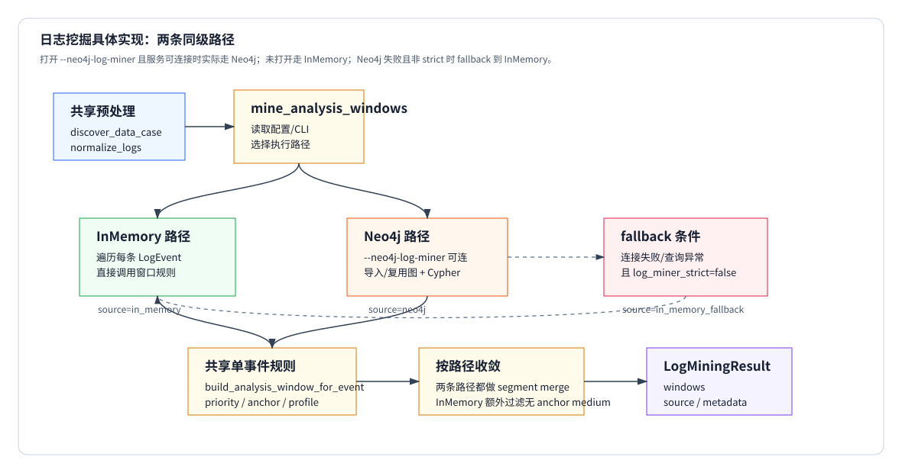

# 01 日志挖掘策略：具体实现

本文解释当前代码如何把 `logs.json` 变成 `AnalysisWindow`。重点是：**InMemory 和 Neo4j 是两条同级执行路径**。它们共享前面的数据发现、日志归一化和后面的窗口生成规则；区别在于候选事件从哪里来。下面按实现边界拆成三个一级章节：`共享预处理`、`InMemory 路径`、`Neo4j 路径`。



当前执行关系是：

```text
未启用 Neo4j log miner
  -> InMemoryLogMiner

启用 Neo4j log miner，且 Neo4j 服务可连接
  -> Neo4jLogMiner

启用 Neo4j log miner，但连接/查询失败，且非 strict
  -> InMemoryLogMiner fallback

启用 Neo4j log miner，但连接/查询失败，且 strict
  -> 直接失败
```

也就是说，Neo4j 不是“写在文档里的备用想法”。只要命令打开了 `--neo4j-log-miner`，并且本地 Neo4j 服务、账号、密码、database 可用，代码就会真正走 `Neo4jLogMiner` 路径，报告里应看到 `log_miner.source="neo4j"`。最近 artifact 里显示 `in_memory_fallback`，只是因为当时 `localhost:7687` 没连上。

对应代码：

- `main/data_leak_detector/datasets.py`
- `main/data_leak_detector/io.py`
- `main/data_leak_detector/log_mining.py`
- `main/data_leak_detector/neo4j/importer.py`
- `main/data_leak_detector/neo4j/queries.py`
- `main/data_leak_detector/frame_analyzer/frames.py`

# 共享预处理

InMemory 和 Neo4j 进入日志挖掘前，共享同一套输入准备逻辑。

## 1. 发现样例文件

### 输入

```text
spec/data/nas_samples/stage1/2-ai-DeepSeek-1
```

目录里可能有多个视频：

```text
video/recording_20260309_182312.mp4
video/recording_20260420_210407.mp4
INDEX.md
groundtruth.json
logs/logs.json
```

### 机械规则

`discover_data_case(...)` 选日志、视频、敏感源和录屏起点。

选日志：

```python
candidates = [
    case_dir / "logs" / "logs.json",
    case_dir / "logs" / "keyevents.json",
    case_dir / "keyevents.json",
    case_dir / "logs.json",
]
return first_existing_non_empty_file
```

选视频时，优先按 `INDEX.md`：

```python
for match in re.findall(r"`([^`]+\.mp4)`", index_text):
    if (case_dir / match).exists():
        return case_dir / match

session_id = re.search(r"Session ID\*\*:\s*([0-9_]+)", index_text)
if session_id:
    return candidate whose filename contains session_id
```

读录屏起点：

```python
recording_start_ms =
    groundtruth["recording_start_time"]
    or INDEX.md["Recording Time"]
    or 0
```

### 输出

```text
DataCase(
  log_file=".../logs/logs.json",
  video_file=".../video/recording_20260420_210407.mp4",
  sensitive_files=(...),
  recording_start_ms=1776719047000
)
```

这个步骤解决两个实际问题：

- 多 mp4 目录不能排序取第一个，要按 `INDEX.md` 的 session 选。
- 有录屏前历史日志时，必须用录屏起点对齐时间轴。

## 2. 读取并归一化日志

### 输入

```json
{
  "timestamp": "2026-03-10T00:15:56.517",
  "event_type": "file_selected",
  "file_path": "C:\\Users\\46521\\Desktop\\数据采集测试\\公司合作合同.docx",
  "process_info": {
    "process_name": "Cherry Studio"
  },
  "window_info": {
    "window_title": "打开"
  },
  "extra": {
    "source": "file_dialog_monitor"
  }
}
```

### 机械规则

`load_json_records(...)` 负责读 JSON/JSON Lines，并修复常见格式问题：

```python
text = read_text(path).strip()
if text.startswith("["):
    return _only_objects(json.loads(_repair_json(text)))

for line in text.splitlines():
    records.extend(_only_objects(json.loads(_repair_json(line))))
```

`normalize_logs(records, session_start_ms=...)` 转成 `LogEvent`：

```python
timestamp_ms = parse_timestamp_ms(record["timestamp"])
video_time_ms = _video_time_ms(record, timestamp_ms, session_start_ms)
file_path = normalize_path(record["file_path"] or record["path"] or upload["original_file"])
process_name = record["process_name"] or process_info["process_name"]
app_name = record["app_name"] or process_info["app_name"] or process_name
window_title = record["window_title"] or window_info["window_title"]
```

`_video_time_ms(...)`：

```python
if extra.relative_timestamp exists:
    return int(relative_timestamp * 1000)

delta = timestamp_ms - session_start_ms
if delta < 0 and explicit_session_start:
    return -1
return max(delta, 0)
```

### 输出

```text
LogEvent(
  event_id="log_123",
  timestamp_ms=1773101756517,
  video_time_ms=19517,
  event_type="file_selected",
  file_path="C:/Users/46521/Desktop/数据采集测试/公司合作合同.docx",
  process_name="Cherry Studio",
  app_name="Cherry Studio",
  window_title="打开"
)
```

如果日志早于录屏起点，`video_time_ms=-1`，后续不会生成抽帧窗口。

## 3. 入口如何选择路径

### 输入

```text
case_id
log_file
records
logs
sensitive_files
vision_config
neo4j_log_miner
```

### 机械规则

`mine_analysis_windows(...)`：

```python
config = Neo4jConfig.from_env()
enabled = config.log_miner_enabled if neo4j_log_miner is None else neo4j_log_miner

if not enabled:
    return InMemoryLogMiner().mine(...)

try:
    return Neo4jLogMiner(config).mine(...)
except Exception as exc:
    if config.log_miner_strict:
        raise
    return InMemoryLogMiner().mine(..., source="in_memory_fallback")
```

命令行对应关系：

```powershell
python main/run_e2e.py `
  --case "..." `
  --neo4j-log-miner `
  --vision `
  --vision-mode ocr
```

这会把 `neo4j_log_miner=True` 传给 `mine_analysis_windows(...)`。如果 Neo4j 服务可连，它就走 Neo4j；如果不可连，非 strict 下才 fallback。

### 输出

```text
LogMiningResult(
  windows=[...],
  source="in_memory" | "neo4j" | "in_memory_fallback",
  metadata={...}
)
```

# InMemory 路径

InMemory 路径不需要外部服务。它直接遍历 `logs: list[LogEvent]`，对每条日志套窗口规则。

## 1. 遍历日志并生成候选窗口

### 输入

```text
logs: list[LogEvent]
sensitive_files
VisionConfig
```

### 机械规则

`build_analysis_windows(...)`：

```python
windows = []
sensitive = tuple(normalize_path(item).lower() for item in sensitive_files)
app_index = _ActiveAppIndex.from_logs(logs)

for event in logs:
    window = build_analysis_window_for_event(
        event,
        logs,
        sensitive,
        config,
        normalized_sensitive=True,
    )
    if window is not None:
        windows.append(window)

segmented = _merge_windows_by_case_segment(windows, config)
filtered = _filter_visual_context_windows(segmented, config)
return _attach_active_apps_to_windows(filtered, app_index)
```

### 输出

```text
list[AnalysisWindow]
```

## 2. 单条事件如何变成窗口

### 输入

```text
event_type="file_selected"
video_time_ms=19517
file_path=".../公司合作合同.docx"
process_name="Cherry Studio"
window_title="打开"
sensitive_files=(".../公司合作合同.docx",)
```

### 机械规则 1：拼搜索文本

`_event_search_text(event)` 拼接：

```python
event_type
file_path
process_name
app_name
window_title
description
raw["file_name"], raw["operation"], raw["path"], raw["destination_path"]
flatten(raw["extra"], raw["upload_detection"], raw["process_info"], raw["window_info"])
```

输出：

```text
"file_selected ... 公司合作合同.docx Cherry Studio 打开 file_dialog_monitor ..."
```

### 机械规则 2：算三类命中

```python
file_text = normalize_path(event.file_path).lower()
sensitive_hit = _matches_sensitive_source(file_text, text, sensitive_files) or looks_sensitive(file_text)
transfer_hit = contains_any(text, TRANSFER_TOKENS)
sink_hit = contains_any(text, SINK_TOKENS)
```

`_matches_sensitive_source(...)`：

```python
if sensitive_path in file_text:
    return True

filename = basename(sensitive_path)
stem = filename_without_ext
if filename in search_text:
    return True
if len(stem) >= 4 and stem in search_text:
    return True
```

这个例子：

```text
公司合作合同.docx in event.file_path
=> sensitive_hit=True
```

### 机械规则 3：定优先级

`_window_priority(...)`：

```python
if event_type in {"file_selected", "file_upload", "upload", "uploaded", "upload_complete"}:
    return "strong"

if raw_operation in {"file_selected", "file_upload", "upload", "send_click"}:
    return "strong"

if process_name == "fsquirt.exe":
    return "strong"

if category contains "文件上传" or "直接外发":
    return "strong"

if operation_detail contains "附件" / "文件选择" / "已发送" / "外发" / "上传":
    return "strong"

if upload_detection looks completed and sensitive_hit:
    return "strong"

if event_type in {"clipboard_image", "screenshot", "screen_capture"}:
    return "medium"

if event_type in {"app_switch", "window_changed", "window_closed"} and process is sink app:
    return "medium"

if sensitive_hit:
    return "medium"

if sink_hit and event_type in {"clipboard_text", "app_switch", "window_changed", "window_closed"}:
    return "medium"

if risk_level == "high":
    return "weak"

return "none"
```

这个例子：

```text
event_type=file_selected
=> priority=strong
```

### 机械规则 4：丢弃不能抽帧的事件

```python
if priority == "none" or event.video_time_ms < 0:
    return None

if priority == "weak" and not config.include_weak_windows:
    return None
```

### 机械规则 5：套窗口参数

```python
strong:
  before=5000
  after=15000
  step=250
  max_keyframes=24
  diff_threshold=0.015

medium:
  before=30000
  after=120000
  step=1000
  max_keyframes=2
  diff_threshold=0.08

weak:
  before=30000
  after=120000
  step=2000
  max_keyframes=2
  diff_threshold=0.08
```

### 机械规则 6：生成 anchor

`_event_anchors(...)`：

```python
if event_type == "app_switch" and process_name == "fsquirt.exe":
    return (event_time,)

if process_name == "fsquirt.exe" and file_path and sensitive_hit:
    return (event_time, event_time + 3000, event_time + 8000)

if event_type in {"app_switch", "window_changed"} and sensitive_hit:
    return (event_time,)

if window_title looks like print/save dialog:
    return (event_time,)

if app/window event and process is sink app:
    return (event_time,)

if sensitive_hit and file_path looks like screenshot:
    return (event_time,)

if event_type in {"clipboard_image", "screenshot", "screen_capture", "file_selected", "file_upload", "upload", "uploaded", "upload_complete"}:
    return (event_time,)

return ()
```

这个例子：

```text
file_selected at 19517
=> anchor_ms=(19517,)
```

### 输出

```text
AnalysisWindow(
  start_ms=14517,
  end_ms=34517,
  reason="strong:file_selected:file_dialog_monitor",
  priority="strong",
  step_ms=250,
  max_keyframes=24,
  diff_threshold=0.015,
  anchor_ms=(19517,)
)
```

## 3. InMemory 的收敛

InMemory 生成一堆候选窗口后，还要做三步收敛。

### 3.1 medium 按 case segment 分组

```python
if window.priority == "medium":
    event_ms = _window_source_event_ms(window, config)
    segment = event_ms // config.case_segment_ms
    medium_by_segment[segment].append(window)
```

默认：

```text
case_segment_ms=300000
```

即 5 分钟一段。这样长视频不会把所有 medium 合成一个超长窗口。

### 3.2 同优先级重叠窗口合并

只合并同优先级重叠窗口：

```python
start_ms = previous.start_ms
end_ms = max(previous.end_ms, window.end_ms)
step_ms = min(previous.step_ms, window.step_ms)
max_keyframes = max(previous.max_keyframes, window.max_keyframes, len(anchors))
diff_threshold = min(previous.diff_threshold, window.diff_threshold)
anchor_ms = sorted(unique(previous.anchor_ms + window.anchor_ms))
```

关键点：

```text
max_keyframes >= len(anchor_ms)
```

合并后 anchor 不会被预算挤掉。

### 3.3 过滤无 anchor medium

```python
if config.include_unanchored_medium_windows:
    return windows

kept = [
    window for window in windows
    if window.priority != "medium" or window.anchor_ms
]

has_direct_evidence = any(window.priority == "strong" or window.anchor_ms for window in windows)

if has_direct_evidence:
    return kept

if no direct evidence:
    keep earliest medium as fallback
```

默认：

```text
include_unanchored_medium_windows=False
```

这一步过滤浏览器缓存、Recent、IndexedDB 等无 anchor 的 medium 噪声。

# Neo4j 路径

Neo4j 路径和 InMemory 同级。打开 `--neo4j-log-miner` 且服务可连接时，代码会实际导入/复用图数据，并用 Cypher 查询候选事件。

## 1. 连接和执行入口

### 输入

```text
case_id
log_file
records
logs
sensitive_files
vision_config
Neo4jConfig
```

### 机械规则

`Neo4jLogMiner.mine(...)`：

```python
driver = GraphDatabase.driver(
    config.uri,
    auth=(config.user, config.password),
    connection_timeout=1.0,
    connection_acquisition_timeout=1.0,
    max_transaction_retry_time=0.0,
)

driver.verify_connectivity()
with driver.session(database=config.database) as session:
    summary = importer.ensure_import(...)
    candidate_ids = queries.candidate_event_ids(session, case_id)
    app_context = queries.active_apps_for_events(...)
```

只要 `verify_connectivity()` 成功，后面就是 Neo4j 路径。

### 输出

```text
candidate_ids: list[str]
app_context: dict[event_id, tuple[app]]
summary: ImportSummary
```

## 2. 导入/复用图事件

### 输入

```text
records
logs: list[LogEvent]
sensitive_files
case_id
```

### 机械规则 1：日志指纹复用

`ensure_import(...)`：

```python
log_hash = sha256(json.dumps(records, sort_keys=True))

reusable =
    case_id same
    and log_hash same
    and records_count same
    and schema_version same
    and import_status == "ready"

if reusable and config.reuse_import:
    return ImportSummary(imported=False, reused=True)
```

所以重复跑固定 case 时，Neo4j 不一定重新导入。

### 机械规则 2：建 schema

会创建：

```text
Constraint:
  DLDCaseImport.case_id
  DLDLogEvent.id
  DLDFile.id
  DLDProcess.id
  DLDApp.id

Index:
  (DLDLogEvent.case_id, DLDLogEvent.video_time_ms)
  (DLDLogEvent.case_id, DLDLogEvent.file_path_lower)
  (DLDLogEvent.case_id, DLDLogEvent.is_candidate)
  (DLDLogEvent.case_id, DLDLogEvent.is_risky_app)
  (DLDLogEvent.case_id, DLDLogEvent.is_sensitive_related)
```

### 机械规则 3：把 LogEvent 变成图事件

`records_to_graph_events(...)` 给每条日志生成属性：

```text
id
event_id
timestamp_ms
video_time_ms
event_type
file_path
file_path_lower
process_name
app_name
window_title
raw_text
is_sensitive_related
is_transfer_action
is_sink_action
is_explicit_upload
is_candidate
app_category
app_known
app_risk_hint
is_risky_app
```

`event_flags(...)`：

```python
sensitive_related =
    sensitive path in file_path
    or sensitive path in raw_text
    or contains_any(text, SENSITIVE_TOKENS)

transfer_action = contains_any(text, TRANSFER_TOKENS)
sink_action = contains_any(text, SINK_TOKENS)

explicit_upload =
    event_type in {"file_selected", "file_upload", "upload", "uploaded", "upload_complete"}
    or raw_operation in {"file_selected", "file_upload", "upload", "send_click"}

is_candidate = sensitive_related or transfer_action or sink_action or explicit_upload
```

同时会建关系：

```text
(:DLDCaseImport)-[:HAS_EVENT]->(:DLDLogEvent)
(:DLDLogEvent)-[:TOUCHES_FILE]->(:DLDFile)
(:DLDLogEvent)-[:BY_PROCESS]->(:DLDProcess)
(:DLDLogEvent)-[:IN_APP]->(:DLDApp)
```

### 输出

```text
ImportSummary(
  imported=True/False,
  reused=True/False,
  log_hash=...,
  imported_events=N,
  import_batches=M
)
```

## 3. Cypher 查询候选事件

### 输入

已经导入的图事件。

### 机械规则

候选事件查询：

```cypher
MATCH (c:DLDCaseImport {case_id: $case_id})-[:HAS_EVENT]->(e:DLDLogEvent)
WHERE e.video_time_ms >= 0 AND e.is_candidate = true
RETURN e.event_id AS event_id
ORDER BY e.video_time_ms ASC
```

active apps 查询：

```cypher
MATCH (c:DLDCaseImport {case_id: $case_id})-[:HAS_EVENT]->(e:DLDLogEvent)
WHERE e.event_id IN $event_ids
OPTIONAL MATCH (c)-[:HAS_EVENT]->(near:DLDLogEvent)
WHERE near.video_time_ms >= e.video_time_ms - $radius_ms
  AND near.video_time_ms <= e.video_time_ms + $radius_ms
  AND (near.is_risky_app = true OR near.is_sink_action = true OR near.is_transfer_action = true)
WITH e, collect(DISTINCT coalesce(near.app_name, near.process_name, "")) AS apps
RETURN e.event_id AS event_id, [app IN apps WHERE app <> ""] AS active_apps
ORDER BY e.video_time_ms ASC
```

### 输出

```text
candidate_ids=["log_123", "log_456", ...]
app_context={
  "log_123": ("Cherry Studio", "Chrome", ...)
}
```

## 4. Neo4j 查询结果怎么变成窗口

### 输入

```text
candidate_ids
app_context
logs
sensitive_files
vision_config
```

### 机械规则

`_windows_from_candidates(...)`：

```python
events_by_id = {event.event_id: event for event in logs}

for event_id in candidate_ids:
    event = events_by_id.get(event_id)
    window = build_analysis_window_for_event(
        event,
        logs,
        sensitive_files,
        vision_config,
        active_apps=tuple(app_context.get(event_id, ())),
    )
    if window:
        windows.append(window)
```

注意：这里和 InMemory 使用同一个窗口生成函数。Neo4j 负责候选收窄和上下文查询，不另写一套窗口策略。

### 输出

```text
windows: list[AnalysisWindow]
```

## 5. Neo4j 路径的收敛

Neo4j 生成窗口后也会合并：

```python
merged = _merge_windows_by_case_segment(windows, vision_config)
```

当前 Neo4j 路径没有显式调用 `_filter_visual_context_windows(...)`，因为候选入口已经被 `is_candidate=true` 收窄；它共享的是单事件窗口生成规则和 segment merge。如果后续需要完全对齐 InMemory 行为，可以把相同过滤也接上。

### 输出

```text
LogMiningResult(
  source="neo4j",
  windows=merged,
  metadata={
    "candidate_events": len(candidate_ids),
    "imported": summary.imported,
    "reused_import": summary.reused,
    ...
  }
)
```

# fallback 不是第三条主路径

fallback 是 Neo4j 路径失败后的错误处理，不是和前两者同级的策略。

### 触发条件

```text
--neo4j-log-miner 已打开
Neo4j 连接失败 / verify_connectivity 失败 / 查询异常
DLD_NEO4J_LOG_MINER_STRICT=false
```

### 行为

```python
fallback = InMemoryLogMiner().mine(...)
metadata["neo4j_enabled"] = True
metadata["fallback_reason"] = "ServiceUnavailable: ..."
return LogMiningResult(source="in_memory_fallback", windows=fallback.windows)
```

### artifact 里怎么看

```json
{
  "log_miner": {
    "source": "in_memory_fallback",
    "neo4j_enabled": true,
    "fallback_reason": "ServiceUnavailable: Couldn't connect to localhost:7687 ..."
  }
}
```

如果服务打开并配置正确，则应该看到：

```json
{
  "log_miner": {
    "source": "neo4j",
    "neo4j_enabled": true,
    "candidate_events": 123,
    "reused_import": true
  }
}
```

# 共享窗口规则

无论候选来自 InMemory 还是 Neo4j，最终 `AnalysisWindow` 的字段含义一致：

```text
start_ms
end_ms
reason
priority
step_ms
max_keyframes
diff_threshold
anchor_ms
active_apps
```

## GPT case：file_selected 到 strong 窗口

实际输出：

```text
artifacts/neo4j_frame_selection_check/2-ai-gpt-cherystudio-2_logs_402.json
recording_start_ms=1773101737000
video_file=recording_20260310_001537.mp4
```

机械过程：

```text
timestamp="2026-03-10T00:15:56.517"
recording_start_time="2026-03-10 00:15:37"
=> video_time_ms=19517

event_type=file_selected
=> priority=strong

event_type=file_selected
=> anchor_ms=(19517,)

strong profile:
  before=5000
  after=15000
=> window=[14517, 34517]
```

输出窗口：

```text
AnalysisWindow(
  start_ms=14517,
  end_ms=34517,
  priority="strong",
  anchor_ms=(19517,),
  step_ms=250,
  max_keyframes=24
)
```

抽帧结果里对应：

```text
14517ms strong:visual_change
19517ms strong:anchor
30517ms strong:visual_change
```

## Bluetooth case：为什么是 strong 蓝牙窗口

实际输出：

```text
artifacts/neo4j_frame_selection_check/Bluetooth-SensitiveLeak_logs_3034.json
log_miner.windows=2
analysis_windows=2
```

机械规则：

```text
process_name == fsquirt.exe
=> priority=strong

fsquirt.exe app_switch
=> anchor=(event_time,)

fsquirt.exe sensitive file access
=> anchor=(event_time, event_time+3000, event_time+8000)
```

OCR 结果验证窗口覆盖了蓝牙流程：

```text
119780ms "设置 ... 蓝牙和其他设备 ..."
120742ms "蓝牙文件传送 ... 使用蓝牙传送文件 ..."
123742ms "选择发送文件的目的地 ..."
126445ms "选择要发送的文件 ..."
144253ms "正在发送的文件 ..."
149253ms "文件已成功传输 ..."
```

# 排查顺序

如果某个关键时间没进窗口，按实现顺序查：

1. `DataCase.video_file` 是否选对。
2. `DataCase.recording_start_ms` 是否非 0。
3. `event.video_time_ms` 是否落在视频内。
4. 是否启用了 `--neo4j-log-miner`。
5. 如果启用 Neo4j，`log_miner.source` 是 `neo4j` 还是 `in_memory_fallback`。
6. InMemory 路径下，`_event_search_text(...)` 是否包含文件名/extra/upload_detection。
7. InMemory 路径下，`_window_priority(...)` 返回什么。
8. Neo4j 路径下，事件是否被导入为 `is_candidate=true`。
9. Neo4j 路径下，`candidate_event_ids(...)` 是否返回该事件。
10. `_event_anchors(...)` 是否给 anchor。
11. medium 是否被 `_filter_visual_context_windows(...)` 丢弃。
12. 最终 `LogMiningResult.windows` 是否覆盖目标时间。
