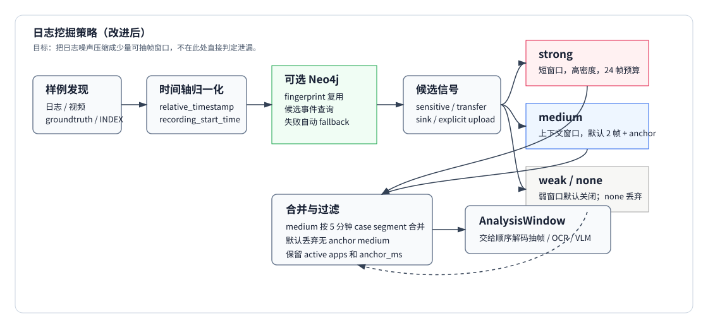
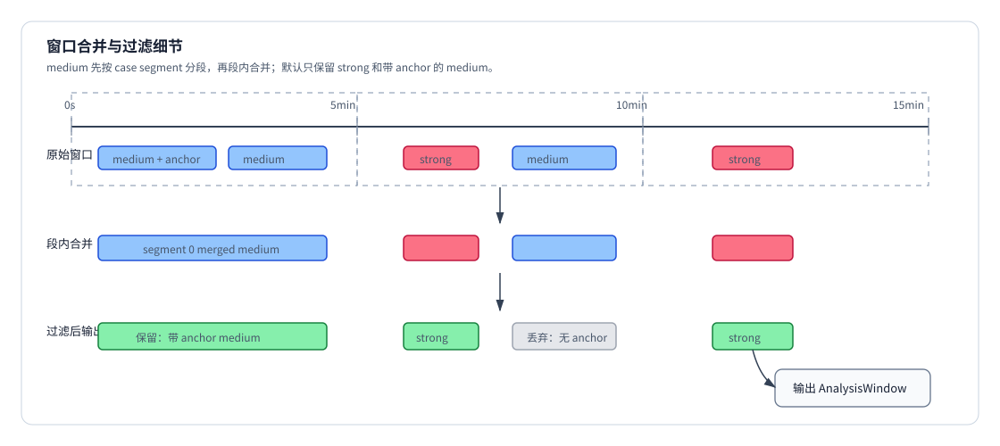
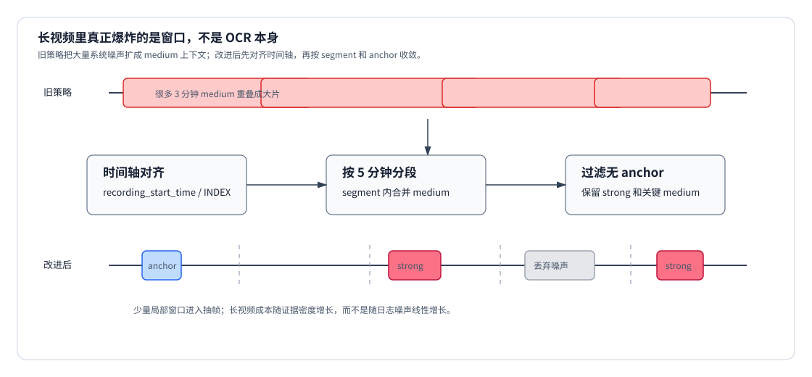

# 日志挖掘策略（改进后）

本文对应当前实现里的 `main/data_leak_detector/log_mining.py`、`main/data_leak_detector/io.py`、`main/data_leak_detector/datasets.py` 和 `main/data_leak_detector/frame_analyzer/config.py`。旧版 `01日志挖掘策略.md` 的大方向仍然成立：日志挖掘不直接判定泄漏，而是把海量低层日志压缩成少量 `AnalysisWindow`，交给抽帧、OCR/VLM、事件关联和 Datalog 推理继续处理。

但当前策略已经做过一轮收紧，和旧文档不完全一致。新版重点是：

- 先把日志时间轴对齐到录屏时间轴，再决定能不能抽帧。
- 强证据直接保留短窗口；中等证据按 case 分段合并，并默认只保留带 anchor 的窗口。
- 弱窗口默认不输出。
- medium 窗口默认只给很少的视觉变化预算，真正关键的时间点靠 `anchor_ms` 保住。
- Neo4j 是可选加速/复用路径，失败时自动回退到 in-memory。
- 视觉阶段不做 ROI 试探；当前 OCR 输入来自日志窗口内的去重关键帧。

## 总体流程



整体分成七步：

1. `discover_data_case(...)` 选择日志、视频、groundtruth，并从 `groundtruth.json` 或 `INDEX.md` 读取录屏起点。
2. `normalize_logs(...)` 归一化原始日志，把 `timestamp` 或 `extra.relative_timestamp` 映射为 `video_time_ms`。
3. 可选导入 Neo4j，复用相同日志指纹；Neo4j 不可用时回退到 in-memory。
4. 对每条候选事件计算 `sensitive_hit`、`transfer_hit`、`sink_hit`。
5. 通过 `_window_priority(...)` 转成 `strong`、`medium`、`weak` 或丢弃。
6. 生成 `AnalysisWindow`，写入窗口范围、步长、帧预算、差分阈值、anchor 和 active apps。
7. 对 medium 窗口做 case 分段合并和上下文过滤，再交给抽帧器。

## 时间轴对齐

时间轴是当前策略里最重要的前置条件。很多 NAS 样例的日志文件包含录屏前的历史事件；如果直接用第一条日志当视频 `0ms`，关键事件会被映射到视频时长之外，抽帧必然抓不到。

当前规则如下：

| 输入 | 优先级 | 行为 |
|---|---:|---|
| `extra.relative_timestamp` | 最高 | 直接转成 `video_time_ms` |
| `groundtruth.json.recording_start_time` | 高 | 用日志绝对时间减录屏起点 |
| `INDEX.md` 的 `Recording Time` | 高 | 当 groundtruth 没有起点时使用 |
| 第一条可解析日志时间 | 低 | 只在没有显式录屏起点时作为兜底 |

如果存在显式录屏起点，并且某条日志早于录屏起点，该日志的 `video_time_ms=-1`，不会生成抽帧窗口。这样可以避免旧剪贴板、缓存、历史窗口事件全部堆到 `0ms`。

`discover_data_case(...)` 还会优先按 `INDEX.md` 选择视频文件。像 `2-ai-DeepSeek-1` 这类目录里有多个 mp4 的样例，不能简单取第一个视频。

## 候选信号

窗口不再由“全文看起来敏感”粗暴触发，而是拆成几类信号：

| 信号 | 来源 | 用途 |
|---|---|---|
| `sensitive_hit` | 文件路径命中敏感源，或文件名/stem 出现在事件文本里 | 判断是否和敏感文件相关 |
| `transfer_hit` | 传输、发送、复制、蓝牙等词 | 判断是否可能发生数据移动 |
| `sink_hit` | 上传、分享、附件、外部接收端等词 | 判断是否靠近外发通道 |
| `explicit_upload` | `file_selected`、`upload`、`send_click` 等明确动作 | 直接升级为 strong |
| sink app | QQ、微信、钉钉、飞书、Lark 等前台进程 | 给即时通讯窗口补 medium anchor |
| Bluetooth | `fsquirt.exe` | 直接视为 strong 外发通道 |

一个重要收紧是：普通 `created/modified/deleted` 不会因为文件系统噪声自动开大窗口。它必须命中敏感文件、sink、明确上传、蓝牙或其他高价值条件，才会进入窗口生成。

## 窗口优先级

当前优先级由 `_window_priority(...)` 决定。

| 优先级 | 触发条件 | 默认范围 | 步长 | 默认保留帧预算 |
|---|---|---:|---:|---:|
| `strong` | `file_selected`、`upload`、`send_click`、`fsquirt.exe`、明确上传检测且命中敏感文件、明确外发/附件/文件选择描述 | 事件前 5s 到后 15s | 250ms | 24 |
| `medium` | 敏感源命中、截图/录屏事件、sink app 前台切换、sink 词出现在剪贴板或窗口事件里 | 事件前 30s 到后 120s | 1000ms | 2 |
| `weak` | `risk_level=high` 但没有更强证据 | 事件前 30s 到后 120s | 2000ms | 2，默认不输出 |
| `none` | 没有足够信号，或时间无法映射到视频 | 无 | 无 | 0 |

配置项来自 `VisionConfig`：

- `DLD_STRONG_WINDOW_BEFORE_MS=5000`
- `DLD_STRONG_WINDOW_AFTER_MS=15000`
- `DLD_FRAME_WINDOW_BEFORE_MS=30000`
- `DLD_FRAME_WINDOW_AFTER_MS=120000`
- `DLD_MAX_KEYFRAMES_PER_STRONG_WINDOW=24`
- `DLD_MAX_KEYFRAMES_PER_MEDIUM_WINDOW=2`
- `DLD_MAX_KEYFRAMES_PER_WEAK_WINDOW=2`
- `DLD_INCLUDE_WEAK_WINDOWS=0`
- `DLD_INCLUDE_UNANCHORED_MEDIUM_WINDOWS=0`

这和旧策略最大的区别是：medium 不再默认吃掉大量帧预算。medium 的职责是保留上下文和少量视觉变化；关键节点靠 anchor 保证。

## Anchor 规则

`anchor_ms` 表示“即使画面变化不大，也要看这个时间点”。当前实现会给以下事件添加 anchor：

| 事件 | anchor |
|---|---|
| `file_selected`、`file_upload`、`upload`、`uploaded`、`upload_complete` | 当前事件时间 |
| 截图、录屏、剪贴板图片 | 当前事件时间 |
| sink app 的 `app_switch/window_changed/window_closed` | 当前事件时间 |
| 命中敏感文件的 `app_switch/window_changed` | 当前事件时间 |
| 打印/另存为对话框标题 | 当前事件时间 |
| 敏感截图路径 | 当前事件时间 |
| `fsquirt.exe` 前台切换 | 当前事件时间 |
| `fsquirt.exe` 文件访问且命中敏感 | 当前事件时间、+3s、+8s |

抽帧阶段会让 anchor 优先进入候选，且合并窗口时 `max_keyframes` 至少覆盖 anchor 数量，避免日志已经指明关键时间点却被 medium 预算挤掉。

## 窗口合并与分段



合并分两层：

1. strong 和 weak 按同优先级重叠窗口合并。
2. medium 先按 `case_segment_ms` 分段，再在段内合并。

默认 `case_segment_ms=300000`，也就是 5 分钟。这样不会出现“一个 medium 从头盖到尾”的情况；长 case 会被切成多个局部段。段内合并时：

- `start_ms` 取最早。
- `end_ms` 取最晚。
- `step_ms` 取更密的值。
- `diff_threshold` 取更敏感的值。
- `max_keyframes` 取更大值，并至少覆盖合并后的 anchor 数量。
- `anchor_ms` 和 `active_apps` 去重合并。

随后 `_filter_visual_context_windows(...)` 默认丢弃没有 anchor 的 medium 窗口。如果整段日志完全没有 strong 或 anchor，才保留最早的 medium 作为兜底。这一步是为了避免浏览器缓存、系统 Recent、IndexedDB、临时文件等噪声把 OCR 预算吃光。

## Neo4j 路径

Neo4j 不是必需依赖，也不是最终判定器。它的作用是把日志变成可复用图结构：

```text
(:DLDCaseImport)-[:HAS_EVENT]->(:DLDLogEvent)
(:DLDLogEvent)-[:TOUCHES_FILE]->(:DLDFile)
(:DLDLogEvent)-[:BY_PROCESS]->(:DLDProcess)
(:DLDLogEvent)-[:IN_APP]->(:DLDApp)
```

导入时会记录日志 fingerprint、schema version、records count。相同 case 反复运行时，如果 fingerprint 未变，可以复用导入结果。

Neo4j 查询只取：

```cypher
MATCH (c:DLDCaseImport {case_id: $case_id})-[:HAS_EVENT]->(e:DLDLogEvent)
WHERE e.video_time_ms >= 0 AND e.is_candidate = true
RETURN e.event_id AS event_id
ORDER BY e.video_time_ms ASC
```

然后再查候选事件附近的 risky/sink/transfer app 作为 `active_apps`。如果 Neo4j 连接失败，非 strict 模式会自动回退到 `InMemoryLogMiner`，报告里的 `log_miner.source` 会显示 `in_memory_fallback`。

Neo4j 路径和 in-memory 路径的语义要尽量保持一致，但入口不同：

- in-memory 会直接遍历每条 `LogEvent`。
- Neo4j 会先按 `is_candidate=true` 收窄，再回到 Python 里复用同一个 `build_analysis_window_for_event(...)`。

## 与抽帧/OCR 的边界

日志挖掘只决定“哪些时间段值得看”，不直接读像素。抽帧器收到 `AnalysisWindow` 后才做：

1. 对窗口生成 probe timestamps。
2. 按相邻时间差分组，尽量顺序解码，减少随机 seek。
3. 计算视觉变化和感知哈希。
4. 保留 anchor、强视觉变化帧和少量窗口上下文。
5. 记录近重复到 `keyframe_duplicates.json`。
6. OCR 所有唯一关键帧，再按窗口做 OCR 文本去重。

当前默认不启用 ROI。也就是说，不会再为了猜 ROI 多跑一轮视觉裁剪；OCR 直接吃抽帧后保留下来的整帧。

## 典型样例变化

### 2-ai-gpt-cherystudio-2

旧问题：日志包含录屏前历史事件，`file_selected` 被映射到视频 3421s 左右，超出 33s 视频长度。

改进后：使用 `recording_start_time=2026-03-10 00:15:37`，`file_selected` 映射到 `19517ms`，生成 strong anchor。

### 2-ai-DeepSeek-1

旧问题：目录里有多个 mp4，简单按排序取第一个视频会选错。

改进后：按 `INDEX.md` 里的 `Session ID=20260420_210407` 选择 `recording_20260420_210407.mp4`，再按 `Recording Time` 对齐，关键 `file_selected` 落到 `25956ms`。

### 1-transfer-print-1

旧问题：medium 长窗口预算太少且 anchor 不够明确，容易只留下开头/随机上下文。

改进后：打印/另存为/敏感文件相关时间点作为 anchor，medium 合并后至少保留这些 anchor。

### Bluetooth-SensitiveLeak

旧问题：`fsquirt.exe` 事件密集，很多毫秒级相邻 anchor 帧视觉上一模一样。

改进后：anchor 仍优先保留，但抽帧阶段会用 `frame_anchor_duplicate_gap_ms=500` 对近距离、视觉完全一致的 anchor 去重。`keyframes_raw_all/` 保留原始候选，`keyframes_raw/` 和 `ocr_results.json` 看去重后的实际输入。

## 排查顺序

如果某个 case 没抓到关键帧，按这个顺序查：

1. `input.recording_start_ms` 是否非 0，视频文件是否和 `INDEX.md` 一致。
2. 关键日志的 `video_time_ms` 是否落在视频时长内。
3. 关键日志是否产生 `strong` 或带 anchor 的 `medium`。
4. medium 是否因为没有 anchor 被 `_filter_visual_context_windows(...)` 丢弃。
5. 合并后的窗口是否覆盖关键时间。
6. `keyframes_raw_all/` 是否曾经抽到该时间附近。
7. `keyframe_duplicates.json` 是否把它判成近重复。
8. `ocr_results.json` 的 provider 是否为预期的 GPU OCR，例如 `paddleocr_gpu`。

这套顺序比直接调视觉阈值更可靠。多数漏帧问题发生在日志时间轴、视频选择、窗口过滤和 anchor 预算，而不是 OCR。

## 实际例子：长视频为什么会炸

这一轮改动最早就是被长视频拖出来的。旧策略的问题不是“某个阈值略大”，而是 medium 窗口的语义过宽：只要日志里不断出现敏感词、传输词、浏览器缓存、Recent、IndexedDB、临时文件和文件系统 `modified`，就可能连续生成很多 3 分钟上下文窗口。短视频里这只是多几张图；长视频里会变成大量 seek、大量 OCR，以及一堆没有外发语义的上下文帧。



改进后的收敛链路是：

1. 先用 `recording_start_time` / `INDEX.md` 把日志事件放回正确的视频时间轴。录屏前的历史事件直接变成 `video_time_ms=-1`，不再挤到 0ms。
2. strong 只给明确外发、文件选择、蓝牙、上传检测等短窗口，保持高密度。
3. medium 只负责上下文，不再默认拿大预算；默认 2 帧，真正关键的 medium 靠 anchor 保住。
4. medium 先按 5 分钟 `case_segment_ms` 分段，再段内合并，避免一个窗口从头盖到尾。
5. 无 anchor 的 medium 默认丢弃；如果整段没有任何 direct evidence，才保留最早 medium 做兜底。
6. 合并窗口时 `max_keyframes` 至少覆盖 anchor 数量，避免“为了省帧把日志明确指出的关键时刻删掉”。

用最近几个样例看这条链路：

| 样例 | 旧症状 | 改进后的窗口/关键点 |
|---|---|---|
| `2-ai-gpt-cherystudio-2` | 录屏前历史日志把 `file_selected` 推到视频外 | `recording_start_time` 对齐后，`file_selected` 落到 `19517ms`，生成 strong anchor |
| `2-ai-DeepSeek-1` | 目录里多个 mp4，取错视频后任何窗口都对不上画面 | 按 `INDEX.md` 选 `recording_20260420_210407.mp4`，关键 anchor 落到 `25956ms` |
| `1-transfer-print-1` | 长 medium 上下文容易只剩随机帧 | 打印/另存为/敏感文件相关点进入 anchor，最终围绕 5.9s、20s、39s、46s、55.7s |
| `Bluetooth-SensitiveLeak` | `fsquirt.exe` 密集事件生成大量相邻点 | strong 覆盖蓝牙传输段，近重复 anchor 交给抽帧阶段压缩 |
| `stage4/11-1` | 长 case 中 medium 上下文容易铺开过多 | 收敛成少量局部窗口，重点覆盖打开、截图、上传等 strong/anchor 附近 |

因此，长视频不是靠“把 OCR 换快”解决的。OCR 只能处理已经进入视觉阶段的帧；真正避免爆炸的是日志挖掘先把时间轴、窗口和 anchor 收紧。抽帧策略再负责在这些窗口内读少量但有代表性的画面。

## 按实际输出文件复盘

下面这几条来自 `artifacts/neo4j_frame_selection_check/` 下当前重跑后的真实输出，不是推演值。看日志挖掘策略是否生效，优先看顶层报告里的 `input`、`log_miner` 和 `frame_analyzer.statistics.vision`。

| 输出文件 | `recording_start_ms` | 视频 | `log_miner.source` | `log_miner.windows` | `analysis_windows` |
|---|---:|---|---|---:|---:|
| `1-transfer-print-1_logs_1056.json` | `1774218043000` | `recording_20260322_222043.mp4` | `in_memory_fallback` | 1 | 1 |
| `2-ai-gpt-cherystudio-2_logs_402.json` | `1773101737000` | `recording_20260310_001537.mp4` | `in_memory_fallback` | 2 | 2 |
| `2-ai-DeepSeek-1_logs_516.json` | `1776719047000` | `recording_20260420_210407.mp4` | `in_memory_fallback` | 1 | 1 |
| `Bluetooth-SensitiveLeak_logs_3034.json` | `1777029553000` | `recording_20260424_111913.mp4` | `in_memory_fallback` | 2 | 2 |

这张表能直接说明两件事。

第一，GPT 和 DeepSeek 的关键修复确实落在输出里：报告写出了非 0 的 `recording_start_ms`，DeepSeek 选中的也是 `recording_20260420_210407.mp4`。所以这不是“抽帧变聪明了”，而是日志事件先被放回了正确视频时间轴。

第二，Neo4j 没连上时不是卡死，而是报告明确写 `in_memory_fallback`。也就是说这几次 artifact 是 fallback 路径产物，窗口数量仍然可解释：GPT 2 个窗口，DeepSeek 1 个窗口，Bluetooth 2 个窗口。

再看 `ocr_results.json` 里的实际 OCR 片段，可以反推这些窗口确实覆盖了关键阶段：

```text
artifacts/neo4j_frame_selection_check/2-ai-gpt-cherystudio-2_logs_402/ocr_results.json
14517ms strong:visual_change
  "打开 ... 桌面数据采集测试 ... 公司合作合同 ..."
19517ms strong:anchor
  "... 默认助手 gpt-3.5-turbo ... 公司合作合同.docx ..."
```

`19517ms` 这个 `strong:anchor` 是这轮时间轴修正最直接的证据。旧映射里它会跑到视频外；现在它出现在 33 秒视频内部，并且 OCR 文本里实际有 `公司合作合同.docx`。

```text
artifacts/neo4j_frame_selection_check/2-ai-DeepSeek-1_logs_516/ocr_results.json
25956ms strong:anchor
  "Win Monitor - 数据泄露行为 ... DeepSeek | 深度求索 ..."
40956ms strong:visual_change
  "... 合同文件问候语分析 - DeepSe ..."
```

DeepSeek 这个 case 同时验证了“选对视频”和“录屏起点对齐”。如果仍然取旧 mp4，`25956ms` 这个 anchor 即使生成，也不会对应当前画面。

长视频/密集事件的问题可以看 Bluetooth：

```text
artifacts/neo4j_frame_selection_check/Bluetooth-SensitiveLeak_logs_3034/ocr_results.json
119780ms strong:anchor
  "设置 ... 蓝牙和其他设备 ..."
120742ms strong:anchor
  "... 蓝牙文件传送 ... 使用蓝牙传送文件 ..."
123742ms strong:anchor
  "... 蓝牙文件传送 ... 选择发送文件的目的地 ..."
126445ms strong:anchor
  "... 选择要发送的文件 ..."
144253ms strong:anchor
  "... 正在发送的文件 ..."
149253ms strong:anchor
  "... 文件已成功传输 ..."
```

这说明日志挖掘保留的是蓝牙外发链路中的关键状态，而不是平均扫完整段视频。这里 `analysis_windows=2`，视觉阶段再把密集 anchor 的重复画面压掉，最终证据链仍能覆盖“打开蓝牙传送 -> 选目的地 -> 选文件 -> 正在发送 -> 成功传输”。
