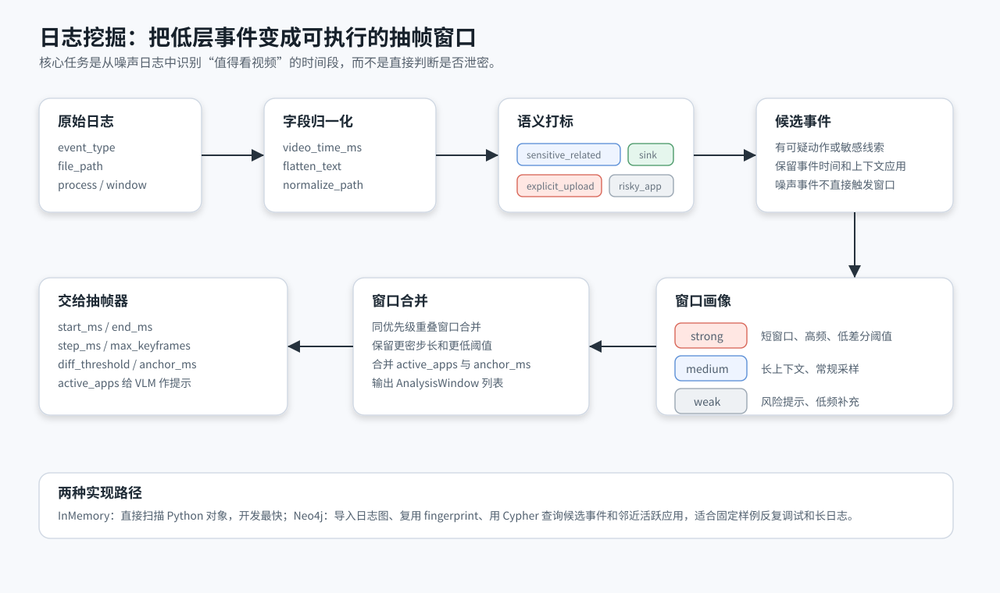
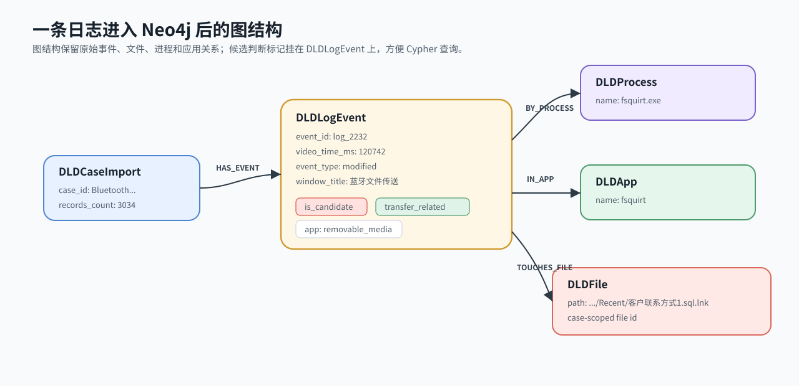
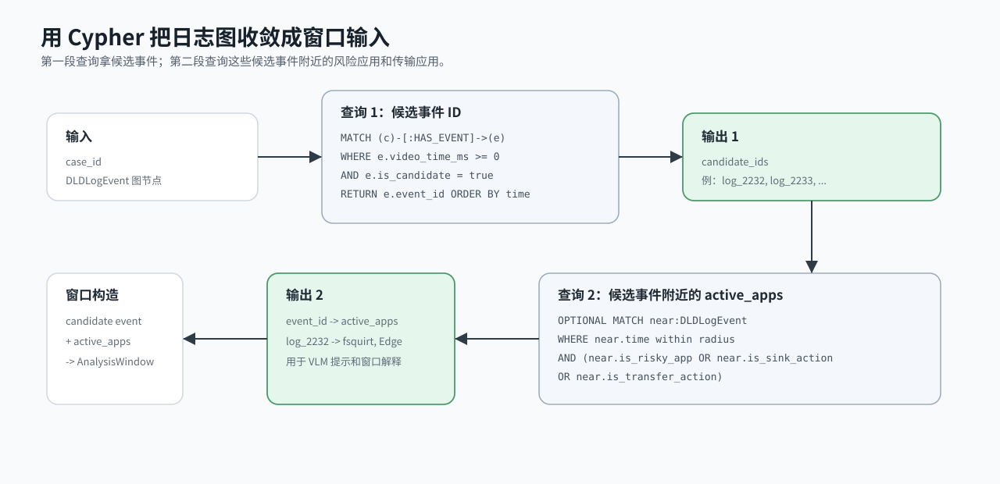
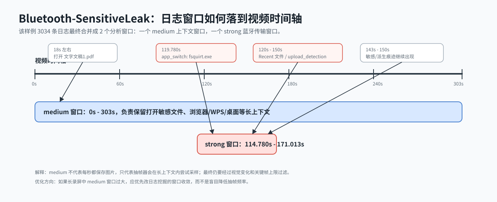

# 日志挖掘策略

日志挖掘负责把大量底层操作日志转成少量 `AnalysisWindow`，交给抽帧器使用。它不直接判断“是否泄密”，而是先回答：

> 哪些视频时间段值得回看？这些时间段应该用什么优先级、采样步长、关键帧预算和视觉差分阈值？

这一步很关键，因为真实日志通常只有进程、文件、窗口、时间和一些采集端分类。它能提示“哪里可疑”，但无法单独证明屏幕里选择了哪个文件、是否点了发送、前端页面是不是外部应用。所以项目把日志挖掘定位成视觉补证的前置路由。

## 总体流程



当前流程分成五步：

1. 读取 `logs.json`，归一化成统一的 `LogEvent`。
2. 从真实字段中提取候选信号：敏感文件、传输动作、外部 sink、上传/发送、风险应用。
3. 可选地把日志转入 Neo4j，复用日志指纹并用 Cypher 查询候选事件。
4. 把候选事件转换成 `strong`、`medium`、`weak` 三类窗口。
5. 合并同优先级重叠窗口，输出给抽帧器。

## 真实依赖的字段

实现不会假设日志里有理想化的 `leak=true` 字段，主要读取这些真实字段：

| 字段 | 作用 |
|---|---|
| `timestamp` | 事件绝对时间，用于归一化、排序和与 groundtruth 对照 |
| `extra.relative_timestamp` | 视频内相对时间，抽帧窗口必须依赖它 |
| `event_type` | 判断是否是 `file_selected`、`upload`、`opened`、`modified` 等操作 |
| `file_path` | 判断是否命中敏感源文件、敏感词、派生痕迹 |
| `process_info.process_name` | 识别 `fsquirt.exe`、浏览器、WPS、Edge 等应用 |
| `window_info.window_title` | 识别“蓝牙文件传送”、文件名窗口标题、外部网页标题 |
| `extra.source` | 区分 `window_monitor`、`watchdog_fs_monitor`、`etw_file_monitor` 等来源 |
| `extra.raw_operation` | 补充原始动作，如 `file_selected`、`send_click`、`modified` |
| `extra.category` / `extra.operation_detail` | 使用采集端对操作类型的粗分类 |
| `upload_detection` | 捕获上传/外发检测器给出的文件访问线索 |

如果事件没有 `relative_timestamp`，就无法稳定映射到视频时间轴，一般不会生成抽帧窗口。

## 从日志到 Neo4j

Neo4j 不是直接替代 Python 规则，而是把日志变成可复用、可查询的图结构。固定数据集反复调试时，Neo4j 路径可以跳过重复导入，并用索引查询候选事件和邻近应用上下文。

### 1. 原始日志片段

以 `stage5/Bluetooth-SensitiveLeak` 中的一条真实日志为例：

```json
{
  "timestamp": "2026-04-24T11:21:13.742",
  "event_type": "modified",
  "file_path": "C:\\Users\\clhcl\\AppData\\Roaming\\Microsoft\\Windows\\Recent\\客户联系方式1.sql.lnk",
  "process_info": {
    "process_name": "fsquirt.exe",
    "process_path": "C:\\Windows\\System32\\fsquirt.exe"
  },
  "window_info": {
    "window_title": "蓝牙文件传送"
  },
  "extra": {
    "raw_operation": "modified",
    "source": "watchdog_fs_monitor"
  },
  "upload_detection": {
    "is_upload": true,
    "app_name": "fsquirt",
    "upload_type": "File Access"
  }
}
```

这条日志不是直接的“泄密结论”。它只是说明蓝牙传输进程附近出现了文件访问痕迹，而且窗口标题是“蓝牙文件传送”。日志挖掘要做的是把它转换成一个值得回看录屏的候选点。

### 2. 归一化成 LogEvent

归一化后，关键字段会变成更稳定的内部表示：

```json
{
  "event_id": "log_2232",
  "timestamp_ms": 1777029673742,
  "video_time_ms": 120742,
  "event_type": "modified",
  "file_path": "C:/Users/clhcl/AppData/Roaming/Microsoft/Windows/Recent/客户联系方式1.sql.lnk",
  "process_name": "fsquirt.exe",
  "app_name": "fsquirt",
  "window_title": "蓝牙文件传送"
}
```

这里最重要的是 `video_time_ms=120742`。它让后续窗口可以落到视频里的 `120.742s` 附近。

### 3. 转成 Neo4j 图事件

导入 Neo4j 时，会生成一条 `DLDLogEvent` 节点属性。该节点既保留基础字段，也打上候选标记：

```json
{
  "id": "Bluetooth-SensitiveLeak_logs_3034:event:log_2232",
  "event_id": "log_2232",
  "video_time_ms": 120742,
  "event_type": "modified",
  "file_path_lower": "c:/users/clhcl/appdata/roaming/microsoft/windows/recent/客户联系方式1.sql.lnk",
  "process_name": "fsquirt.exe",
  "app_name": "fsquirt",
  "window_title": "蓝牙文件传送",
  "is_sensitive_related": true,
  "is_transfer_action": true,
  "is_sink_action": false,
  "is_explicit_upload": false,
  "is_candidate": true,
  "app_category": "removable_media",
  "app_risk_hint": "local_or_benign_inferred"
}
```

这些标记来自 `records_to_graph_events(...)` 中的 `event_flags(...)`：

| 标记 | 含义 |
|---|---|
| `is_sensitive_related` | 路径或全文命中敏感源文件、敏感词、敏感内容线索 |
| `is_transfer_action` | 全文命中传输类词，例如发送、复制、传输等 |
| `is_sink_action` | 全文命中外部接收端、上传、分享等 sink 类词 |
| `is_explicit_upload` | `event_type` 或 `raw_operation` 明确表示上传、选择文件、发送点击 |
| `is_candidate` | 前四类任一为真时进入候选事件查询 |
| `is_risky_app` | 前端应用识别认为它可能是外部发送或未知外部 sink |

注意：`is_risky_app` 本身不会直接让事件进入候选。它更多用于补充候选事件附近的应用上下文，避免仅因为打开浏览器就大面积抽帧。

### 4. 图结构长什么样

同一条日志在 Neo4j 中大致会形成这样的结构：



```text
(:DLDCaseImport {case_id})
  -[:HAS_EVENT]->
(:DLDLogEvent {
  event_id: "log_2232",
  video_time_ms: 120742,
  is_candidate: true
})
  -[:BY_PROCESS]-> (:DLDProcess {name: "fsquirt.exe"})
  -[:IN_APP]->     (:DLDApp {name: "fsquirt"})
  -[:TOUCHES_FILE]-> (:DLDFile {path_lower: "...客户联系方式1.sql.lnk"})
```

导入时会建立这些约束和索引：

- `DLDCaseImport.case_id`
- `DLDLogEvent.id`
- `DLDFile.id`
- `(DLDLogEvent.case_id, DLDLogEvent.video_time_ms)`
- `(DLDLogEvent.case_id, DLDLogEvent.is_candidate)`
- `(DLDLogEvent.case_id, DLDLogEvent.file_path_lower)`

这样固定样例重复跑时，不需要每次全量扫描 JSON。

### 5. 用 Cypher 取候选事件



候选事件查询很直接：

```cypher
MATCH (c:DLDCaseImport {case_id: $case_id})-[:HAS_EVENT]->(e:DLDLogEvent)
WHERE e.video_time_ms >= 0 AND e.is_candidate = true
RETURN e.event_id AS event_id
ORDER BY e.video_time_ms ASC
```

然后再查候选事件附近的活跃应用：

```cypher
MATCH (c:DLDCaseImport {case_id: $case_id})-[:HAS_EVENT]->(e:DLDLogEvent)
WHERE e.event_id IN $event_ids
OPTIONAL MATCH (c)-[:HAS_EVENT]->(near:DLDLogEvent)
WHERE near.video_time_ms >= e.video_time_ms - $radius_ms
  AND near.video_time_ms <= e.video_time_ms + $radius_ms
  AND (near.is_risky_app = true OR near.is_sink_action = true OR near.is_transfer_action = true)
WITH e, collect(DISTINCT coalesce(near.app_name, near.process_name, "")) AS apps
RETURN e.event_id AS event_id, [app IN apps WHERE app <> ""] AS active_apps
```

这一步的结果不会直接变成泄密结论，而是作为窗口的 `active_apps`，给后续 VLM 或报告解释提供上下文。

## 从候选事件到 AnalysisWindow

候选事件进入 `build_analysis_window_for_event(...)` 后，会被转换成 `AnalysisWindow`：

```json
{
  "start_ms": 115742,
  "end_ms": 135742,
  "reason": "strong:modified:watchdog_fs_monitor",
  "priority": "strong",
  "step_ms": 250,
  "max_keyframes": 24,
  "diff_threshold": 0.015,
  "anchor_ms": [120742, 123742, 128742],
  "active_apps": ["Explorer", "Edge", "fsquirt", "VS Code"]
}
```

这个窗口来自上面的 `log_2232`。它会变成 strong，因为：

- `process_name=fsquirt.exe`，指向 Windows 蓝牙文件传送。
- `window_title=蓝牙文件传送`，指向外发通道。
- `file_path` 和全文里有文件访问/传输线索。
- `video_time_ms=120742` 可对齐视频时间。

`anchor_ms` 的含义是：即使画面变化不大，也要重点检查这些时间点附近的帧。蓝牙传输里，敏感文件被操作后的几秒钟经常会出现选择文件、进度条、确认按钮等关键状态。

## InMemory 与 Neo4j 的差别

当前有两条路径：

| 路径 | 工作方式 | 优点 | 注意点 |
|---|---|---|---|
| `InMemoryLogMiner` | 直接扫描 Python `LogEvent` 列表，每次重新判断窗口 | 简单、快、适合测试和小样例 | 不能复用导入结果 |
| `Neo4jLogMiner` | 先导入图，再用 Cypher 查候选事件和上下文 | 固定样例可复用，长日志更适合扩展关系查询 | 候选入口由 `is_candidate` 控制 |

有一个容易混淆的点：InMemory 会逐条调用 `build_analysis_window_for_event(...)`，所以一条纯 `fsquirt.exe app_switch` 也能直接生成 strong 窗口。Neo4j 路径先查 `is_candidate=true`，纯 app_switch 未必是候选；但附近带文件访问或传输文本的日志会进入候选，并同样生成 strong 窗口。

例如：

```json
{
  "event_id": "log_2221",
  "event_type": "app_switch",
  "process_name": "fsquirt.exe",
  "window_title": "蓝牙文件传送",
  "video_time_ms": 119780,
  "is_candidate": false
}
```

这条事件在 InMemory 路径下可以直接生成 strong 窗口；在 Neo4j 路径下，它更像上下文。真正进入候选的是附近的 `log_2232` 这类文件访问/传输线索。这个差别是合理的：Neo4j 路径更偏“先收敛候选，再查上下文”，避免只因应用切换造成大量窗口。

## 窗口优先级

窗口分三类：

| 优先级 | 触发条件 | 默认范围 | 默认步长 | 默认关键帧上限 |
|---|---|---:|---:|---:|
| `strong` | 文件选择、上传、发送点击、蓝牙传输、明确外发操作、`fsquirt.exe` 文件访问 | 事件前 5s 到后 15s | 250ms | 24 |
| `medium` | 命中敏感文件、传输词、sink 词，但动作不够明确 | 事件前 30s 到后 120s | 1000ms | 18 |
| `weak` | 只有高风险提示，例如 `risk_level=high` | 事件前 30s 到后 120s | 2000ms | 9 |

`strong` 的窗口短但密，适合捕捉文件选择器、上传列表、蓝牙发送窗口、进度条。`medium` 的窗口更长，用于保留上下文。`weak` 只做低成本补充。

## 窗口合并

日志里会有大量相邻事件。如果每条事件都单独抽帧，成本会爆炸。因此窗口会按优先级合并：

- 只合并同优先级且重叠的窗口。
- 合并后保留更早的开始时间和更晚的结束时间。
- `step_ms` 取更密的值。
- `max_keyframes` 取更大的值。
- `diff_threshold` 取更低的值。
- `anchor_ms` 和 `active_apps` 合并去重。

这一步把日志噪声压成少量可执行窗口，也解释了为什么一个样例里可能有上千条候选事件，但最终只得到几个分析窗口。

## Bluetooth-SensitiveLeak 样例复盘

样例路径：

```text
spec/data/nas_samples/stage5/Bluetooth-SensitiveLeak
```

当前一次 Neo4j log miner 报告摘要：

| 项目 | 结果 |
|---|---:|
| 日志记录数 | 3034 |
| 导入批次数 | 2 |
| Neo4j 候选事件 | 1660 |
| 合并后分析窗口 | 2 |
| 最终关键帧 | 18 |

窗口落到时间轴上大致如下：



这个样例的关键点是：

- `0s - 303s` 的 `medium` 窗口来自敏感文件、浏览器/WPS/桌面上下文和文件访问痕迹。它很宽，但抽帧器仍会用视觉变化和窗口上限控制最终图片数量。
- `114.780s - 171.013s` 的 `strong` 窗口来自蓝牙传输相关事件。它更短、更密，负责覆盖文件选择、蓝牙发送、传输进度这些快速状态。
- `keyframe_duplicates.json` 为空，说明最终 18 张关键帧没有被全局去重删除。

这个例子说明：日志挖掘不是为了“越多越好”，而是为了给视觉侧圈出证据密度最高的区域。

## 当前最该优化什么

结合当前样例，抽帧主结构暂时不需要大改。更值得优先优化的是日志挖掘层：

1. **medium 窗口收敛**  
   短视频里 `0s - 303s` 还能接受，但 24 小时录屏不能让 medium 窗口无限扩张。后续可以按事件簇拆分：相邻候选事件间隔超过阈值就断开，或者对系统噪声只保留局部窗口。

2. **系统噪声降权**  
   `watchdog_fs_monitor` 会产生大量 `modified`、`created`、`deleted`。Recent、缓存、临时文件、浏览器 Profile 文件可以单独降权，避免把系统维护行为误当作强上下文。

3. **外发通道保持敏感**  
   `fsquirt.exe`、明确上传、文件选择、发送点击仍应保持 strong。它们是视觉补证最关键的入口，不应为了省 OCR 成本过早压掉。

4. **活跃窗口坐标传递**  
   如果采集端能记录 `foreground_window.rect`，日志挖掘可以把它随窗口传给抽帧/OCR。这样比后处理阶段用 OpenCV 猜 ROI 更可靠。

## 与抽帧策略的边界

日志挖掘输出窗口：

```text
LogEvent -> AnalysisWindow
```

抽帧策略使用窗口：

```text
AnalysisWindow -> KeyFrame -> OCR/VLM Observation
```

如果抽帧结果缺少关键画面，不要只调视觉阈值。应按顺序排查：

1. 日志里是否有对应事件。
2. 事件是否有 `relative_timestamp`。
3. 事件是否被标成候选事件。
4. 候选事件是否生成窗口。
5. 窗口合并后是否覆盖正确时间段。
6. 抽帧器是否在 `keyframes_raw_all/` 中抽到该画面。
7. 是否被 `keyframe_duplicates.json` 判成重复。
