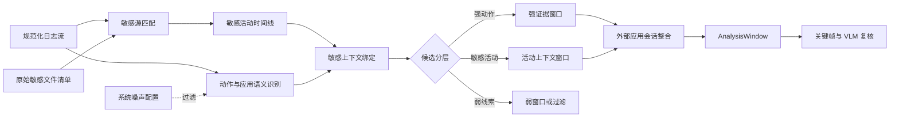
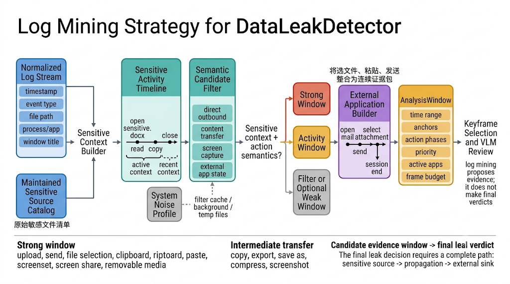

# 日志挖掘策略

## 1. 目标与定位

日志挖掘的目标不是仅凭日志直接宣布泄露，而是从持续时间长、噪声多的终端事件流中筛出**与敏感数据传播有关、且值得进行视觉复核的证据片段**。其输出是带有动作语义的 `AnalysisWindow`，供后续关键帧选择和 VLM 分析使用。

因此，日志挖掘承担的是“从全量行为流到少量证据窗口”的数据缩减任务：

```text
原始终端日志 + 原始敏感文件清单
        -> 敏感上下文与候选动作
        -> 外部应用会话整合
        -> AnalysisWindow
        -> 关键帧与 VLM 视觉复核
```

最终的泄露结论仍需结合视觉观察、文件血缘和确定性推理生成。日志中出现浏览器、网盘或上传按钮等风险线索，并不自动等价于确认泄露。

## 2. 输入与输出模型

### 2.1 输入

日志挖掘使用以下三类输入：

| 输入             | 作用                     | 关键内容                                                     |
| ---------------- | ------------------------ | ------------------------------------------------------------ |
| 规范化终端日志   | 提供行为时序与应用上下文 | 时间、事件类型、文件路径、进程、应用、窗口标题、原始扩展字段 |
| 原始敏感文件清单 | 提供唯一的敏感源边界     | 受控文档、报表、源码等原始路径                               |
| 视觉配置         | 决定窗口大小和采样预算   | 强/弱窗口前后范围、帧间隔、关键帧上限、是否保留弱证据        |

敏感源必须来自维护的配置文件。复制件、另存文件、压缩包、截图和上传缓存都不是初始敏感源，而是在后续阶段通过文件血缘关联回原始敏感文件。

### 2.2 输出

每个 `AnalysisWindow` 描述一个需视觉核验的时间片段，至少包含：

- 起止时间 `start_ms`、`end_ms`；
- 产生原因和优先级，例如敏感文件选择、粘贴、上传、发送或外部应用会话；
- 动作锚点和动作阶段，例如“进入聊天应用 -> 选择文件 -> 发送 -> 会话结束”；
- 后续抽帧所需的帧间隔、帧预算和画面差异阈值；
- 当前窗口内的应用上下文和前台活跃区间。

窗口只描述“何时、为什么值得看”，不描述“已确认泄露什么”。

## 3. 核心策略

### 3.1 建立敏感活动上下文

对于每个维护的敏感源，系统寻找其打开、读取、关闭等相关日志，得到敏感活动区间。若没有显式关闭事件，则以同一文件的下一次打开或 session 结束作为边界。敏感活动区间解决了许多日志不携带文件路径的问题：在用户刚刚操作敏感文档后发生的剪贴板、粘贴或应用切换，仍然可能与该文档有关。

策略使用两种上下文强度：

- **活动中上下文**：动作发生在敏感文件打开至关闭的区间内；
- **近期上下文**：动作发生在最近的敏感信号之后。剪贴板和粘贴采用更长的关联范围，以覆盖“复制后切换应用再粘贴”的常见流程。

该策略既避免将所有办公行为视为敏感行为，也避免因剪贴板记录缺少文件路径而漏掉关键的跨应用传播。

### 3.2 候选动作分层

系统不对所有日志事件建立窗口，而是按行为语义分层筛选。

| 层级           | 典型动作                                             | 风险含义                   | 默认处理                     |
| -------------- | ---------------------------------------------------- | -------------------------- | ---------------------------- |
| 直接外发动作   | 上传、发送、提交、文件选择、外接设备复制、屏幕共享   | 可能到达外部汇聚点         | 强窗口，优先视觉复核         |
| 内容传播动作   | 复制、剪贴板读写、粘贴、另存、导出、压缩、打印为 PDF | 可能产生新的敏感载体       | 在敏感上下文中建立强窗口     |
| 屏幕与采集动作 | 截图、录屏、屏幕捕获                                 | 可能形成图像化载体         | 建立窗口，后续结合去向判断   |
| 外部应用状态   | 邮件、聊天、AI 对话、网盘、会议、代码托管等前台会话  | 提供潜在外发通道与界面语义 | 与邻近敏感动作合并为会话窗口 |
| 弱风险线索     | 风险应用、模糊外发词、异常窗口标题                   | 仅提供补充线索             | 默认不单独触发，按配置可保留 |
| 系统噪声       | 缓存、临时目录、系统进程、常见后台读写               | 通常与用户外发无关         | 尽早过滤                     |

分层的关键原则是：**动作语义与敏感上下文必须同时考虑**。例如，“复制”在普通网页中并不重要；但在敏感文档活动期间发生的复制，或紧随其后的聊天应用切换，就应进入视觉复核范围。

### 3.3 外部应用会话整合

外发行为经常由多条分散日志组成。例如，用户打开邮件客户端、选择附件、等待上传、点击发送；或从文档复制文本、切换到 AI 对话页面、粘贴并提交。若每条日志各自形成短窗口，关键帧可能割裂，无法同时展示源文件、附件状态和最终操作。

因此，系统将相邻且属于同一外部应用类别的前台活动聚合为会话，例如：

- AI 对话与普通聊天；
- 邮件与附件发送；
- 网盘与云同步；
- 会议与屏幕共享；
- 代码托管、技术社区和协作平台；
- 可移动设备或蓝牙传输界面。

当会话附近存在敏感文件访问、剪贴板、派生文件或明确外发动作时，系统生成一个连续的外部会话窗口，并保留会话开始、状态变化、动作锚点和会话结束等阶段。这样，后续 VLM 可以在同一证据包中判断“仅打开应用”与“确实选择、粘贴、发送或共享”的区别。

### 3.4 窗口优先级与资源分配

窗口分为强、活动和弱三个优先级，其目的不是给行为定罪，而是将有限的视觉预算优先分配给更可能出现状态变化的片段。

| 优先级   | 触发条件                                                                       | 策略                                                             |
| -------- | ------------------------------------------------------------------------------ | ---------------------------------------------------------------- |
| 强窗口   | 上传、发送、选文件、剪贴板、粘贴、外设、屏幕共享、派生操作等，且具有敏感上下文 | 使用更密集采样、更严格的画面变化阈值和更高帧预算；保留动作后状态 |
| 活动窗口 | 已确认的敏感文件打开/关闭活动区间                                              | 作为敏感内容可见的背景上下文；仅在与强动作关联时提供重点帧       |
| 弱窗口   | 未能直接绑定敏感源但包含风险应用或模糊风险线索                                 | 默认关闭，可用于召回优先的实验或人工复核                         |

对于邮件附件选择等常见的延迟操作，窗口会向后延伸，以覆盖选择附件与点击发送之间的间隔。对于截图、剪贴板、导出等可能先产生载体、后进入外部应用的动作，则允许在有限时间范围内与后续外部会话关联。

### 3.5 噪声抑制与保守关联

日志来源常包含系统缓存、同步程序、后台索引和临时文件写入。日志挖掘通过系统噪声配置过滤典型路径、文件名、应用名和窗口标题标记，并对纯噪声事件停止后续窗口构造。

同时，系统采用保守关联原则：

- 仅打开一个外部应用，不足以生成泄露证据；
- 仅看到上传入口、菜单项或传输能力，不应被当作已发生的外发；
- 截图、导出和压缩是中间操作，必须继续寻找与外部汇聚点的连接；
- 远距离的截图与聊天会话不能仅凭时间邻近强行绑定；
- 关联失败时保留为可疑线索或不生成窗口，而不是虚构文件传播关系。

外发、传播、可疑行为及最终结论的统一定义见 [00口径.md](/media/hwt/Data/Projects/Job/DataLeakDetector/spec/docs/00口径.md)。本章只依据该口径构造视觉复核候选窗口，不重复定义或裁决行为类别。

## 4. 策略流程示意





## 5. 与后续文档的关系

本章说明日志挖掘的抽象模型和策略边界。具体实现请见：

- `01纯日志挖掘具体实现.md`：不启用 Neo4j 时的内存数据结构、规则和窗口构造；
- `01neo4j具体实现.md`：启用 Neo4j 后的图导入、索引、Cypher 查询与回退机制；
- `02关键帧策略.md`：`AnalysisWindow` 如何驱动关键帧选择；
- `04事实收集及证据链推理`：视觉观察和日志证据如何进一步形成最终泄露路径。
