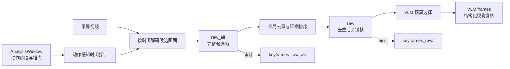
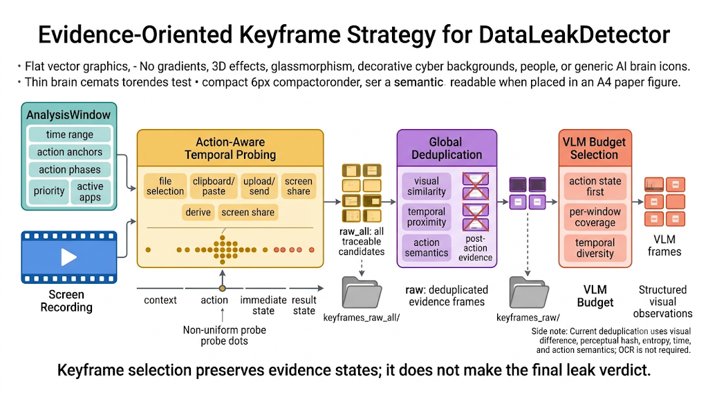

# 关键帧策略

## 1. 目标与定位

关键帧模块接收日志挖掘输出的 `AnalysisWindow`，从录屏中选择能够说明行为状态变化的少量画面，供 VLM 进行视觉复核。它不试图完整保存视频，也不依据单帧直接裁决是否泄露；其任务是保留足以验证“发生了什么、是否实际执行、敏感内容是否可见”的证据帧。

策略的核心目标是同时满足：

- **状态完整性**：尽量保留动作发生前、发生时、发生后和最终结果状态；
- **时间精度**：围绕日志动作锚点密集取帧，避免短暂的粘贴预览、附件状态或发送确认被跳过；
- **视觉多样性**：压缩连续静态界面，避免相同画面重复进入 VLM；
- **可追溯性**：保留候选帧、去重记录和最终选帧原因，使每次筛选都可复核。

## 2. 三层帧集合

关键帧选择包含三个集合，形成 `raw_all -> raw -> VLM frames` 的逐层缩减流程。

| 阶段 | 名称           | 含义                             | 主要用途                                                   |
| ---- | -------------- | -------------------------------- | ---------------------------------------------------------- |
| 1    | `raw_all`    | 每个分析窗口独立生成的全部候选帧 | 保留所有动作锚点、动作状态、探针和窗口上下文，供审计与调参 |
| 2    | `raw`        | `raw_all` 经全局去重后的关键帧 | 去掉跨窗口和连续静态画面的重复帧，保留更有证据力的帧       |
| 3    | `VLM frames` | 在`raw` 中按请求预算选择的帧   | 保证动作优先、时间覆盖和窗口间的公平分配，控制模型成本     |

运行制品中，`keyframes_raw_all/` 对应第一阶段，`keyframes_raw/` 对应第二阶段；去重原因和保留帧清单会随视觉制品一同保存。`raw_all` 并不表示“视频所有帧”，而是日志引导后的候选集合。





## 3. `raw_all` 的选择策略

### 3.1 以日志窗口为边界

抽帧只在 `AnalysisWindow` 内进行。窗口包含起止时间、优先级、动作锚点、动作阶段和活跃应用上下文，因此关键帧模块不需要在整段视频上盲目均匀采样。若日志没有定位到结果型动作，系统才会使用稀疏的视频覆盖窗口作为兜底，避免出现完全没有视觉证据的情况。

### 3.2 以动作状态而非固定帧率采样

每个动作都有不同的界面演化速度，因而使用不同的时间探针模式：

| 动作类型               | 需要保留的状态                               | 选帧重点                                               |
| ---------------------- | -------------------------------------------- | ------------------------------------------------------ |
| 文件选择 / 附件        | 打开文件选择器、选中文件、附件出现、后续发送 | 锚点前的来源状态，以及锚点后较长时间内的附件和结果状态 |
| 上传 / 发送 / 外接设备 | 操作前、点击或传输瞬间、进度或完成提示       | 锚点附近的稠密帧和动作后的确认帧                       |
| 剪贴板 / 粘贴          | 源内容、切换应用、粘贴预览、提交前后         | 短时间密集探针，特别保留粘贴后可能短暂出现的内容       |
| 派生操作               | 原文件、导出/压缩/另存过程、派生文件结果     | 在锚点前后扩大范围，覆盖可能延迟写入的文件操作         |
| 截图 / 录屏            | 敏感内容可见、采集工具启动、生成结果         | 截图前的屏幕内容与采集动作附近的状态                   |
| 屏幕共享               | 共享启动、共享进行、敏感文件在共享期间可见   | 共享开始后的状态变化和持续可见性                       |
| 外部应用会话           | 会话打开、文件/内容进入界面、提交、会话结束  | 将会话阶段和邻近传播动作置于同一证据包中               |

除动作专属探针外，策略还会保留窗口锚点附近帧、窗口边界帧和稠密上下文探针。其目的不是增加帧数，而是避免日志时间与实际 GUI 刷新时间之间存在数百毫秒到数秒偏差时遗漏关键状态。

### 3.3 动作前后帧必须成对考虑

单张“上传页面”通常不能区分准备与执行。关键帧策略因此优先保留下列状态组合：

```text
动作前上下文 -> 动作锚点 -> 立即状态 -> 动作后结果状态
```

例如，邮件场景中应尽量同时保留敏感文件或文件选择状态、附件已出现的撰写窗口以及发送后的界面状态；粘贴场景中应保留粘贴前的目标应用状态和粘贴后内容进入输入区域的状态。后续 VLM 通过这些相邻状态判断实际操作，而不是根据某个孤立按钮推断。

## 4. 窗口优先级与帧预算

日志挖掘为窗口分配强、活动、弱等优先级，关键帧策略据此分配不同的采样密度与预算。

| 窗口类型     | 典型来源                                               | 关键帧策略                                                           |
| ------------ | ------------------------------------------------------ | -------------------------------------------------------------------- |
| 强窗口       | 上传、发送、选文件、粘贴、剪贴板、派生、外设、屏幕共享 | 最优先；密集探针；保留动作后状态；允许较高帧预算                     |
| 活动窗口     | 敏感文件打开至关闭的活动区间                           | 提供源内容上下文；主要与重叠的强窗口结合，避免长时间办公画面占用预算 |
| 弱窗口       | 风险线索不足或未绑定敏感源的候选                       | 默认不启用；启用后使用稀疏采样和较低预算                             |
| 视频覆盖兜底 | 缺少结果型日志动作                                     | 在整段视频上稀疏取样，仅用于发现可能遗漏的视觉线索                   |

当多个窗口重叠时，同一优先级的窗口会合并动作锚点和阶段信息；不同外部应用会话仍保持独立证据包，避免把两次无关的发送或上传混为同一操作。

## 5. `raw_all -> raw` 的策略边界

`raw_all` 的设计原则是“宁可在候选阶段保留动作证据，也不要因为相邻窗口或静态画面判断过早丢失关键帧”。因此，两个窗口即使在相同时间点解码到同一画面，也可以各自先保留在 `raw_all` 中，记录其不同的动作来源。

随后生成 `raw` 时，系统在全局范围压缩重复帧，并优先保留：

- 动作语义更明确的帧，例如动作后状态优先于普通上下文；
- 优先级更高的窗口产生的帧；
- 与已保留帧具有明显时间、画面或信息量差异的帧；
- 能补齐同一操作“前置、执行、结果”状态链的帧。

反之，连续静态画面、仅因重叠窗口重复生成的同一画面、以及不能增加动作或上下文信息的帧，会被记录为重复项后从 `raw` 移除。该阶段目前基于画面差异、感知哈希、信息熵、时间间隔和动作语义进行判断；**当前版本不依赖 OCR**。OCR 或文字区域感知可作为后续的增强去重策略，但不应破坏已有的动作状态保留规则。

## 6. `raw -> VLM frames` 的预算策略

去重后的 `raw` 仍可能超过一次 VLM 分析的图像预算。最终选帧遵循以下顺序：

1. 优先保留高分且带有动作状态的关键帧；
2. 在每个分析窗口保留必要的代表帧，避免一个长窗口占用全部预算；
3. 对剩余帧进行时间分散选择，覆盖操作的开始、中间和结束；
4. 在同一时间附近有多个候选时，选择动作优先级、画面变化和信息量更高的帧。

这样，VLM 输入既不会被大量近似图片淹没，也不会因只保留“最变化大”的一帧而失去操作前后的因果关系。若未设置总帧上限，则保留经去重后的全部 `raw` 帧，并按窗口组织为请求批次。

## 7. 与最终判定的关系

关键帧只承担视觉取证职责。它可以帮助确认：附件是否已经出现、敏感内容是否已经粘贴、上传是否已提交、屏幕共享是否已启动、敏感文件是否在共享期间可见等。

关键帧和 VLM 观察本身不直接产生 `data_leak_risk_detected`。最终结论仍必须遵循 [00口径.md](/media/hwt/Data/Projects/Job/DataLeakDetector/spec/docs/00口径.md)：将视觉观察与日志、文件血缘和时间有序的推理路径结合后，才可确认泄露。

## 8. 与后续文档的关系

- `01日志挖掘策略.md`：解释 `AnalysisWindow` 如何形成；
- `02抽帧具体实现.md`：说明时间探针、视频解码、候选帧与配置参数的具体实现；
- `02帧去重具体实现.md`：说明 `raw_all -> raw` 的去重实现和后续 OCR 增强方向；
- `03vlm策略及实现.md`：说明 `VLM frames` 如何组网格、请求和解析；
- `00口径.md`：定义视觉证据如何参与最终泄露判定。
