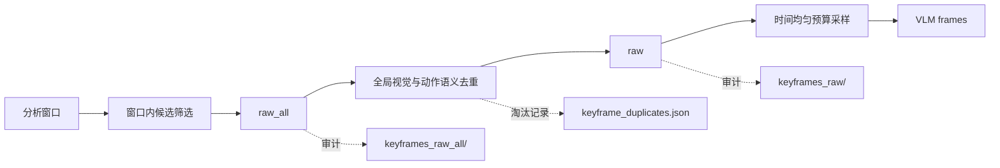

# 帧去重具体实现

本文说明关键帧从 `raw_all` 收敛到 `raw` 的现有实现，并记录 `raw -> VLM frames` 的后续去重方案。实现入口位于 `main/data_leak_detector/frame_analyzer/frames.py` 的 `select_keyframes_detailed()` 和 `_dedupe_keyframes_globally()`。

## 1. 集合边界

| 集合 | 含义 | 当前状态 |
| --- | --- | --- |
| `raw_all` | 各分析窗口完成动作锚点保留、窗口内筛选和预算后的候选帧 | 已实现 |
| `raw` | `raw_all` 经跨窗口全局去重后的帧 | 已实现 |
| `VLM frames` | 从 `raw` 中按 `max_vlm_frames` 做时间均匀预算采样的帧 | 已实现预算，尚无独立语义去重 |

`raw_all` 不是视频全部解码帧。动作锚点、动作状态和其上下文会优先进入该集合；普通帧已在窗口内按画面变化和预算做过基础控制。全局去重的目标是消除重叠窗口和连续静态画面造成的重复，同时不能破坏数据来源、传播动作与结果状态之间的证据链。



## 2. `raw_all -> raw` 当前实现

`select_keyframes_detailed()` 先保存候选帧列表，再调用全局去重：

```python
raw_all = [candidate.frame for candidate in candidates]
raw, duplicates = _dedupe_keyframes_globally(candidates, config)
return KeyFrameSelection(raw, raw_all, duplicates, warnings)
```

候选帧按 `(timestamp_ms, priority)` 排序。新候选只会与已经保留的帧比较；最终 `raw` 再按时间排序输出。每个候选携带灰度图、8x8 平均哈希、图像熵、窗口优先级，以及由 `reason` 表达的动作锚点、动作状态和画面变化来源。

### 2.1 比较范围与动作保护

算法并不把任意两帧都当作可合并对象，先根据时间和动作语义排除应独立保留的证据：

| 条件 | 行为 | 原因 |
| --- | --- | --- |
| 两帧都属于 `clipboard`、`paste` 或 `file_selected`，且时间差至少 500 ms | 不比较，不去重 | 同一动作的来源、执行、结果状态可以画面相近，但都可能是链路证据 |
| 任一帧是 `:pre` 点击前帧，且间隔小于 `max(frame_anchor_duplicate_gap_ms, 500)` | 不比较，不去重 | 点击前的内容是解释点击目标和待外发内容的证据 |
| 两帧均为 `action_state`，且时间差至少 1 秒 | 不比较，不去重 | 跨时间的状态变化应保留 |
| 无动作锚点，时间差超过 2 秒 | 不比较 | 不跨越较长时间直接合并画面相似的帧 |
| 存在动作锚点，时间差超过 `max(frame_anchor_duplicate_gap_ms, 500)` | 不比较 | 锚点附近仅允许在更窄的动作阶段内合并 |

这意味着当前的“全局”指跨窗口候选统一处理，不等于跨整段视频将所有相似桌面画面归为同一帧。

### 2.2 视觉相似判定

对进入比较范围的一对帧，计算三项指标：

| 指标 | 计算 | 默认阈值 | 作用 |
| --- | --- | --- | --- |
| 像素差 `delta` | 灰度图绝对差均值除以 255 | 精确重复 `<= 0.001`；近似 `<= 0.01` | 捕捉整体像素变化 |
| 感知哈希距离 | 8x8 average hash 的汉明距离 | `<= 12` | 对小幅位移、压缩噪声更稳健 |
| 熵差 `entropy_delta` | `abs(entropy_a - entropy_b) / 8` | `<= 0.015` | 辅助判断画面信息量是否接近 |

判定规则为：

```python
exact = delta <= config.frame_exact_duplicate_threshold

near = (
    same_action_phase
    and not ("visual_change" in a.reason or "visual_change" in b.reason)
    and count(
        delta <= config.frame_near_duplicate_threshold,
        hamming(a.hash, b.hash) <= config.frame_hash_distance_threshold,
        entropy_delta <= config.frame_entropy_duplicate_threshold,
    ) >= 2
)

is_duplicate = exact or near
```

显式带有 `visual_change` 原因的候选不会走“近似重复”合并，避免窗口内已经识别出的画面变化又被全局规则抵消。精确重复不受此限制，因为其像素本身已经几乎相同。

### 2.3 保留谁、如何审计

确认重复后，候选与既保留帧按以下优先级比较：

1. `strong` 窗口优先于普通窗口；
2. 带 `anchor` 或 `action_state` 的帧优先；
3. `frame.score` 较高者优先；
4. 仍相同则时间更早者优先。

较低优先级帧会记录为 `visual_duplicate`；若新候选更有证据力，则替换原保留帧，原帧记录为 `lower_evidence_priority`。每条记录包含被淘汰帧、保留帧 ID、原因、像素差和哈希距离：

```json
{
  "frame_id": "...",
  "kept_frame_id": "...",
  "reason": "visual_duplicate",
  "delta": 0.004,
  "hash_distance": 6
}
```

`export_vision_artifacts()` 会输出以下制品，供人工核验阈值和误删风险：

- `keyframes_raw_all/`：去重前候选帧；
- `keyframes_raw/`：最终保留帧；
- `keyframe_duplicates.json`：逐帧淘汰记录；
- `artifact_manifest.json`：两个集合的文件清单和计数。

## 3. 配置与调参

| 环境变量 | 默认值 | 影响 |
| --- | ---: | --- |
| `DLD_FRAME_EXACT_DUPLICATE_THRESHOLD` | `0.001` | 精确重复的像素差阈值 |
| `DLD_FRAME_NEAR_DUPLICATE_THRESHOLD` | `0.01` | 近似重复的像素差条件 |
| `DLD_FRAME_HASH_DISTANCE_THRESHOLD` | `12` | 近似重复的哈希距离条件 |
| `DLD_FRAME_ENTROPY_DUPLICATE_THRESHOLD` | `0.015` | 近似重复的熵差条件 |
| `DLD_FRAME_ANCHOR_DUPLICATE_GAP_MS` | `500` | 动作锚点帧允许合并的最大时间范围 |

另有 `DLD_FRAME_ENTROPY_CHANGE_THRESHOLD` 用于窗口内候选筛选，而不是全局去重判定。调参时应同时检查上述三类制品，重点观察“相同桌面被保留过多”和“来源/动作/结果状态被错误合并”两类问题，不能只看最终帧数。

## 4. 当前边界

当前全局去重只使用像素、感知哈希、熵、时间和已有的日志动作标签：

- 不识别前景应用窗口或桌面背景；
- 不读取 OCR 文本，也不比较页面文字的语义；
- 不执行跨应用、跨长时间范围的内容等价判断；
- `raw -> VLM frames` 仅由 `choose_keyframes_for_vlm()` 按总帧上限作时间均匀采样，**没有独立的视觉或语义去重步骤**。

因此，不能把当前 `raw` 当作“内容语义唯一”的集合。相同文本或同一页面在不同窗口、不同布局下仍可能同时被送往 VLM；反之，动作语义保护会刻意保留某些画面接近的帧。

## 5. `raw -> VLM frames` 后续方案

这一层应在不丢失取证状态的前提下，减少对 VLM 没有新增信息的重复请求。它是规划，不属于当前发布实现，也不应修改现有 `raw` 的审计语义。

### 5.1 ROI：以 UI 前景区域为比较主体

可评估接入 Microsoft Research 的 [OmniParser](https://www.microsoft.com/en-us/research/articles/omniparser-for-pure-vision-based-gui-agent/)。该工具将 UI 截图解析为结构化元素，包含可交互区域检测和元素功能描述；它可补充桌面截图的 UI 元素 ROI，但不是可靠的前景应用窗口识别器，也不替代本项目的泄漏判定模型。

拟定处理方式：

1. 使用日志中的活动应用/窗口上下文确定比较范围，再从截图中解析主要内容区和交互控件区域；
2. 对任务栏、桌面壁纸、通知阴影等低价值背景做掩码或降低权重；
3. 对同一应用上下文中的 ROI 生成视觉指纹，并保留 ROI 坐标和解析版本；
4. 仅在同一时间邻域、同一窗口上下文或相同前景应用中比较，避免把不同应用的相似控件误合并。

ROI 结果只能提供“比较哪个区域”的特征，不能单独决定淘汰。模型本身有部署成本和解析误差，接入前需以录屏样本验证其对浏览器、客户端、文件选择器和多窗口叠加场景的稳定性。

### 5.2 OCR：去除文字未变化的语义重复

对通过 ROI 预筛的相似帧执行 OCR，构建可审计的文本指纹：

```text
normalized_text = normalize(ocr(roi))
fingerprint = hash(app_identity, roi_layout, normalized_text)
```

`normalize` 应至少统一大小写、空白、常见日期/时间和动态计数；敏感正文、文件名、收件人和按钮状态不能一概删除，因为它们正是本项目要保留的传播证据。文本相似度可采用 token Jaccard、编辑距离或嵌入相似度，但必须同时满足“同一 UI 上下文、无新增动作状态、无关键字段变化”才可视为语义重复。

### 5.3 两阶段选择伪代码

```python
def choose_vlm_frames(raw, max_frames):
    protected = [f for f in raw if has_anchor_or_state(f)]
    candidates = [f for f in raw if f not in protected]

    enriched = [attach_roi_and_ocr(f) for f in candidates]
    groups = cluster_within_context(enriched)  # 同窗口/同应用/相近时间
    representatives = [best_evidence(group) for group in groups]

    # 先保证链路状态，再从语义代表帧中保持时间覆盖。
    return budget_with_temporal_coverage(protected + representatives, max_frames)
```

`has_anchor_or_state()` 至少保护 `clipboard`、`paste`、`file_selected`、点击前帧和其他传播链路状态帧。任何 OCR/ROI 失败都应降级为保留该帧，而不是静默淘汰。

### 5.4 接入验收条件

- 每个淘汰决定可回溯到原始帧、ROI、OCR 结果、相似度和保留代表帧；
- 关键链路的来源、动作、结果三类状态帧不得因语义去重减少；
- 相同页面连续录屏的 VLM 请求数显著下降，同时人工复核的关键信息召回率不降低；
- OCR、ROI、模型版本和阈值进入制品清单，支持回放与 A/B 对比；
- 依赖模型许可、运行资源和离线部署方式经工程评审后再落地。

## 6. 代码定位

| 位置 | 职责 |
| --- | --- |
| `frame_analyzer/frames.py:select_keyframes_detailed` | 生成 `raw_all` 并调用全局去重 |
| `frame_analyzer/frames.py:_dedupe_keyframes_globally` | 当前全局去重规则与重复记录 |
| `frame_analyzer/frames.py:_array_delta`、`_average_hash`、`_frame_entropy` | 三类视觉特征 |
| `frame_analyzer/frames.py:_candidate_rank` | 重复帧的证据优先级排序 |
| `frame_analyzer/config.py:VisionConfig` | 去重阈值及环境变量读取 |
| `frame_analyzer/artifacts.py:export_vision_artifacts` | 帧目录、淘汰记录和清单输出 |
| `frame_analyzer/vlm_client.py:choose_keyframes_for_vlm` | 当前仅做时间预算的 VLM 选帧 |

相关文档：[02抽帧具体实现.md](02抽帧具体实现.md)、[02关键帧策略.md](02关键帧策略.md)、[03vlm策略及实现.md](03vlm策略及实现.md)。
