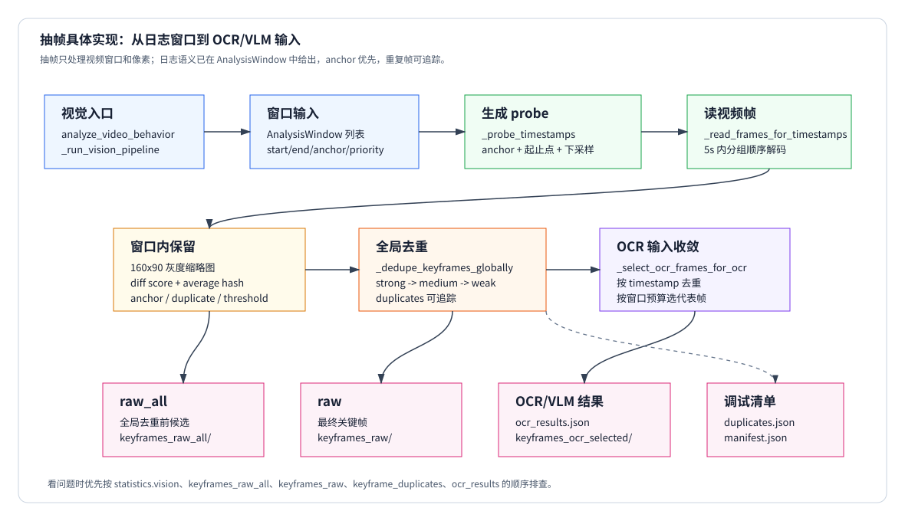

# 02 抽帧策略：具体实现

本文解释当前代码如何把日志挖掘输出的 `AnalysisWindow` 变成可 OCR/VLM 使用的关键帧。重点是：**抽帧策略只处理视频窗口和像素，不重新判断日志是否可疑**。日志语义来自 `main/data_leak_detector/log_mining.py`，抽帧实现主要落在：

- `main/data_leak_detector/frame_analyzer/analyzer.py`
- `main/data_leak_detector/frame_analyzer/frames.py`
- `main/data_leak_detector/frame_analyzer/config.py`



当前执行关系是：

```text
analyze_video_behavior(...)
  -> _run_vision_pipeline(...)
  -> select_keyframes_detailed(...)
  -> _probe_timestamps(...)
  -> _read_frames_for_timestamps(...)
  -> _should_keep_frame(...)
  -> _dedupe_keyframes_globally(...)
  -> _select_ocr_frames_for_ocr(...)
  -> _export_vision_artifacts(...)
```

也就是说，抽帧不是全视频均匀采样，也不是从 OCR/VLM 结果反推帧；它先按日志窗口和 anchor 生成少量 probe，再用视觉变化和重复检测收敛成最终关键帧。

# 入口和输入边界

## 1. `analyze_video_behavior(...)` 什么时候会抽帧

### 输入

```text
video_path
logs
sensitive_files
vision_enabled
vision_mode
max_vlm_frames
artifact_dir
analysis_windows
log_mining
```

### 机械规则

`analyze_video_behavior(...)` 总是先生成 deterministic log-anchored observations。只有 `VisionConfig.enabled=True` 时，才进入 `_run_vision_pipeline(...)`：

```python
config = VisionConfig.from_env().with_overrides(
    enabled=vision_enabled,
    mode=vision_mode,
    max_vlm_frames=max_vlm_frames,
)

if config.enabled:
    _run_vision_pipeline(...)
```

CLI 对应：

```powershell
python main/run_e2e.py `
  --case "..." `
  --vision `
  --vision-mode ocr `
  --max-vlm-frames 0
```

`--vision` 打开视觉链路；`--vision-mode ocr` 会跑 OCR，不向 VLM 发帧；`--max-vlm-frames 0` 会让 VLM 候选帧数量为 0。

### 输出

```text
frame_analyzer.statistics.vision = {
  enabled,
  mode,
  analysis_windows,
  keyframes,
  keyframes_raw_all,
  keyframe_duplicates,
  ocr_input_keyframes,
  ocr_frames,
  vlm_frames,
  timing_seconds,
  artifacts
}
```

## 2. 窗口来源

### 输入

```text
analysis_windows: list[AnalysisWindow] | None
logs
sensitive_files
config
```

### 机械规则

`_run_vision_pipeline(...)` 优先使用上游已经传入的 `analysis_windows`。如果没有传入，才本地调用 `build_analysis_windows(...)`：

```python
windows = analysis_windows if analysis_windows is not None else build_analysis_windows(logs, sensitive_files, config)
```

正常 E2E 路径里，窗口来自 `pipeline.py` 已经执行过的日志挖掘结果。`log_mining.source` 只用于统计和追踪，不改变抽帧像素逻辑。

### 输出

```text
windows: list[AnalysisWindow]
vision_stats.window_source = log_mining.source | "provided" | "in_memory"
```

# 抽帧核心路径

## 1. `select_keyframes_detailed(...)` 的前置检查

### 输入

```text
video_path
windows
VisionConfig
```

### 机械规则

函数先做几个硬条件检查：

```python
if not video_path:
    return empty selection
if not Path(video_path).exists():
    warnings=["video_not_found: ..."]
if not Path(video_path).is_file():
    warnings=["video_not_file: ..."]
if import cv2 failed:
    warnings=["opencv_not_installed: ..."]
if cv2.VideoCapture cannot open:
    warnings=["video_open_failed: ..."]
if fps <= 0:
    warnings=["video_fps_unavailable"]
```

这里不会 fallback 到均匀抽帧。视频打不开时，视觉链路返回空关键帧和 warning。

### 输出

```text
KeyFrameSelection(
  keyframes=[],
  raw_keyframes=[],
  duplicates=[],
  warnings=[...]
)
```

## 2. 每个窗口生成 probe 时间点

### 输入

```text
AnalysisWindow(
  start_ms,
  end_ms,
  step_ms,
  max_keyframes,
  anchor_ms
)
VisionConfig.frame_probe_multiplier
```

### 机械规则

`_probe_timestamps(...)` 先按窗口步长生成完整序列：

```python
exact = range(window.start_ms, window.end_ms + 1, window.step_ms)
max_probes = max(window.max_keyframes, window.max_keyframes * config.frame_probe_multiplier)
```

如果完整序列不超过 `max_probes`，就全部读；否则做等距下采样：

```python
for slot in range(max_probes):
    timestamps.append(exact[round(slot * last_index / (max_probes - 1))])
```

然后显式加入：

```text
窗口内 anchor
window.start_ms
window.end_ms
下采样后的 timestamps
```

加入顺序是 anchor 优先，再起止点，再普通 probe；最后按去重后的顺序返回。

### 默认效果

```text
medium window:
  max_keyframes=2
  frame_probe_multiplier=6
  => max_probes=12

strong window:
  max_keyframes=24
  frame_probe_multiplier=6
  => max_probes=144
```

这一步把长窗口压到可控的读帧数量，同时保证日志 anchor 不会因为下采样消失。

## 3. 相近时间点顺序解码

### 输入

```text
timestamps
fps
VisionConfig.frame_sequential_gap_ms
```

### 机械规则

`_read_frames_for_timestamps(...)` 会先排序去重，再按时间间隔分组：

```python
for group in _timestamp_groups(sorted(set(timestamps)), config.frame_sequential_gap_ms):
    if len(group) == 1:
        _seek_read_frame(...)
    else:
        _read_timestamp_group_sequentially(...)
```

默认：

```text
frame_sequential_gap_ms=5000
```

如果相邻 timestamp 间隔不超过 5 秒，就放在同一组。单点组直接 seek；多点组只 seek 到第一帧，然后连续 `capture.read()`，沿途把视频帧分配给目标 timestamp。

顺序读取时容忍度是：

```python
frame_interval_ms = round(1000 / fps)
tolerance_ms = max(frame_interval_ms, 50)
```

### 输出

```text
frames_by_timestamp: dict[int, frame]
```

这个实现主要是为了减少密集 strong 窗口里反复 seek 的成本。

## 4. 窗口内是否保留一帧

### 输入

```text
frame
timestamp
previous_small
retained_hashes
retained_small_frames
last_kept_ms
window.diff_threshold
window.anchor_ms
```

每个读出的 frame 会先缩小并灰度化：

```python
small = cv2.resize(frame, (160, 90))
gray = cv2.cvtColor(small, cv2.COLOR_BGR2GRAY)
```

然后计算：

```python
score = 1.0 if previous_small is None else _frame_delta(previous_small, gray)
frame_hash = _average_hash(gray)  # 16x16 average hash
force_keep = _is_near_anchor(timestamp, window.anchor_ms, window.step_ms)
exact_duplicate = _is_exact_duplicate(gray, retained_small_frames, frame_exact_duplicate_threshold)
```

`_is_near_anchor(...)` 的容忍范围是：

```python
tolerance = max(window.step_ms // 2, 125)
```

### 保留规则

`_should_keep_frame(...)` 的顺序是：

```python
if previous_small is None:
    return True
if force_keep:
    return True
if exact_duplicate:
    return False
if score < diff_threshold:
    return False
if frame_min_keep_gap_ms > 0 and timestamp - last_kept_ms < frame_min_keep_gap_ms:
    return False
return all(hamming(frame_hash, retained) > frame_hash_distance_threshold for retained in retained_hashes)
```

几个关键点：

- 窗口第一张可读帧必保留。
- anchor 优先于精确重复和差分阈值。
- 普通帧必须同时通过差分、最小间隔和 hash 距离检查。
- `score` 是当前灰度缩略图与上一张保留参考帧的平均像素差。

### 输出

保留时写临时 jpg，并生成 `KeyFrame`：

```python
KeyFrame(
  frame_id=f"frame_{window_index}_{retained_for_window}",
  timestamp_ms=timestamp,
  image_path=".../frame_0_0_14517.jpg",
  score=round(score, 4),
  reason="strong:anchor" | "strong:window_start" | "strong:visual_change",
  window_id="window_0",
)
```

注意：`retained_for_window >= window.max_keyframes` 后会停止处理该窗口。日志挖掘合并窗口时已经保证 `max_keyframes >= len(anchor_ms)`，避免 anchor 被预算挤掉。

# 全局去重

窗口内保留的帧只是候选帧。多个窗口重叠时，同一画面可能出现多次，所以还要执行 `_dedupe_keyframes_globally(...)`。

## 1. 排序顺序

### 输入

```text
candidates: list[_FrameCandidate]
```

### 机械规则

候选帧按优先级和时间排序：

```python
sorted(candidates, key=lambda item: (_priority_sort_key(item.priority), item.frame.timestamp_ms))
```

优先级顺序是：

```text
strong -> medium -> weak
```

这意味着 strong 窗口里的帧会优先成为保留基准；后面的 medium/weak 如果画面重复，会被标记为 duplicate。

## 2. duplicate 判定

### 机械规则

`_find_global_duplicate(...)` 会逐张和已保留帧比较：

```python
candidate_is_anchor = "anchor" in candidate.frame.reason
retained_is_anchor = "anchor" in retained.frame.reason

if candidate_is_anchor and not (
    retained_is_anchor
    and anchor_duplicate_gap_ms > 0
    and abs(candidate.timestamp_ms - retained.timestamp_ms) <= anchor_duplicate_gap_ms
):
    continue

delta = _frame_delta(retained.gray, candidate.gray)
hash_distance = _hamming(candidate.frame_hash, retained.frame_hash)

if same_timestamp or delta <= frame_exact_duplicate_threshold:
    return retained
```

默认阈值：

```text
frame_exact_duplicate_threshold=0.001
frame_anchor_duplicate_gap_ms=500
```

anchor 的特殊性是：普通重复不会删掉 anchor；只有两个 anchor 相距不超过 500ms 且画面近乎完全一样时，后一个 anchor 才会被去重。

### 输出

```text
keyframes: 全局去重后的最终帧，按 timestamp_ms 排序
duplicates: 被删掉的候选帧及其 kept_frame_id、delta、hash_distance
raw_keyframes: 全局去重前的候选帧
```

如果有窗口但最终没有任何 keyframe，会追加 warning：

```text
no_keyframes_selected
```

# OCR 输入收敛

全局去重后的 `keyframes` 不一定全部送 OCR。`_select_ocr_frames_for_ocr(...)` 会再按窗口做一次预算控制。

## 1. 先按 timestamp 去重

### 机械规则

```python
for frame in sorted(frames, key=timestamp_ms):
    if timestamp not in seen_timestamps:
        unique.append(frame)
```

## 2. 每个窗口按优先级给预算

### 默认预算

```text
strong: max_keyframes_per_strong_window = 24
medium: max_keyframes_per_medium_window = 2
weak: max_keyframes_per_weak_window = 2
```

每个窗口会先收集 anchor 帧：

```python
anchor_frames = [frame for frame in group if "anchor" in frame.reason]
budget = max(budget, len(anchor_frames))
```

然后用 `_representative_frames(...)` 等距挑代表帧：

```python
if len(ordered) <= budget:
    return ordered
for slot in range(budget):
    selected.append(ordered[round(slot * last_index / (budget - 1))])
```

这一步保证每个窗口都有代表帧进入 OCR，同时 medium 窗口不会因为很长而吞掉 OCR 预算。

## 3. ROI 当前默认关闭

### 机械规则

```python
if config.ocr_roi_enabled:
    ocr_candidates = prepare_ocr_candidates(...)
    ocr_candidate_frames = selected ROI frames
else:
    ocr_candidates = []
    ocr_candidate_frames = ocr_frames
```

默认 `DLD_OCR_ROI_ENABLED=false`，所以当前主要路径是整帧 OCR。

# artifact 导出

`_export_vision_artifacts(...)` 负责把抽帧中间结果和 OCR 结果写到 case artifact 目录。只有传入 `artifact_dir` 时才会导出。

## 1. 目录重建

### 机械规则

每次导出会先删除并重建这些目录：

```text
keyframes_raw_all/
keyframes_raw/
keyframes_ocr_roi/
keyframes_ocr_selected/
```

## 2. 文件含义

| 路径 | 来源 | 含义 |
|---|---|---|
| `keyframes_raw_all/` | `keyframe_selection.raw_keyframes` | 全局去重前候选帧，便于确认“曾经抽到过什么” |
| `keyframes_raw/` | `keyframes` | 全局去重后的最终关键帧，也是 OCR 输入的基础集合 |
| `keyframe_duplicates.json` | `keyframe_selection.duplicates` | 被全局去重删掉的帧、保留帧 ID、像素差和 hash 距离 |
| `keyframes_ocr_roi/` | `ocr_candidates` | ROI OCR 输入；默认关闭时为空 |
| `ocr_results.json` | `ocr_results` | OCR 后且按窗口文本去重后的结果 |
| `ocr_roi_regions.json` | `ocr_candidates` | ROI 区域详情；默认关闭时为空数组 |
| `keyframes_ocr_selected/` | `vlm_frames` 对应帧 | OCR 后选择给 VLM 的帧；`max_vlm_frames=0` 时为空 |
| `artifact_manifest.json` | 导出清单 | 各目录实际复制出的文件列表 |

复制后的帧文件名格式是：

```text
{index:03d}_{timestamp_ms}ms_{reason}.jpg
```

例如：

```text
000_19517ms_strong-anchor.jpg
```

# 统计字段怎么读

报告里优先看：

```json
{
  "frame_analyzer": {
    "statistics": {
      "vision": {
        "analysis_windows": 2,
        "window_source": "neo4j",
        "keyframes_raw_all": 31,
        "keyframes": 18,
        "keyframe_duplicates": 13,
        "ocr_input_keyframes": 18,
        "ocr_frames": 18,
        "vlm_frames": 0
      }
    }
  }
}
```

字段含义：

| 字段 | 含义 |
|---|---|
| `analysis_windows` | 日志挖掘给抽帧的窗口数量 |
| `window_source` | 窗口来自 `neo4j`、`in_memory`、`in_memory_fallback` 或直接传入 |
| `keyframes_raw_all` | 窗口内保留后、全局去重前的候选帧数 |
| `keyframes` | 全局去重后的最终关键帧数 |
| `keyframe_duplicates` | 全局去重删掉的帧数 |
| `ocr_input_keyframes` | 实际送 OCR 的关键帧数 |
| `ocr_frames` | OCR 文本按窗口去重后的结果数 |
| `vlm_frames` | OCR 结果中被挑给 VLM 的帧数 |

# 实际例子

## GPT case：file_selected anchor 怎么进入 OCR

已知日志挖掘输出 strong 窗口：

```text
AnalysisWindow(
  start_ms=14517,
  end_ms=34517,
  priority="strong",
  step_ms=250,
  max_keyframes=24,
  diff_threshold=0.015,
  anchor_ms=(19517,)
)
```

抽帧过程：

```text
_probe_timestamps
  -> 先加入 anchor 19517
  -> 加入 start 14517 / end 34517
  -> strong 步长 250ms 生成候选并按 max_probes 控制

_read_frames_for_timestamps
  -> 相邻候选在 5 秒内，按组顺序解码

_should_keep_frame
  -> 14517ms 作为 window_start 保留
  -> 19517ms 因为靠近 anchor 强制保留
  -> 30517ms 如果视觉变化通过阈值，作为 visual_change 保留
```

最终 artifact 通常能看到类似：

```text
keyframes_raw/000_14517ms_strong-visual_change.jpg
keyframes_raw/001_19517ms_strong-anchor.jpg
keyframes_raw/002_30517ms_strong-visual_change.jpg
```

如果 `keyframes_raw_all/` 里有目标画面，但 `keyframes_raw/` 没有，说明它可能被全局去重压掉，下一步看 `keyframe_duplicates.json`。

## Bluetooth case：密集 anchor 为什么会有 duplicates

蓝牙传输类日志会给出多个 strong anchor，例如：

```text
打开蓝牙传送
选择目的地
选择文件
正在发送
成功传输
```

抽帧器会优先保留这些 anchor，但如果相邻 anchor 在 `frame_anchor_duplicate_gap_ms=500` 内且画面几乎完全一样，全局去重会把后一个写入 `keyframe_duplicates.json`。这就是为什么 `keyframes_raw_all` 可能大于 `keyframes`。

# 排查顺序

如果关键画面没有进入 OCR，按实现顺序查：

1. `frame_analyzer.statistics.vision.enabled` 是否为 `true`。
2. `analysis_windows` 是否大于 0。
3. `window_source` 是否符合预期，例如 `neo4j` 还是 `in_memory_fallback`。
4. 目标时间是否落在某个 `AnalysisWindow.start_ms/end_ms` 内。
5. 目标时间是否在 `anchor_ms` 附近；容忍范围是 `max(step_ms // 2, 125)`。
6. `keyframes_raw_all/` 是否有目标附近帧。
7. 如果 raw_all 有而 raw 没有，看 `keyframe_duplicates.json` 的 `kept_frame_id` 和 `duplicate_reason`。
8. 如果 raw 有而 OCR 没有，看 `ocr_input_keyframes` 和每窗口 OCR 预算。
9. 如果 OCR 有而 VLM 没有，看 `max_vlm_frames`、`vision_mode` 和 `keyframes_ocr_selected/`。
10. 如果整段都没有帧，先看 warnings：`video_not_found`、`video_open_failed`、`video_fps_unavailable`、`opencv_not_installed`。

这套顺序能把问题定位到窗口、读帧、窗口内保留、全局去重、OCR 输入裁剪或 VLM 选择中的具体一步。
