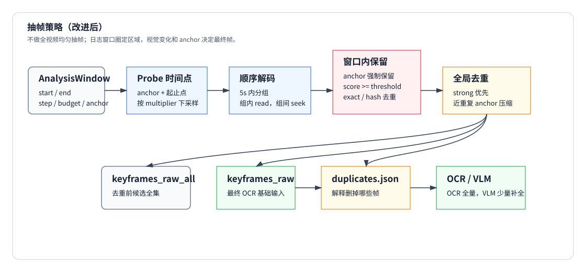
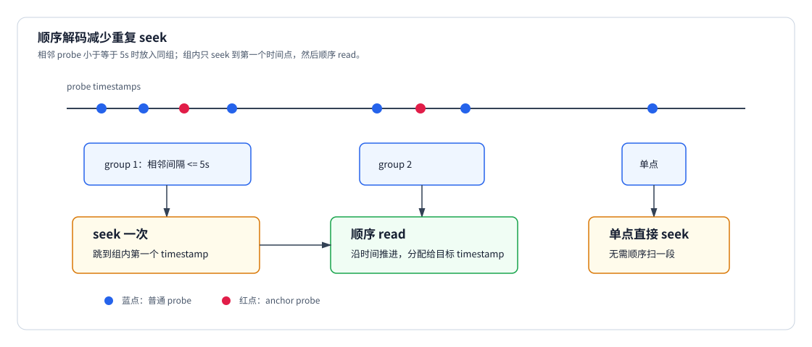
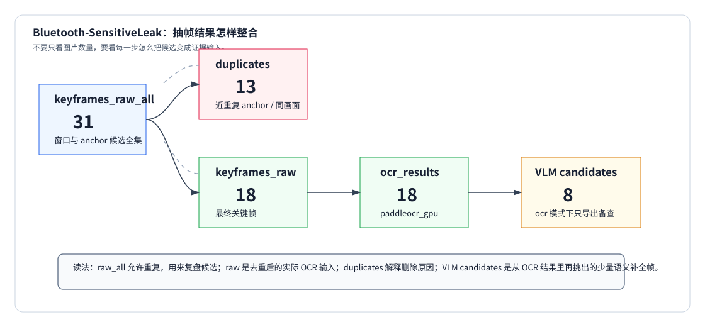
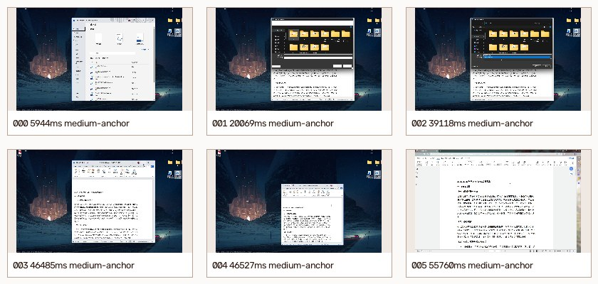
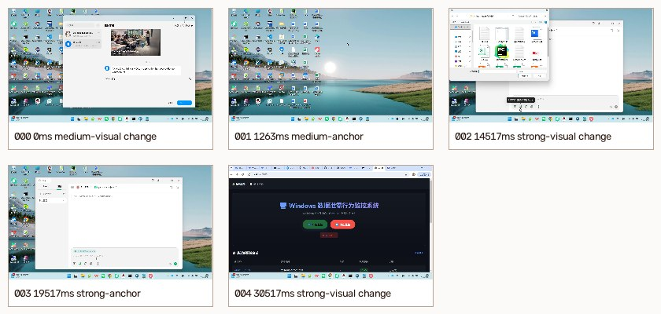
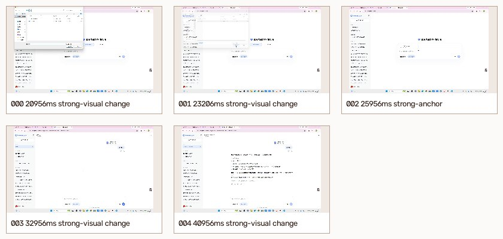
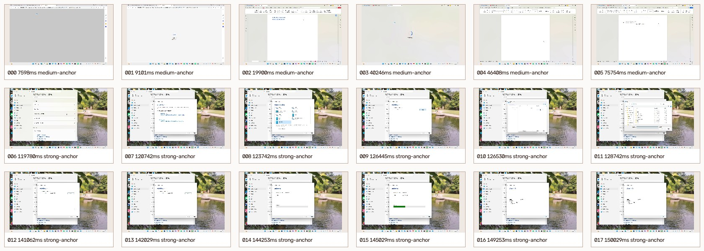

# 抽帧策略（改进后）

本文对应当前实现里的 `main/data_leak_detector/frame_analyzer/frames.py` 和 `main/data_leak_detector/frame_analyzer/analyzer.py`。抽帧策略只处理视频窗口和像素，不决定哪些日志可疑；可疑时间段来自日志挖掘输出的 `AnalysisWindow`。

当前目标是：

- 不做全视频均匀抽帧。
- 不试 ROI，默认整帧 OCR。
- 优先保留日志 anchor 附近的画面。
- 用视觉变化和感知哈希减少重复帧。
- 用顺序解码减少反复 seek 的成本。
- 让 `keyframes_raw_all/`、`keyframes_raw/`、`keyframe_duplicates.json` 能解释每一次保留和删除。

## 总体流程



完整链路如下：

1. 接收日志挖掘给出的 `AnalysisWindow`。
2. 每个窗口生成 probe timestamps：anchor、窗口起止点、按 step 采样后的候选点。
3. 将相近时间点分组，组内顺序解码，组间再 seek。
4. 对读出的帧计算缩略灰度图、平均像素差分和 16x16 average hash。
5. 窗口内按 anchor、差分阈值、精确重复和 hash 距离决定是否保留。
6. 对所有窗口候选帧做全局去重，生成最终 keyframes。
7. 导出 raw_all、raw、duplicates，并把最终 keyframes 交给 OCR/VLM。

## 输入：AnalysisWindow

抽帧器只消费以下字段：

| 字段 | 含义 |
|---|---|
| `start_ms` / `end_ms` | 视频内窗口范围 |
| `priority` | `strong`、`medium`、`weak`，影响全局去重排序 |
| `step_ms` | 窗口内候选时间点间隔 |
| `max_keyframes` | 该窗口最多保留多少候选帧 |
| `diff_threshold` | 视觉变化阈值 |
| `anchor_ms` | 日志侧认为必须检查的关键时间点 |
| `active_apps` | 给 VLM/报告使用的上下文，不参与像素判断 |

窗口参数来自日志挖掘策略。抽帧器不会重新判断 `file_selected`、`fsquirt.exe`、敏感文件等日志语义。

## Probe 时间点

`_probe_timestamps(...)` 负责生成实际要读视频的时间点。

规则如下：

1. 先按 `window.step_ms` 生成完整时间序列。
2. 如果完整序列太长，就按 `frame_probe_multiplier` 做均匀下采样。
3. `max_probes = max(window.max_keyframes, window.max_keyframes * frame_probe_multiplier)`。
4. 默认 `frame_probe_multiplier=6`，因此 medium 默认 `2 * 6 = 12` 个 probe，加上 anchor 和起止点。
5. anchor、窗口起点、窗口终点会被显式加入，并去重。
6. anchor 按时间排序后优先放入读取列表。

这一步的意义是：长 medium 窗口不会因为 `step_ms=1000` 就真的读上百帧；它会先被压缩成少量 probe，再靠 anchor 保住关键时刻。

## 顺序解码

旧的方式是每个 timestamp 都 `seek` 一次。对 H.264/H.265 这类视频，seek 往往要从最近关键帧解码到目标帧；很多相邻 timestamp 反复 seek 会很慢。

当前 `_read_frames_for_timestamps(...)` 会先用 `_timestamp_groups(...)` 分组：

- 默认 `frame_sequential_gap_ms=5000`。
- 相邻 timestamp 差值不超过 5 秒，就放进同一组。
- 单点组直接 seek 读取。
- 多点组只 seek 到组内第一个 timestamp，然后顺序 `read()`，把沿途帧分配给目标 timestamp。



这样对密集 strong 窗口很有用：比如 250ms 级别的候选点，如果每次 seek 都会重复解码同一段 GOP；顺序解码可以把这段成本摊开。

## 窗口内保留规则

每个读出的帧会先缩成 `160x90`，再转灰度图。抽帧器计算：

- `score`：当前灰度缩略图与上一张窗口参考帧的平均像素差。
- `frame_hash`：`16x16` average hash。
- `exact_duplicate`：是否与窗口内已保留帧几乎完全一样。
- `force_keep`：是否靠近 `anchor_ms`。

保留逻辑在 `_should_keep_frame(...)`：

| 条件 | 结果 |
|---|---|
| 窗口内第一张可读帧 | 保留 |
| `force_keep=True` | 保留，anchor 优先于 exact duplicate |
| 精确重复且不是 anchor | 丢弃 |
| `score < diff_threshold` | 丢弃 |
| `frame_min_keep_gap_ms` 生效且距离上一张太近 | 丢弃 |
| hash 与窗口内已保留帧都足够不同 | 保留 |

这里有一个刻意设计：anchor 在窗口内会强制保留。因为很多关键画面变化很小，例如文件选择器里的文件名被选中、上传列表新增一行、蓝牙传输状态改变，这些在整帧平均差分里可能并不显眼。

## 全局去重

窗口内保留下来的帧仍然可能重复，原因包括：

- strong 和 medium 窗口重叠。
- 多个 anchor 指向几乎相同的 UI 状态。
- 同一时间点被不同窗口读到。

`_dedupe_keyframes_globally(...)` 会按优先级排序候选：

```text
strong -> medium -> weak
同优先级按 timestamp_ms 升序
```

然后逐张和已保留帧比较：

| 情况 | 行为 |
|---|---|
| timestamp 完全相同 | 后来的候选记为 duplicate |
| 非 anchor 且和已保留帧像素差小于 `frame_exact_duplicate_threshold` | 记为 duplicate |
| anchor 与非 anchor 相似 | 默认仍保留 anchor |
| anchor 与 anchor 相距不超过 `frame_anchor_duplicate_gap_ms` 且近乎完全一样 | 后来的 anchor 记为 duplicate |

默认阈值：

- `frame_exact_duplicate_threshold=0.001`
- `frame_hash_distance_threshold=12`
- `frame_anchor_duplicate_gap_ms=500`

也就是说，anchor 不是绝对免死牌。Bluetooth 这种毫秒级密集 anchor，如果相邻 500ms 内画面完全一样，会被压到 `keyframe_duplicates.json`，减少一模一样帧进入 OCR。

## 输出文件

开启 `--vision` 和 `--output-dir` 后，artifact 里会生成：

| 路径 | 含义 |
|---|---|
| `keyframes_raw_all/` | 全局去重前的候选帧，便于追踪“曾经抽到过什么” |
| `keyframes_raw/` | 全局去重后的最终关键帧，也是 OCR 的基础输入 |
| `keyframe_duplicates.json` | 被全局去重删掉的帧、保留帧 ID、原因、像素差和 hash 距离 |
| `ocr_results.json` | OCR 对最终关键帧的识别结果 |
| `keyframes_ocr_selected/` | 会送给 VLM 的 OCR 结果候选帧 |
| `ocr_roi_regions.json` | ROI 实验输出；当前默认关闭，通常为空 |
| `artifact_manifest.json` | artifact 文件路径清单 |

看重复帧时要区分：

- `keyframes_raw_all/` 允许重复，它是调试用候选全集。
- `keyframes_raw/` 是实际保留下来的最终帧。
- `ocr_results.json` 是 OCR 实际处理后的结果。
- `keyframe_duplicates.json` 解释哪些 raw_all 帧被删掉。

## OCR 输入与去重

`_select_ocr_frames_for_ocr(...)` 先按 timestamp 去重，再按窗口分组，并按窗口优先级应用预算：

| 窗口 | OCR 输入预算 |
|---|---:|
| strong | `max_keyframes_per_strong_window`，默认 24 |
| medium | `max_keyframes_per_medium_window`，默认 2 |
| weak | `max_keyframes_per_weak_window`，默认 2 |

但是 anchor 不会被预算挤掉：

```text
budget = max(budget, len(anchor_frames))
```

这条规则是为了避免 medium 默认预算很小的时候，日志已经明确指出的关键时刻反而不进 OCR。

OCR 后还有文本去重 `_dedupe_ocr_results(...)`：

- anchor OCR 结果始终保留。
- 空文本结果保留，用于解释 provider 和置信度。
- 非 anchor 的文本如果和同窗口已保留文本相似度超过 `ocr_text_similarity_threshold=0.92`，会被去掉。

因此 OCR 去重压的是重复文本，不会吞掉 anchor 证据。

## VLM 选择

VLM 不看所有帧。当前流程是：

1. OCR 先处理最终关键帧。
2. `choose_vlm_frames(...)` 从 OCR 结果里选低置信度或可疑帧。
3. 最多选择 `max_vlm_frames`，默认 8。
4. 只有 `mode=hybrid` 或 `mode=vlm` 时才真正调用 VLM。
5. `mode=ocr` 时仍会导出 `keyframes_ocr_selected/`，但不调用远端 VLM。

这符合当前定位：OCR 是批量文本证据入口，VLM 只做少量语义补全。

## 当前默认配置

常用配置项如下：

| 配置 | 默认值 | 作用 |
|---|---:|---|
| `DLD_FRAME_PROBE_MULTIPLIER` | 6 | 每个窗口最多读 `max_keyframes * multiplier` 个非 anchor probe |
| `DLD_FRAME_SEQUENTIAL_GAP_MS` | 5000 | 相邻 probe 小于等于该值时顺序解码 |
| `DLD_FRAME_ANCHOR_DUPLICATE_GAP_MS` | 500 | 近距离 anchor 完全重复时去重 |
| `DLD_FRAME_EXACT_DUPLICATE_THRESHOLD` | 0.001 | 精确重复像素差阈值 |
| `DLD_FRAME_HASH_DISTANCE_THRESHOLD` | 12 | 窗口内 hash 去重阈值 |
| `DLD_MAX_KEYFRAMES_PER_STRONG_WINDOW` | 24 | strong 窗口预算 |
| `DLD_MAX_KEYFRAMES_PER_MEDIUM_WINDOW` | 2 | medium 窗口预算 |
| `DLD_MAX_KEYFRAMES_PER_WEAK_WINDOW` | 2 | weak 窗口预算 |
| `DLD_OCR_TEXT_SIMILARITY_THRESHOLD` | 0.92 | OCR 文本去重阈值 |
| `DLD_OCR_ROI_ENABLED` | 0 | ROI 默认关闭 |

## 典型样例结果

### 1-transfer-print-1

当前刷新结果：

```text
keyframes=6
raw_all=8
duplicates=2
ocr provider=paddleocr_gpu
timestamps=5944, 20069, 39118, 46485, 46527, 55760
```

这个 case 主要靠日志侧的打印/另存为/敏感文件 anchor 保住关键时间点。最终帧都来自 `medium:anchor`，说明不是靠随机视觉变化撞中。

### 2-ai-gpt-cherystudio-2

当前刷新结果：

```text
keyframes=5
raw_all=5
duplicates=0
timestamps=0, 1263, 14517, 19517, 30517
```

关键点是 `19517ms` 的 `strong:anchor`，来自文件选择。之前漏帧主要是日志时间轴没对齐，不是抽帧阈值问题。

### 2-ai-DeepSeek-1

当前刷新结果：

```text
keyframes=5
raw_all=5
duplicates=0
timestamps=20956, 23206, 25956, 32956, 40956
```

`25956ms` 是 `strong:anchor`。这里还依赖数据集发现阶段按 `INDEX.md` 选择正确 mp4。

### Bluetooth-SensitiveLeak

当前刷新结果：

```text
keyframes=18
raw_all=31
duplicates=13
ocr provider=paddleocr_gpu
```

这个 case 展示了 `raw_all` 和 `raw` 的区别：日志侧给了很多蓝牙相关 anchor，抽帧阶段先全部纳入候选，再把 13 张近重复帧写进 `keyframe_duplicates.json`。最终给 OCR 的是 18 张去重后的关键帧。

## 排查顺序

如果抽出来的帧不对，按这个顺序看：

1. 先看日志挖掘输出的窗口是否覆盖关键时间。
2. 看窗口 `anchor_ms` 是否包含关键动作。
3. 看 `keyframes_raw_all/` 是否抽到目标画面。
4. 如果 raw_all 有、raw 没有，看 `keyframe_duplicates.json`。
5. 如果 raw 有、OCR 没有，看 `_select_ocr_frames_for_ocr(...)` 的窗口预算和 anchor 数量。
6. 如果 OCR 有但推理没有，看 `ocr_results.json` 的文本、置信度和 provider。
7. 如果连 raw_all 都没有，优先回到日志时间轴和窗口生成，不要先调视觉阈值。

多数问题不是“差分阈值太高”，而是上游窗口没覆盖、时间轴错位、视频选错、anchor 没生成，或者 artifact 里看的是 raw_all 而不是 raw。

## 实际例子：结果怎样整合

抽帧结果不能只看某一个目录。`raw_all`、`raw`、`duplicates`、`ocr_results`、`keyframes_ocr_selected` 是一条证据流水线的不同截面。



以 `Bluetooth-SensitiveLeak` 当前结果为例：

```text
analysis_windows=2
keyframes_raw_all=31
keyframe_duplicates=13
keyframes_raw=18
ocr_frames=18
vlm_frames=8
provider=paddleocr_gpu
```

这组数字的含义是：

1. 日志挖掘给了 2 个窗口：一个 medium 上下文窗口，一个 strong 蓝牙传输窗口。
2. 抽帧阶段先从窗口和 anchor 里读到 31 张候选帧，全部导出到 `keyframes_raw_all/`。
3. 全局去重发现 13 张是近距离、近乎完全一样的 anchor 或重复画面，写入 `keyframe_duplicates.json`。
4. 剩下 18 张进入 `keyframes_raw/`，这是 OCR 实际基础输入。
5. OCR 识别这 18 张，结果写入 `ocr_results.json`。
6. `choose_vlm_frames(...)` 再从 OCR 结果里挑最多 8 张候选帧放到 `keyframes_ocr_selected/`；如果运行模式是 `ocr`，这些帧只是导出备查，不会远端调用 VLM。

这解释了一个容易误会的点：`keyframes_raw_all/` 里有重复不等于最终输入有重复。`raw_all` 是为了复盘“抽帧器曾经看到过什么”；真正要看是否给 OCR 造成浪费，应看 `keyframes_raw/` 和 `ocr_results.json`。

再看 `2-ai-gpt-cherystudio-2`：

```text
timestamps=0, 1263, 14517, 19517, 30517
19517ms = strong:anchor
```

这里的关键不是抽帧算法多聪明，而是上游日志挖掘把 `file_selected` 对齐到了 19.517s。抽帧器随后把 strong anchor 强制保留，补上窗口前后视觉变化帧。这个 case 说明：如果 `raw_all` 里根本没有关键画面，第一反应应该查日志时间轴和视频选择，而不是调 `diff_threshold`。

`1-transfer-print-1` 则体现了 anchor 对 medium 的意义：

```text
keyframes=6
raw_all=8
duplicates=2
timestamps=5944, 20069, 39118, 46485, 46527, 55760
reasons=medium:anchor
```

medium 默认预算只有 2，但最终保留 6 张，是因为这些时间点都是日志侧给出的 anchor。也就是说，预算不是硬删关键帧的上限；它是普通视觉变化帧的上限，anchor 会把关键动作撑出来。

把这三个例子合在一起，可以得到当前抽帧策略的实际工作方式：

- 日志窗口决定“去哪看”。
- probe 和顺序解码决定“用多低成本读帧”。
- anchor 决定“哪些时刻不能漏”。
- 视觉差分和 hash 决定“哪些普通帧有增量”。
- 全局去重决定“哪些重复候选不进 OCR”。
- OCR/VLM 决定“哪些视觉文字和语义进入下游推理”。

所以评估抽帧效果时，不要只数图片张数。更有用的是看每个阶段的转化：窗口是否覆盖、raw_all 是否命中、duplicates 是否合理、raw 是否保留关键状态、OCR 是否读到证据、VLM 候选是否集中在不确定帧上。

## 按实际输出文件复盘

这一节只引用当前 artifact 里的实际字段。对应文件都在 `artifacts/neo4j_frame_selection_check/`。

| case | `keyframes_raw_all` | `keyframe_duplicates` | `keyframes_raw` / `ocr_frames` | `vlm_frames` | provider |
|---|---:|---:|---:|---:|---|
| `1-transfer-print-1_logs_1056` | 8 | 2 | 6 | 6 | `paddleocr_gpu` |
| `2-ai-gpt-cherystudio-2_logs_402` | 5 | 0 | 5 | 5 | `paddleocr_gpu` |
| `2-ai-DeepSeek-1_logs_516` | 5 | 0 | 5 | 5 | `paddleocr_gpu` |
| `Bluetooth-SensitiveLeak_logs_3034` | 31 | 13 | 18 | 8 | `paddleocr_gpu` |

这张表来自每个报告的 `frame_analyzer.statistics.vision` 和每个目录下的 `ocr_results.json`。它说明 `raw_all`、`duplicates`、`raw/OCR` 之间不是同一个概念：Bluetooth 有 31 张候选，但实际 OCR 是 18 张；被压掉的 13 张能在 `keyframe_duplicates.json` 里逐条核验。

下面几张 grid 直接由对应 artifact 的 `keyframes_raw/` 生成，图下方标签就是最终关键帧文件名里的序号、时间戳和 reason。

`1-transfer-print-1` 的实际 OCR 结果证明 medium anchor 没有被 2 帧预算挤掉：



```text
artifacts/neo4j_frame_selection_check/1-transfer-print-1_logs_1056/ocr_results.json
5944ms  medium:anchor  "公司战略规划.docx·已保存到这台电脑 ..."
20069ms medium:anchor  "将打印输出另存为 ... 公司战略规 ... 划.docx ..."
46485ms medium:anchor  "公司战略规划.pdf ... 公司战略规划.docx·已保存到这台电脑 ..."
55760ms medium:anchor  "公司战略规划.pdf ... chrome-extension://..."
```

同一个目录下的 `keyframe_duplicates.json` 也能看到删掉的是近重复：

```text
39286ms -> frame_0_2  near_exact_visual_duplicate  delta=0.00009  hash_distance=0
39594ms -> frame_0_2  near_exact_visual_duplicate  delta=0.00009  hash_distance=1
```

也就是说，这个 case 不是“少抽了”，而是 8 个候选里 2 个几乎相同，最终 6 个 anchor 都进了 OCR。

`2-ai-gpt-cherystudio-2` 的 `ocr_results.json` 展示了 strong 窗口的前后状态：



```text
14517ms strong:visual_change
  "打开 ... 桌面数据采集测试 ... 公司合作合同 ..."
19517ms strong:anchor
  "... 默认助手 gpt-3.5-turbo ... 公司合作合同.docx ..."
30517ms strong:visual_change
  "Win Monitor ... 20260310_001537 ..."
```

这里 `keyframe_duplicates=0`，说明 5 张最终帧都是不同状态。`19517ms` 是日志 anchor，`14517ms` 和 `30517ms` 是窗口内视觉变化补充。

`2-ai-DeepSeek-1` 同理：



```text
20956ms strong:visual_change  "打开 ... 桌面 ..."
23206ms strong:visual_change  "Win Monitor - 数据泄露行为 ... DeepSeek ..."
25956ms strong:anchor         "Win Monitor - 数据泄露行为 ... DeepSeek | 深度求索 ..."
40956ms strong:visual_change  "... 合同文件问候语分析 - DeepSe ..."
```

这说明抽帧器不是只截 anchor 一帧，而是在 strong 窗口里保留了前后几个状态，方便 OCR/VLM 还原页面变化。

Bluetooth 的 `keyframe_duplicates.json` 最能说明“有一模一样帧”现在是怎么被处理的：



```text
120812ms -> frame_0_1  near_exact_visual_duplicate  delta=0.000232  hash_distance=0
123780ms -> frame_0_3  near_exact_visual_duplicate  delta=0.0       hash_distance=0
123812ms -> frame_0_3  near_exact_visual_duplicate  delta=0.00001   hash_distance=0
128780ms -> frame_0_6  near_exact_visual_duplicate  delta=0.0       hash_distance=0
128812ms -> frame_0_6  near_exact_visual_duplicate  delta=0.00027   hash_distance=0
141253ms -> frame_0_8  near_exact_visual_duplicate  delta=0.000091  hash_distance=0
```

这些不是主观觉得像，而是输出文件里记录的像素差和 hash 距离。`delta=0.0` 或 `hash_distance=0` 的帧不会进入最终 `keyframes_raw/`，但会留在 `keyframes_raw_all/` 供复盘。

Bluetooth 的 `ocr_results.json` 则说明去重后留下来的 18 张仍然覆盖完整过程：

```text
119780ms strong:anchor  "设置 ... 蓝牙和其他设备 ..."
120742ms strong:anchor  "蓝牙文件传送 ... 使用蓝牙传送文件 ..."
123742ms strong:anchor  "蓝牙文件传送 ... 选择发送文件的目的地 ..."
126445ms strong:anchor  "选择要发送的文件 ..."
144253ms strong:anchor  "正在发送的文件 ..."
149253ms strong:anchor  "文件已成功传输 ..."
150029ms strong:anchor  "文件已成功传输 ..."
```

这就是当前 artifact 的读法：`keyframes_raw_all/` 看候选覆盖，`keyframe_duplicates.json` 看删帧是否合理，`keyframes_raw/` 和 `ocr_results.json` 看实际进入证据链的内容。用这些文件串起来，才能判断抽帧策略是否真的抓到了关键过程。
