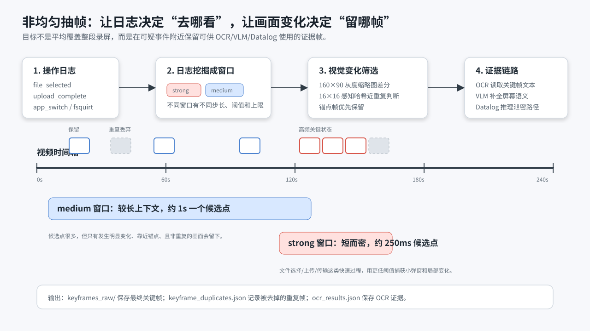
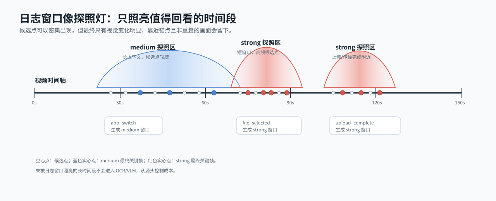
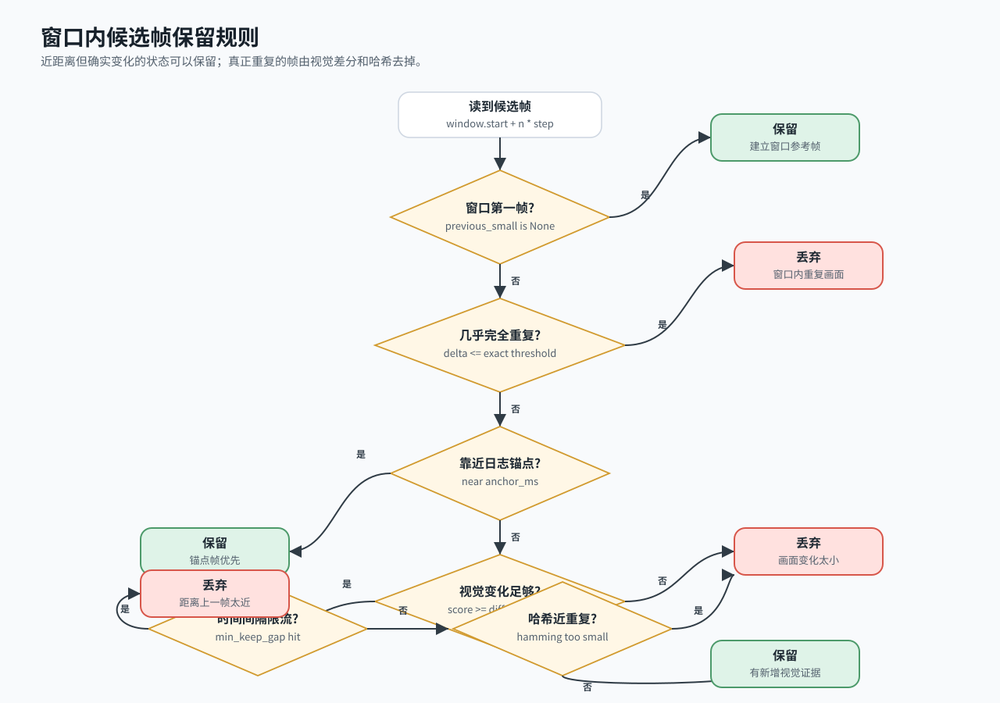
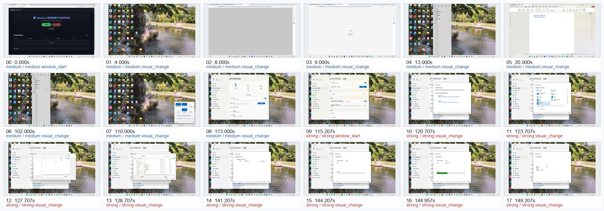

# 抽帧策略

抽帧策略负责把 `AnalysisWindow` 转成可供 OCR/VLM 使用的关键帧。它接收日志挖掘已经圈出的时间窗，不再关心日志如何转 Neo4j、候选事件如何判断、窗口为什么是 strong 或 medium。那些内容见 [01日志挖掘策略.md](01日志挖掘策略.md)。

本文只解释：

```text
AnalysisWindow -> 视频候选点 -> 视觉变化筛选 -> 全局去重 -> KeyFrame -> OCR/VLM
```

## 原理图



抽帧不是把视频按固定 FPS 平均切图。日志挖掘已经告诉我们“哪些时间窗值得看”，抽帧器要继续回答：

- 窗口里哪些时间点需要读视频帧？
- 读出来的帧和前面相比有没有证据增量？
- 很近但重要的状态变化要不要保留？
- 重叠窗口造成的重复帧怎么删？
- 最终哪些帧应该交给 OCR/VLM？

更形象地看，长视频不会被整段平均抽帧，而是被日志窗口拉出若干探照区域：



## 窗口内如何筛帧

每个 `AnalysisWindow` 已经带有：

- `start_ms` / `end_ms`：视频内起止时间。
- `step_ms`：候选点间隔。
- `max_keyframes`：该窗口最多保留多少帧。
- `diff_threshold`：画面变化阈值。
- `anchor_ms`：日志侧认为需要重点检查的时间点。

抽帧器在窗口里按 `step_ms` 生成候选时间点，但不会“到点就保存”。每个候选点都会经过视觉判断：

1. 用 OpenCV 跳到候选时间点读取原始帧。
2. 把画面缩放成 `160x90` 灰度图。
3. 与上一张窗口内参考帧计算平均像素差异，得到 `score`。
4. 计算 `16x16` average hash，用于判断近重复画面。
5. 判断时间点是否靠近日志锚点。
6. 按保留规则决定保存或丢弃。

保留规则如下：



当前默认不按时间强制限流。也就是说，间隔很近但画面确实发生关键变化的帧可以被保留；真正重复的帧由视觉相似度和哈希去掉。

## 为什么 strong 窗口更容易保留小变化

`strong`、`medium`、`weak` 的窗口参数由日志挖掘决定。抽帧器只按窗口参数执行。

strong 窗口通常来自文件选择、上传、发送、蓝牙传输等快速操作。它们的关键变化可能只发生在小弹窗或局部区域里，例如：

- 文件选择器打开。
- 文件名被选中。
- 上传列表新增文件。
- 蓝牙传输窗口进入发送状态。
- 进度条或完成状态变化。

这些变化在整帧平均差异里可能很小，所以 strong 窗口通常会使用更低的差分阈值和更密的候选点。这样不是为了多抽，而是为了避免漏掉“只占屏幕局部但语义很关键”的状态变化。

## 去重分两层

### 窗口内去重

窗口内去重发生在抽帧过程中，主要避免同一个窗口连续保留几乎一样的画面。

使用两种信号：

- 精确差分：灰度缩略图平均差异小于 `DLD_FRAME_EXACT_DUPLICATE_THRESHOLD`，默认 `0.001`。
- 感知哈希：`16x16` average hash 的汉明距离小于等于 `DLD_FRAME_HASH_DISTANCE_THRESHOLD`，默认 `12`。

### 全局去重

多个窗口可能重叠。同一张视频帧可能被不同窗口抽到，或者同一画面在相邻窗口里重复出现。

全局去重会按优先级和时间排序候选帧：

1. `strong` 优先于 `medium`。
2. `medium` 优先于 `weak`。
3. 同优先级按时间排序。

如果候选帧与已保留帧满足下面任一条件，就会被记录为重复：

- 时间戳相同。
- 缩略图差异小于精确重复阈值。

被删掉的帧会写入 `keyframe_duplicates.json`，包含：

- 被去掉的帧 ID。
- 它重复了哪张已保留帧。
- 重复原因。
- 像素差异 `delta`。
- 感知哈希距离 `hash_distance`。

如果怀疑关键画面被误删，先看 `keyframes_raw_all/` 和 `keyframe_duplicates.json`。

## Bluetooth-SensitiveLeak 抽帧结果

下面用 `spec/data/nas_samples/stage5/Bluetooth-SensitiveLeak` 的真实结果解释。日志挖掘部分见 [01日志挖掘策略.md](01日志挖掘策略.md)，这里只看抽帧输出。

该样例最终统计：

| 项目 | 结果 |
|---|---:|
| 分析窗口数 | 2 |
| 全局去重前候选帧 | 18 |
| 最终关键帧 | 18 |
| 全局重复帧 | 0 |
| OCR 输入帧 | 18 |

最终关键帧 grid：



这张图可以这样读：

- `000` 到 `008` 是 medium 上下文帧，覆盖 `0s`、`4s`、`8s`、`9s`、`13s`、`20s`、`102s`、`110s`、`113s`。这些帧用于确认桌面、浏览器、文件查看器、蓝牙设置入口等上下文变化。
- `009` 到 `017` 是 strong 关键帧，覆盖 `115.207s` 到 `149.207s`。这些帧更接近蓝牙发送过程，包含文件选择器、蓝牙传输窗口、进度状态等。
- `keyframe_duplicates.json` 为空数组，表示该样例没有全局重复帧被删。也就是说，这 18 张图之间的视觉差异都足够保留下来，或者属于必要上下文。

这个例子体现了当前策略的几个特点：

1. 抽帧数量不是按 case 固定分配，而是由窗口参数和画面变化共同决定。
2. medium 帧不是“弱证据”，它们提供文件内容和应用上下文。
3. strong 帧靠近外发过程，但不一定包含完整文件名，所以 OCR 仍然要看全部最终关键帧。
4. 如果后续觉得帧太多，应优先检查日志窗口是否过宽，而不是直接提高视觉差分阈值。

## 输出文件怎么看

开启 `--output-dir` 和 `--vision` 后，一个样例会生成 artifact 目录。关键文件包括：

| 文件/目录 | 含义 |
|---|---|
| `keyframes_raw_all/` | 全局去重前的候选帧图片 |
| `keyframes_raw/` | 全局去重后的最终关键帧图片 |
| `keyframe_duplicates.json` | 被全局去重删掉的帧及原因 |
| `ocr_results.json` | OCR 对最终关键帧的识别结果 |
| `frame_observations.json` | OCR/VLM 转成的视觉观察事实 |
| `artifact_manifest.json` | 图片路径清单，避免主报告 JSON 过长 |

推荐排查顺序：

1. 先看 `keyframes_raw/`，确认最终关键帧是否覆盖关键过程。
2. 如果缺帧，看 `keyframes_raw_all/` 和 `keyframe_duplicates.json`。
3. 如果关键帧有了但证据没进入推理，看 `ocr_results.json` 和 `frame_observations.json`。
4. 如果连 `keyframes_raw_all/` 都没有目标画面，回到 `01日志挖掘策略.md` 检查窗口是否覆盖正确时间段。

## 与 OCR/VLM 的关系

当前策略默认让 OCR 读取所有最终关键帧。原因是 strong 帧能说明“外发过程可能发生”，但不一定知道“外发的文件内容是什么”。文件名、页面标题、按钮文本、上传列表、蓝牙传输对象等视觉文字仍需要 OCR 提供。

VLM 不负责全量看视频，也不负责代替 OCR。它更适合补全 OCR 难以稳定表达的语义，例如：

- 当前前端应用是什么。
- 画面是否是上传、发送、分享、蓝牙传输等操作。
- OCR 读到的文件名与视觉上下文是否一致。
- 是否存在未知但看起来像外部 sink 的风险页面。

因此抽帧策略的目标是：用日志窗口和视觉变化减少 OCR/VLM 需要处理的图片，同时不丢掉泄密链路里的关键状态。

## 当前限制和后续方向

当前抽帧本身不急着大改。更应优先改的是上游日志窗口收敛，尤其是超长录屏下 medium 窗口可能过宽的问题。

抽帧侧可以继续优化：

- 对同一 case 的抽帧结果做指纹缓存，避免重复调试时重新抽帧。
- 为抽帧阶段增加更细的耗时统计和候选命中率统计。
- 支持从日志侧传来的 `foreground_window.rect`，让 OCR 只看前台窗口区域。
- 对超长录屏做分段读取和窗口级缓存，避免重复 seek 同一时间段。
- 根据 OCR 结果动态调整 VLM 帧数，而不是固定上限。

ROI 裁剪目前只是实验能力，默认关闭。仅靠 OpenCV 从截图中猜文字区域或前台窗口不够稳定；更合理的方向是采集端记录活跃窗口坐标，然后在分析阶段直接裁剪。
