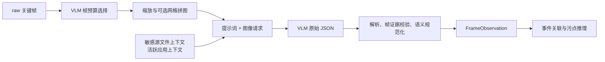

# VLM 策略及实现

## 1. 目标与边界

VLM 的职责是从日志引导的关键帧中提取 GUI 证据：前端应用、文件或内容在界面中的状态、上传/发送/共享等动作，以及可见的结果或失败提示。它解决的是终端日志难以直接表达的“用户在界面上实际做了什么”。

VLM 不直接生成最终泄露结论。模型输出先经过 JSON 解析、帧证据校验和语义规范化，再与日志、文件血缘和确定性污点推理结合。最终外发与结论的定义以 [00口径.md](/media/hwt/Data/Projects/Job/DataLeakDetector/spec/docs/00口径.md) 为准。



## 2. 输入组织

### 2.1 关键帧输入

VLM 的输入来自关键帧模块去重后的 `raw` 集合，而不是原始视频或 `raw_all`。每个输入帧被包装为 `VlmRequestFrame`，包含以下元数据：

| 字段 | 作用 |
| --- | --- |
| `frame_id` | 视觉事件引用的稳定证据 ID |
| `timestamp_ms` | 视频时间轴上的帧时间，用于与日志关联 |
| `window_id` | 所属 `AnalysisWindow`，用于保持同一操作的时间上下文 |
| `reason` / `selection_score` | 说明该帧因动作锚点、窗口优先级或画面变化而被保留 |
| `image_path` | 请求使用的帧图像或网格图像 |
| `source_frames` | 网格图中每个单元格对应的原始帧映射 |

`max_vlm_frames` 用于限制总输入量。选择时优先保留高优先级、动作锚点和状态帧，再按时间均匀覆盖剩余区间；未设置上限时保留全部 `raw` 帧。

### 2.2 图像缩放与网格

为控制请求体积，系统可将图像长边限制为 `DLD_VLM_MAX_IMAGE_SIDE`。当配置 `DLD_VLM_GRID_SIZE` 或 `DLD_VLM_GRID_LAYOUT` 时，同一 `window_id` 内的帧会拼为网格图，网格单元格标注 `cell_id` 和原始 `frame_id`。不同分析窗口不会混入同一张网格，以保留“文件身份帧 -> 后续提交或结果帧”的时间关系。

```text
raw keyframes
  -> choose_keyframes_for_vlm(max_vlm_frames)
  -> prepare_vlm_frame_images(max_image_side)
  -> build_vlm_frame_grids(group_by=window_id, layout=rows x columns)
  -> VlmRequestFrame[]
```

敏感源上下文以路径、文件名和文件名前缀的形式传入提示词，供模型比对可见文件名；活动应用上下文由当前分析窗口汇总而来。两者只是辅助上下文，模型不得据此臆造画面中不可见的文件或操作。

## 3. 请求格式与提示词策略

### 3.1 OpenAI 兼容请求

客户端使用 OpenAI 兼容的 `chat/completions` 请求，每个请求由一个文本内容块和一个或多个 `image_url` 内容块组成，温度固定为 `0`：

```json
{
  "model": "configured-model",
  "messages": [
    {
      "role": "user",
      "content": [
        {"type": "text", "text": "prompt with frame metadata"},
        {"type": "image_url", "image_url": {"url": "data:image/jpeg;base64,..."}}
      ]
    }
  ],
  "temperature": 0
}
```

帧图像以 JPEG base64 data URL 内嵌在请求中。调试制品中的 `vlm_request.json` 只保存可复现的提示词、帧元数据和尺寸统计，不保存大体积 base64 内容。

### 3.2 结构化输出契约

提示词要求模型只返回 JSON，并以 `events` 数组输出观察结果。单个事件的核心字段如下：

```json
{
  "evidence_frame_ids": ["frame_0_0"],
  "timestamp_ms": 120742,
  "app_name": "Outlook",
  "behavior_category": "normal | direct_leak | hidden_transfer | unknown_risk",
  "operation_type": "file_upload | email_send | paste | screen_share | ...",
  "original_filename": "customer_contract.docx",
  "modified_filename": "customer_contract.pdf",
  "sink_type": "ai_chat | mail_attachment | cloud_sync | chat_upload | screen_share | removable_media | network_upload | unknown",
  "action_status": "selected | submitted | in_progress | completed | failed | unknown",
  "description": "visible evidence only",
  "confidence": 0.0
}
```

每个非空事件必须引用提供的 `evidence_frame_ids`。若输入是网格图，应优先引用网格单元格映射中的原始帧 ID，而不是只引用网格文件本身。

### 3.3 提示词约束

提示词由 `frame_analyzer/vlm_client.py` 中的 `_prompt()` 构造，主要包含以下规则：

| 约束类别 | 核心规则 |
| --- | --- |
| 证据范围 | 只使用图像、帧元数据、敏感源文件上下文和活跃应用提示；不读取或推断 ground truth |
| 跨帧关联 | 同一 `window_id` 是一个按时间排序的证据包；允许用早期帧识别文件名、用后续帧识别提交、进度或结果 |
| 文件名 | 只允许使用画面中可见或敏感源上下文中给出的精确文件名；不可翻译、改写、语义替代或编造 |
| 外发与准备 | 区分“能力可见”“已选择/已附加”“已提交/进行中/完成/失败”；不能把静态上传入口、未选择菜单或空拖放区当作外发 |
| 通道识别 | 对邮件、聊天、AI 对话、网盘、网页/代码托管、外接设备和屏幕共享给出专门的界面线索 |
| 易混淆场景 | 云盘历史同步图标、录屏工具、监控终端、虚拟机/远程桌面、会议文档导入与屏幕共享均需额外约束，避免误判 |
| 正常行为 | 纯阅读、打开、浏览等不应单独输出，除非用于解释后续风险操作 |

提示词强调“界面具备功能”不等于“用户执行了操作”。例如未点击的上传按钮、空的文件发送面板、仅打开的 AI 页面、聊天应用图标或会议入口都不能单独证明外发。对于两步网页上传，文件进入暂存区而提交按钮仍未点击时，应标记为准备状态，而不是已完成上传。

## 4. 解析与证据校验

模型响应先被解析器转换为 `ParsedVisionEvent`，再转换为 `FrameObservation`。解析过程中包括：

1. 清理 JSON 周围的 Markdown 包裹并解析 `events`；
2. 规范化时间、文件路径、行为类别、汇聚点和动作状态；
3. 过滤普通阅读类事件、无关事件、字段错误事件和重复事件；
4. 校验 `evidence_frame_ids` 是否属于当前请求批次或网格源帧映射；
5. 对缺少可验证帧证据的事件进行丢弃或降级，并记录 `dropped_events` 与 `parse_errors`；
6. 将有效事件写为下游可消费的 `FrameObservation`。

解析器还会修正明显矛盾的组合。例如，只有准备状态的两步上传不会保持为已完成外发；本地录屏不会因为出现录屏窗口就被误判为屏幕共享；会议文档导入会与真正的共享屏幕区分；内容转换、翻译或编码在没有外部提交证据时保留为中间传播或可疑行为。

```text
response_text
  -> parse JSON events
  -> normalize fields and statuses
  -> validate evidence_frame_ids against batch frames
  -> deduplicate and filter contradictions
  -> ParsedVisionEvent[]
  -> FrameObservation[]
```

模型置信度只是观察元数据。下游不会仅凭高置信度的 `direct_leak` 文本做出最终裁决，而是继续检查敏感源绑定、文件血缘、外发状态和时间顺序。

## 5. 窗口级并行与重试

### 5.1 不拆分时间证据包

VLM 批次按 `window_id` 分组。一个窗口内可能包含“文件选择时可见名称”和“稍后发送/失败状态”两类画面，因此同一窗口不得仅为了提高并发而拆成多个独立请求。不同窗口则可以并行执行。

```text
batches = group_by_window_id(request_frames)
parallelism = DLD_VLM_WORKERS

for batch in batches:
    submit(batch)  # one chronological evidence packet

collect futures in completion order
sort results by batch index
```

调度器使用共享的 `ThreadPoolExecutor`。`DLD_VLM_WORKERS` 同时控制线程池并发度和单 endpoint 的并发槽位上限；队列等待时间、在途批次、成功/失败数和 endpoint 活跃数会写入 dispatch 统计。

当前 `build_vlm_clients()` 会从有效 endpoint 配置中保留首个 client，因此当前实现的并行主要是**单 endpoint 上的窗口级并行**，而非多密钥/多 endpoint 的轮换负载均衡。文档和实验报告应以实际 `vlm_api_key_count`、`vlm_parallelism` 与 `vlm_dispatch` 输出为准。

### 5.2 重试与失败隔离

每个批次独立处理。对于超时、HTTP 429、5xx 等瞬态错误，调度器采用指数退避重试；达到重试上限的批次被记录为错误，不会取消其他窗口的请求。所有批次完成后，结果按原始批次序号重排，再汇总事件、解析错误、模型 usage 和调度指标。

`DLD_VLM_DRY_RUN=1` 时不发起真实请求，但仍产生关键帧、请求摘要和空事件结果，适合检查选帧、提示词、请求组织与制品落盘。

## 6. 运行配置

| 环境变量 | 用途 |
| --- | --- |
| `DLD_VISION_ENABLED` | 是否启用视觉与 VLM 流程 |
| `DLD_VLM_MODEL` | 模型名称 |
| `DLD_VLM_BASE_URL` / `DLD_VLM_CHAT_URL` | OpenAI 兼容服务地址与可选完整 chat 地址 |
| `DLD_VLM_API_KEY` | 服务密钥，禁止写入制品或提交到仓库 |
| `DLD_VLM_TIMEOUT_SECONDS` | 单次请求超时 |
| `DLD_VLM_RETRY_ATTEMPTS` / `DLD_VLM_RETRY_BACKOFF_SECONDS` | 瞬态错误的重试次数与退避基数 |
| `DLD_VLM_WORKERS` | 窗口级并发度及单 endpoint 并发槽位上限 |
| `DLD_VLM_GRID_SIZE` / `DLD_VLM_GRID_LAYOUT` | 网格拼图规模或显式行列布局 |
| `DLD_VLM_MAX_IMAGE_SIDE` | 请求图像最大边长；设为非正数时不缩放 |
| `DLD_MAX_VLM_FRAMES` | 发送给 VLM 的源关键帧总上限；负数表示不设上限 |
| `DLD_VLM_DRY_RUN` | 仅生成请求与制品，不调用模型 |

建议先以较低并发运行 `vlm_preflight.py` 验证服务地址、密钥、模型和配额，再逐步提高 `DLD_VLM_WORKERS`。遇到配额错误或 429 时，应降低并发或等待配额恢复，而不是把失败批次视为没有风险。

## 7. 可审计制品

视觉调试开启时，VLM 阶段会保存：

- `keyframes_vlm_input/`：缩放后的请求帧；
- `keyframes_vlm_grid/`：可选的网格图；
- `vlm_request.json`：提示词、帧映射、请求指标和调度配置；
- `vlm_response.json`：模型原始响应、usage、批次错误与重试信息；
- `vlm_parse_result.json`：有效事件、原始事件、丢弃事件和解析错误；
- 最终报告中的视觉统计：窗口数、原始关键帧数、VLM 帧数、调用批次、用量、耗时和调度指标。

这些制品使“模型为何报告某个行为、它引用了哪些帧、哪些响应被丢弃”能够被复核，而不是仅保存一个不可解释的风险标签。

## 8. 实现对应关系

| 职责 | 主要代码位置 |
| --- | --- |
| 请求帧选择、网格、提示词与 OpenAI 兼容客户端 | `main/data_leak_detector/frame_analyzer/vlm_client.py` |
| 批次分组、并发队列、重试、响应汇总与帧证据校验 | `main/data_leak_detector/frame_analyzer/vlm_dispatch.py` |
| JSON 解析、语义规范化与观察转换 | `main/data_leak_detector/frame_analyzer/parser.py` |
| VLM 编排、统计与调试制品 | `main/data_leak_detector/frame_analyzer/analyzer.py`、`artifacts.py` |
| 环境配置 | `main/data_leak_detector/frame_analyzer/config.py` |
