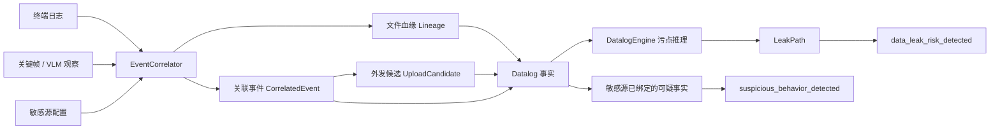

# 事实收集及证据链推理

本文说明 DataLeakDetector 如何将日志、文件血缘和关键帧/VLM 观察收集为可审计事实，并通过确定性的污点推理生成 `LeakPath`。最终结论口径以 [00口径.md](00口径.md) 为准；本文件描述其落地过程。

## 1. 目标与边界

系统不以单条日志、单帧画面或 VLM 的自然语言判断直接认定泄露。每项输入先被规范化为带时间、对象和证据引用的事实，再验证是否存在从敏感源到外部汇聚点的连续路径。



这里的“事实”分为两层：

| 层次 | 对象 | 含义 |
| --- | --- | --- |
| 证据事实 | `LogEvent`、`FrameObservation` | 可定位的原始日志记录或视觉观察，保留其来源和时间 |
| 推理事实 | `CorrelatedEvent`、`UploadCandidate`、`DatalogFact` | 由确定性规则把证据、文件身份和传播语义组合后的结构化断言 |

`LeakPath` 是推理结果，不是输入事实。它必须可回溯到事实中的操作 ID、文件链和证据引用。

## 2. 输入事实与标识

### 2.1 日志事实

所有导入日志先规范化为 `LogEvent`。核心字段为：

| 字段 | 用途 |
| --- | --- |
| `event_id` | 作为原始日志与下游事实的稳定引用，例如 `log:<event_id>` |
| `timestamp_ms`、`video_time_ms` | 关联日志、关键帧和路径顺序 |
| `event_type` | 文件、进程、窗口、剪贴板、外设或网络动作类别 |
| `file_path` | 文件身份和血缘的候选输入 |
| `process_name`、`app_name`、`window_title` | 应用上下文和外部汇聚点判断 |
| `description`、`raw` | 保留原始语义和供应商字段，供规则复核 |

日志证明时间、文件访问和显式操作，不自动证明 GUI 中已经完成了上传、发送或粘贴。无敏感源绑定的外发日志仍可保存用于审计，但不应单独形成风险结论。

### 2.2 视觉事实

关键帧模块和 VLM 输出转换为 `FrameObservation`。其中 `operation_type`、`resource`、`related_resources`、`description`、`confidence` 表达界面中可见的操作与对象。

VLM 观察必须能引用实际输入帧：`evidence_frame_ids` 经校验后写入描述，并在关联阶段转为 `frame:<frame_id>` 引用。模型置信度只是元数据，不能绕过文件血缘、外发状态或时间顺序直接生成最终结论。

视觉观察主要补足以下信息：

- 附件是否已出现、内容是否已粘贴、提交是否可见、共享是否已启动；
- 文件名或派生文件名是否在界面中出现；
- 某个外部应用会话是否处于实际操作状态，而非仅显示上传按钮或应用主页。

### 2.3 初始敏感源与派生载体

初始敏感源只来自敏感文件配置和可验证的日志上下文，不从 ground truth 或 VLM 文字中直接注入。`Lineage` 以 `derived -> source` 维护派生关系，支持：

```text
原始敏感文件
  -> 导出 PDF
  -> 压缩包
  -> 外部应用实际接触的派生文件
```

`Lineage.root()` 追溯原始源，`Lineage.chain()` 给出派生链。路径或文件名不唯一时保持保守：无法唯一解析到具体产物的引用不应被强行绑定到敏感源。

## 3. 关联：从证据到业务事实

`EventCorrelator.run()` 是事实收集的协调入口，依次完成：

1. 规范化日志和视觉观察；
2. 建立日志和视觉线索中的文件血缘；
3. 将临近的视觉汇聚点/结果观察绑定到文件身份；
4. 生成与敏感源绑定的 `CorrelatedEvent`；
5. 从其中提取 `UploadCandidate`；
6. 生成下游污点推理使用的 `DatalogFact`。

### 3.1 `CorrelatedEvent`

关联事件是“某个敏感源或其载体，在某应用中发生了一次可解释行为”的中间对象：

```json
{
  "event_id": "corr_0",
  "timestamp": "2026-01-01T10:00:00Z",
  "app_name": "Outlook",
  "original_file": "C:/data/customer.xlsx",
  "current_file": "C:/data/customer.zip",
  "operation_type": "external_sink_interaction",
  "behavior_category": "data_exfiltration_candidate",
  "evidence_refs": ["log:event_42", "frame:frame_0_3"],
  "join_reasons": ["explicit_sink_log", "visual_sink_context"]
}
```

其中：

- `original_file` 必须是初始敏感源或能回溯到该源；
- `current_file` 保留当时实际操作的载体，不能在关联阶段过早折叠为原文件；
- `evidence_refs` 记录日志、帧等原始证据；
- `join_reasons` 记录绑定理由，便于检查“为什么认为日志和画面属于同一操作”。

视觉汇聚点观察如果本身没有明确文件身份，关联器只会在时间距离、应用兼容性和敏感源解析满足条件时绑定到附近日志或视觉身份帧；找不到唯一绑定时保留观察，但不把它伪造成敏感外发事实。

### 3.2 `UploadCandidate`

`UploadCandidate` 代表“敏感对象可能进入外部汇聚点”的候选，包含 `original_file`、`current_file`、`sink_type`、`risk_level` 和证据引用。候选必须是显式外部汇聚点交互或可确认的外接设备/剪贴板/云同步动作；仅打开浏览器、网盘、聊天工具或看到上传入口不会产生候选。

重复候选按 `(original_file, current_file, sink_type)` 合并，优先保留更高的外发状态、置信度和日志证据，并合并所有 `evidence_refs`。

外发状态的语义遵循 00 口径：`selected_or_attached`、`in_progress`、`content_exposed`、`completed` 等确认级别可生成外发事实；未提交、失败、未知或未绑定敏感源的候选只能形成可疑事实或审计记录。

## 4. 符号化事实

`event_correlator/facts.py:build_datalog_facts()` 将关联结果转换为 Datalog 风格关系。关系和参数如下：

| 关系 | 参数形状 | 作用 |
| --- | --- | --- |
| `OpenFile` | `(op_id, process, file, timestamp)` | 标记敏感源在某进程/血缘上下文中可用 |
| `TransferFile` | `(op_id, process, source, derived, timestamp)` | 标记文件派生、导出、压缩或同进程载体转换 |
| `CrossProcessTransfer` | `(op_id, from_process, to_process, file, timestamp)` | 标记载体进入外部应用；剪贴板读写可派生此关系 |
| `ClipboardWrite` / `ClipboardRead` | `(op_id, process, data, timestamp)` | 原始剪贴板动作；推理器会在时序和跨进程条件满足时连边 |
| `UploadBinding` | `(op_id, leak_id, source, current, timestamp)` | 把外发候选的实际载体绑定回敏感源 |
| `LeakFile` | `(op_id, process, file, channel, timestamp, share_start)` | 已确认的外发/暴露动作终点 |
| `SuspiciousBehavior` | `(op_id, process, source, current, type, status, timestamp)` | 与敏感源绑定但未形成完整泄露路径的风险事实 |

示例：一个敏感 Excel 被压缩后作为邮件附件发送，会形成近似如下的事实链：

```text
OpenFile(open_1, case_lineage, customer.xlsx, t1)
TransferFile(zip_1, case_lineage, customer.xlsx, customer.zip, t2)
UploadBinding(bind_1, leak_1, customer.xlsx, customer.zip, t3)
CrossProcessTransfer(access_1, case_lineage, Outlook, customer.zip, t3)
LeakFile(leak_1, Outlook, customer.zip, mail_attachment, t3)
```

事实生成会保留实际到达汇聚点的 `current_file`。这样推理必须经过 `customer.xlsx -> customer.zip -> Outlook`，避免把派生链压缩成无法审计的“原文件直接外发”。

## 5. `LeakPath` 推理

`DatalogEngine` 在纯 Python 中实现确定性污点传播。它以 `(process, data)` 为状态，沿 `TransferFile`、`CrossProcessTransfer` 和符合条件的剪贴板传递向前扩展，并维护操作 ID 路径和时间戳。

### 5.1 完整路径条件

对每条 `LeakFile`，引擎反向寻找匹配的敏感源路径，并要求：

1. 路径以 `OpenFile` 的敏感源开始；
2. 每个派生或跨进程边与目标文件/进程连通；
3. 时间从源到汇聚点单调前进；
4. `UploadBinding` 存在时，路径源必须与其绑定源一致；
5. 路径无环，且同一 `(process, data)` 状态不会重复回访。

剪贴板关系仅在数据相同、读写进程不同、读取发生在写入之后且间隔不超过 5 分钟时转为 `CrossProcessTransfer`。屏幕共享是例外状态：共享已确认后，发生在共享期间的文件活动可以作为身份/血缘证据，即使监控日志和视觉帧的写入顺序略有差异。

### 5.2 推理伪代码

```python
for leak in LeakFile:
    paths = backward_walk(
        target=(leak.process, leak.file),
        edges=[TransferFile, CrossProcessTransfer, ClipboardTransfer],
        stop=OpenFile,
        require_forward_time=True,
        forbid_cycles=True,
    )
    for path in paths:
        if source_matches_upload_binding(path, leak):
            emit(LeakPath(path + [leak]))
```

生成的 `LeakPath` 包含 `source_file`、`file_chain`、`leak_channel`、`leak_timestamp`、`full_path` 和逐步 `flow_steps`。相同的 `(进程, 文件, 通道, 原始源)` 只保留一条路径，避免等价事实重复放大报告数量。

## 6. 结论与降级

最终结论由 `pipeline.py` 决定：

| 条件 | 结论 |
| --- | --- |
| 至少一条 `LeakPath` | `data_leak_risk_detected` |
| 无 `LeakPath`，但存在与敏感源或其派生载体绑定的 `SuspiciousBehavior` | `suspicious_behavior_detected` |
| 以上均无 | `no_confirmed_data_leak` |

以下情况必须降级，不能确认泄露：

- 只有外部应用、上传菜单、云盘目录或发送按钮，没有实际操作证据；
- 有外发动作，但对象无法唯一绑定到敏感源；
- 有敏感源和外发终点，但中间的文件/内容/跨进程关系不连通；
- 事件时间反向，且不属于已确认屏幕共享期间的受控例外；
- VLM 声称已外发，但缺少可验证的帧 ID、日志绑定或可用文件身份。

ground truth 仅用于评测，不参与事实生成、关联或推理。报告会分别保存检测结论和标注结论，禁止用标注反向补齐事实链。

## 7. 审计制品与排障顺序

每个报告会拆分保存关键中间结果：

| 文件 | 内容 | 排查问题 |
| --- | --- | --- |
| `frame_observations.json` | 有效视觉观察和帧引用 | VLM 是否观察到真实界面状态 |
| `event_correlator_details.json` | 关联事件、候选、血缘、事实与原始日志计数 | 文件身份、绑定理由或事实生成是否错误 |
| `leak_paths.json` | 最终路径、文件链、操作步骤 | 路径是否完整、顺序是否正确 |
| `verdict_check.json` | 检测结论、标注对照和路径/可疑事实计数 | 结论为何升级、降级或与标注不一致 |

推荐按以下顺序排查：

1. 敏感源配置是否包含真正的原始文件；
2. `file_lineage` 是否能将派生载体回溯到原始源；
3. `correlated_events` 是否同时具有正确文件、应用和 `evidence_refs`；
4. `upload_candidates` 的外发状态是否被夸大或错误降级；
5. `datalog_facts` 是否具备从 `OpenFile` 到 `LeakFile` 的连通边；
6. `leak_paths.json` 是否因为时间顺序、路径绑定或去重规则被拒绝。

## 8. 代码定位

| 位置 | 职责 |
| --- | --- |
| `models.py` | `LogEvent`、`FrameObservation`、`CorrelatedEvent`、`UploadCandidate`、`DatalogFact`、`LeakPath` 契约 |
| `event_correlator/correlator.py` | 事实收集、日志/视觉关联和文件身份绑定 |
| `event_correlator/lineage.py` | 派生文件到原始敏感源的血缘维护 |
| `event_correlator/candidates.py` | 外部汇聚点候选提取与合并 |
| `event_correlator/facts.py` | 关联结果到符号事实的确定性转换 |
| `leak_reasoner/engine.py` | 污点传播、时序约束与 `LeakPath` 生成 |
| `pipeline.py` | 事实入引擎、三类结论和审计文件输出 |

相关文档：[01日志挖掘策略.md](01日志挖掘策略.md)、[02关键帧策略.md](02关键帧策略.md)、[03vlm策略及实现.md](03vlm策略及实现.md)、[00口径.md](00口径.md)。
