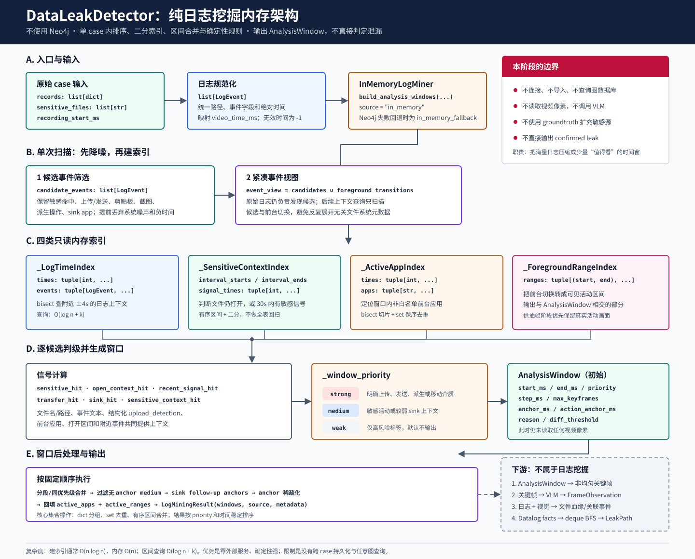

# 1-1 纯日志挖掘：不使用图数据库的内存实现

本文说明 DataLeakDetector 在**不启用 Neo4j**时，如何仅使用原始日志、维护的敏感源配置和 Python 内存数据结构，生成供视觉阶段使用的 `AnalysisWindow`。

对应当前实现：

- `main/data_leak_detector/pipeline.py`
- `main/data_leak_detector/log_mining.py`
- `main/data_leak_detector/models.py`
- `main/data_leak_detector/frame_analyzer/config.py`
- `main/data_leak_detector/frame_analyzer/frames.py`
- `main/data_leak_detector/event_correlator/lineage.py`
- `main/data_leak_detector/leak_reasoner/engine.py`

## 1. 一句话定义

纯日志挖掘不是“只看日志就直接判定泄漏”，而是：

> 把单个 case 中数量很大的低层日志，压缩成少量有优先级、有 anchor、有应用上下文的时间窗口，告诉后续抽帧阶段哪些时间段值得查看。

它的主输出是：

```python
LogMiningResult(
    windows=list[AnalysisWindow],
    source="in_memory",
    metadata={...},
)
```

它不直接输出 `LeakPath`，也不使用 groundtruth 为检测器补充敏感文件。

## 2. 总体架构图



图中 A 到 E 是纯日志挖掘本身；右下角虚线框是下游阶段，用于说明数据会流向哪里，但不属于日志挖掘。

## 3. 能力边界

### 3.1 本阶段负责什么

纯日志挖掘负责：

1. 接收规范化的 `LogEvent` 列表；
2. 从维护的敏感源集合构造匹配上下文；
3. 排除无法映射到录屏时间的日志和明显系统噪声；
4. 找出上传、发送、文件选择、剪贴板、截图、导出、复制、压缩等候选事件；
5. 建立时间、敏感上下文、前台应用和前台区间索引；
6. 将候选事件分成 `strong`、`medium`、`weak` 或 `none`；
7. 为候选事件生成、合并和过滤 `AnalysisWindow`；
8. 把窗口交给关键帧选择阶段。

### 3.2 本阶段不负责什么

纯日志挖掘不负责：

- 不连接 Neo4j；
- 不读取视频像素；
- 不执行关键帧视觉差分；
- 不调用 VLM；
- 不依据 groundtruth 的文件路径或操作标签扩大敏感源；
- 不把“出现了敏感文件”直接等同于“发生泄漏”；
- 不生成最终 `confirmed_data_leak` 结论。

因此，日志窗口为空表示“没有日志信号值得触发视觉检查”，不严格等价于“没有泄漏”；窗口非空也只表示“值得检查”，不等价于已经确认泄漏。

## 4. 运行入口

端到端入口在 `run_pipeline(...)`：

```text
load records
  -> normalize_logs(...)
  -> load_sensitive_files_config(...)
  -> mine_analysis_windows(...)
  -> InMemoryLogMiner.mine(...)
  -> build_analysis_windows(...)
  -> analyze_video_behavior(analysis_windows=...)
```

`InMemoryLogMiner` 本身很薄：

```python
class InMemoryLogMiner:
    def mine(self, *, logs, sensitive_files, vision_config):
        windows = build_analysis_windows(logs, sensitive_files, vision_config)
        return LogMiningResult(
            windows=windows,
            source="in_memory",
            metadata={
                "status": "ready",
                "windows": len(windows),
                "neo4j_enabled": False,
            },
        )
```

真正的挖掘逻辑集中在 `build_analysis_windows(...)`。这样做的好处是入口清晰，Neo4j 路径失败时也能回退到同一套内存规则。

### 4.1 `source` 的三种取值

| `source` | 含义 |
| --- | --- |
| `in_memory` | 明确使用纯内存日志挖掘。 |
| `in_memory_fallback` | 请求了 Neo4j，但连接或查询失败，非 strict 模式自动回退到内存实现。 |
| `neo4j` | Neo4j 成功完成候选查询；随后仍会回到 Python 生成窗口。 |

本文只讨论前两种情况实际执行的内存算法。

## 5. 输入数据契约

### 5.1 `LogEvent`

原始 JSON 记录先由 `normalize_logs(...)` 转换为统一数据类：

| 字段 | 用途 |
| --- | --- |
| `event_id` | 稳定引用日志事件。 |
| `timestamp` | 原始绝对时间字符串。 |
| `timestamp_ms` | 绝对时间毫秒值。 |
| `video_time_ms` | 相对录屏起点的毫秒值，是窗口计算的主时间轴。 |
| `event_type` | 规范化事件类型，例如 `file_selected`、`clipboard_text`、`app_switch`。 |
| `file_path` | 当前事件涉及的文件路径。 |
| `process_name` / `app_name` | 进程和应用上下文。 |
| `window_title` | 窗口标题，可包含文件名、上传进度或文件选择对话框信息。 |
| `description` | 事件描述。 |
| `raw` | 尚未提升为统一字段的原始结构化元数据。 |

`video_time_ms < 0` 表示该日志无法落到录屏时间轴内，例如事件发生在录屏开始前。这类事件不会生成分析窗口。

### 5.2 敏感源集合

输入的 `sensitive_files` 来自维护的敏感源配置。挖掘阶段会将路径规范化并转成小写元组：

```python
sensitive = tuple(normalize_path(item).lower() for item in sensitive_files)
```

匹配时会建立以下引用：

- 完整规范化路径；
- 文件名；
- 不含扩展名的 stem，且至少 4 个字符才用于文本包含匹配。

这是一组运行时匹配键，不是新的敏感源发现机制。复制件、压缩包、PDF、截图等派生文件仍应在后续文件血缘中回溯，不能写回初始敏感源集合。

### 5.3 `VisionConfig`

日志挖掘虽然不读取像素，但要为抽帧器决定时间范围、步长和帧预算，因此会使用 `VisionConfig` 中与窗口相关的配置。

当前默认值：

| 配置 | 默认值 | 含义 |
| --- | ---: | --- |
| `frame_window_before_ms` | 30,000 | 普通窗口向前扩展 30 秒。 |
| `frame_window_after_ms` | 120,000 | 普通窗口向后扩展 120 秒。 |
| `strong_window_before_ms` | 5,000 | strong 窗口向前扩展 5 秒。 |
| `strong_window_after_ms` | 15,000 | strong 窗口向后扩展 15 秒。 |
| `frame_step_ms` | 1,000 | activity/medium 的 probe 步长。 |
| `strong_frame_step_ms` | 250 | strong 的 probe 步长。 |
| `weak_frame_step_ms` | 2,000 | weak 的 probe 步长。 |
| `max_keyframes_per_window` | 18 | activity/普通窗口基础帧预算。 |
| `max_keyframes_per_strong_window` | 8 | strong 基础帧预算。 |
| `max_keyframes_per_medium_window` | 2 | strong 已存在时，普通 medium 上下文窗口的收紧预算。 |
| `max_keyframes_per_weak_window` | 2 | weak 基础帧预算。 |
| `case_segment_ms` | 300,000 | medium 窗口按 5 分钟 case 分段。 |
| `include_weak_windows` | `false` | 默认不输出 weak。 |
| `include_unanchored_medium_windows` | `false` | 默认过滤无 anchor 的 medium。 |

注意：`max_keyframes_per_medium_window=2` 不是所有 medium 一生成就只有 2 帧。medium 初始使用普通窗口预算；当 case 中已有 strong 证据时，非 `sensitive_activity` 的 medium 才会被 `_with_context_medium_budget(...)` 收紧到 2。

## 6. 核心内存数据结构

纯日志实现没有使用 DataFrame、NetworkX、SQLite 或其他数据库。核心是 Python 的 `list`、`tuple`、`dict`、`set` 和 `bisect`。

### 6.1 数据结构总表

| 结构 | 实际类型 | 作用 | 选择原因 |
| --- | --- | --- | --- |
| 规范化日志 | `list[LogEvent]` | 保存单 case 全部日志。 | 适合单次顺序扫描和排序。 |
| 敏感引用 | `tuple[str, ...]` | 保存规范化后的敏感文件路径。 | 只读、可缓存、可作为 `lru_cache` 参数。 |
| 候选事件 | `list[LogEvent]` | 保存可能贡献窗口的事件。 | 保留原始事件顺序和对象。 |
| 候选 ID 集合 | `set[int]` | 构造紧凑事件视图时按对象身份去重。 | 平均 `O(1)` 成员判断。 |
| 分段窗口 | `dict[int, list[AnalysisWindow]]` | 按 case 时间段分组 medium 窗口。 | 分组直接，避免跨长时间段误合并。 |
| active state | `dict[str, dict]` | 记录每个敏感文件从打开到关闭的状态。 | 按文件快速更新开始时间和 anchor 集合。 |
| anchor 去重 | `set[int]` | 合并、稀疏化关键时间点。 | 防止重复事件耗尽帧预算。 |
| 日志事实 | `list[DatalogFact]` | 下游推理器保存符号事实。 | 关系内保持插入顺序，便于调试。 |

### 6.2 `_LogTimeIndex`

结构：

```python
@dataclass(frozen=True)
class _LogTimeIndex:
    times: tuple[int, ...]
    events: tuple[LogEvent, ...]
```

建立时按 `video_time_ms` 排序，查询时使用二分：

```python
start = bisect_left(times, start_ms)
end = bisect_right(times, end_ms)
return events[start:end]
```

它主要解决“候选事件附近 4 秒内还有哪些日志”这一问题。没有索引时，每个候选都可能重新扫描全部日志；有序数组将时间范围定位成本降为 `O(log n)`，随后只处理落在范围内的 `k` 条记录。

### 6.3 `_SensitiveContextIndex`

结构：

```python
@dataclass(frozen=True)
class _SensitiveContextIndex:
    interval_starts: tuple[int, ...]
    interval_ends: tuple[int, ...]
    signal_times: tuple[int, ...]
```

它保存两类信息：

1. 敏感文件打开到关闭的合并区间；
2. 出现敏感文件信号的有序时间点。

用途：

- `has_open_context(t)`：判断时间 `t` 是否仍处在敏感文件打开区间；
- `has_recent_signal(t, 30_000)`：判断 `t` 之前 30 秒内是否出现过敏感信号。

该索引很重要，因为截图、剪贴板复制、另存为等事件本身可能没有文件路径。只要这些行为发生在敏感文档仍打开或刚刚出现敏感信号的上下文中，就可以得到 `sensitive_context_hit=True`。

打开区间结束时间按以下优先级确定：

1. 日志有明确 `end_time`，使用显式结束时间；
2. 否则寻找同一完整路径或文件名的下一条 close 事件；
3. 仍找不到 close，则延伸到当前 session 最后一条可映射日志。

重叠或相邻区间会合并，避免同一敏感文件的重复 open/read 产生大量碎片。

### 6.4 `_ActiveAppIndex`

结构：

```python
@dataclass(frozen=True)
class _ActiveAppIndex:
    times: tuple[int, ...]
    apps: tuple[str, ...]
```

它只收集：

- 有有效 `video_time_ms`；
- 有应用或进程名；
- 属于前台应用事件；
- 不在系统白名单中。

查询窗口 `[start_ms, end_ms]` 时先二分切片，再用 `set` 做保序去重，最终写入 `AnalysisWindow.active_apps`。这些应用名会作为后续 VLM 的辅助提示，但不能单独证明泄漏。

### 6.5 `_ForegroundRangeIndex`

结构：

```python
@dataclass(frozen=True)
class _ForegroundRangeIndex:
    ranges: tuple[tuple[int, int], ...]
```

它把 `app_switch`、`window_changed`、`window_closed` 等前台状态变化转换为时间区间。窗口完成后，索引返回与窗口相交的可见前台范围，写入 `AnalysisWindow.active_ranges`。

`active_ranges` 的作用不是日志判级，而是帮助后续抽帧避开没有有效前台应用的画面。

## 7. 算法流程

### 7.1 第一步：候选事件筛选

`_may_need_analysis_window(...)` 对每条日志执行低成本筛选。

立即拒绝：

- `video_time_ms < 0`；
- 路径属于系统噪声，并且不是 sink 应用中的文件选择对话框。

直接保留：

- 路径或事件文本命中维护的敏感源；
- 文件路径看起来敏感；
- `app_switch`、`window_changed`、`window_closed`；
- `clipboard_text`、`clipboard_image`；
- `screenshot`、`screen_capture`；
- `file_selected`、`file_upload`、`upload`、`uploaded`、`upload_complete`；
- `send`、`sent`；
- `print_to_pdf`、`save_as`、`export`、`copied`；
- 截图路径或已知 sink 进程；
- `raw_operation` 包含 copy、paste、clipboard、capture、export、print、save_as、send、compress、base64、encode、decode 等行为。

这一层有意“宁可多保留一点”。候选事件不等于最终窗口，更不等于泄漏；后续还会结合敏感上下文和行为强度判级。

### 7.2 第二步：紧凑事件视图

原始日志仍然是候选发现的权威数据源。候选确定后，`_compact_event_view(...)` 只保留：

```text
candidate events
  + 能影响上下文判断的 foreground transitions
```

这样做的原因是原始日志可能含有大量无关 `opened/closed/modified`、浏览器缓存、临时文件或系统目录事件。后续若对每个候选都重复展开这些事件的嵌套 `raw` 元数据，会产生明显的 CPU 和内存开销。

紧凑视图不是永久删除日志，也不影响第一轮候选发现；它只缩小后续上下文查询的工作集。

### 7.3 第三步：一次性建立索引

基于 `event_view` 和 `candidate_events` 构造：

```python
app_index = _ActiveAppIndex.from_logs(event_view)
foreground_range_index = _ForegroundRangeIndex.from_logs(event_view)
time_index = _LogTimeIndex.from_logs(event_view)
sensitive_context_index = _SensitiveContextIndex.from_logs(
    candidate_events,
    event_view,
    sensitive,
)
```

这些索引在单次 case 分析中只构造一次，随后被所有候选事件复用。

### 7.4 第四步：计算候选信号

对每个候选事件，先组合自身文本和必要的附近上下文：

```text
event text
  + nearby event text（只有需要上下文的事件才查 ±4s）
```

然后计算：

| 信号 | 含义 |
| --- | --- |
| `sensitive_hit` | 文件路径或组合文本命中敏感源，或文件路径呈现敏感特征。 |
| `open_context_hit` | 当前时间仍在敏感文件打开区间内。 |
| `recent_signal_hit` | 当前时间之前 30 秒内出现过敏感文件信号。 |
| `sensitive_context_hit` | 直接敏感命中，或剪贴板/截图/派生行为发生在敏感上下文内。 |
| `transfer_hit` | 组合文本命中传输类 token。 |
| `sink_hit` | 组合文本命中外部汇聚点 token，或属于网盘上下文。 |
| `action_hit` | `transfer_hit or sink_hit`。 |

`sensitive_context_hit` 是连接“源文件日志”和“无文件路径行为”的关键。例如：

```text
10.0s 打开 敏感合同.docx
16.5s clipboard_text，事件自身没有 file_path
18.0s 切换到聊天应用
```

只看 16.5 秒的事件无法确认剪贴板来源；打开区间索引能证明该时刻仍处于敏感文档上下文，从而将剪贴板行为提升为强窗口。

### 7.5 第五步：窗口判级

`_window_priority(...)` 按确定性规则返回优先级。

#### `strong`

主要条件：

- 事件类型是文件选择、上传完成、发送等明确动作；
- `raw_operation` 是 `file_selected`、`file_upload`、`upload`、`send`、`send_click`；
- 存在结构化文件上传信号；
- 进程是 `fsquirt.exe`；
- 敏感文件在可移动介质上下文中被创建、修改、移动或复制；
- category/operation_detail 明确表示附件、文件选择、外发、上传或已发送；
- upload detection 已成功，并命中敏感文件；
- sink 应用显示文件选择对话框或上传进度；
- 剪贴板、截图或派生行为发生在敏感上下文内。

默认 profile：

```text
事件前 5s ～ 事件后 15s
probe step = 250ms
基础关键帧预算 = 8
视觉差分阈值 = 0.015
```

#### `medium`

主要条件：

- sink 应用前台事件发生在敏感上下文中，但没有更直接动作；
- 派生行为缺少足够敏感上下文；
- 事件直接命中敏感文件，但没有明确外发动作；
- sink 上下文中的剪贴板文本没有更强绑定。

默认 profile：

```text
事件前 30s ～ 事件后 120s
probe step = 1000ms
初始基础关键帧预算 = 18
视觉差分阈值 = 0.08
```

如果 case 同时存在 strong，普通 medium 的上下文预算会进一步收紧为 2；`sensitive_activity:*` 窗口不走这次收紧。

#### `weak`

当结构化元数据只有 `risk_level=high/高`，但没有更强证据时返回 weak。

默认配置 `include_weak_windows=false`，所以 weak 通常不会进入最终窗口列表。

#### `none`

没有满足上述条件，或者前台事件并非真正可见状态时返回 none，不生成窗口。

### 7.6 第六步：生成 anchor

`anchor_ms` 是“后续抽帧必须重点查看的时间点”。它和普通 probe 不同：即使画面变化不明显，anchor 也具有更高选择优先级。

典型规则：

| 场景 | anchor |
| --- | --- |
| `fsquirt.exe` 前台切换 | 当前时间。 |
| `fsquirt.exe` 访问敏感文件 | 当前、+3s、+8s。 |
| 敏感文件进入可移动介质上下文 | 当前、+3s、+8s。 |
| sink 应用中的文件选择对话框 | 当前、+3s；工作区上传应用还增加 +8s、+16s、+20s。 |
| sink 应用前台事件且存在敏感上下文 | 当前、+3s、+8s。 |
| 打印或另存为对话框 | 当前时间。 |
| 剪贴板、截图、派生行为命中敏感上下文 | 当前时间。 |
| 明确上传、文件选择或结构化上传信号 | 当前时间。 |

`action_anchor_ms` 是 anchor 的子集，表示真正触发窗口的动作节点。后续 anchor 稀疏化时优先保留 action anchor。

### 7.7 第七步：构造敏感活动窗口

除逐事件窗口外，`build_sensitive_activity_windows(...)` 还会维护：

```python
active: dict[sensitive_file, {
    "start_ms": int,
    "anchors": set[int],
}]
```

它顺序扫描日志：

1. 首次看到某敏感文件，创建 active state；
2. 再次看到同一文件，向 anchor 集合追加时间；
3. 遇到 close，生成 `priority="activity"` 的 open-to-close 窗口；
4. session 结束仍未 close，则窗口延伸到 session 最后一条可映射日志。

一旦存在 activity 窗口，原先的普通 medium 会被移除，避免同一敏感活动被重复覆盖。

### 7.8 第八步：窗口合并与分段

窗口按优先级分别合并，避免 strong 与 medium 相互吞并。

medium 还会先按 case 分段：

```python
segment = source_event_ms // case_segment_ms
```

默认每段 5 分钟。这样长录屏中的两个远距离 medium 事件不会因为宽上下文窗口而合并成覆盖整段视频的大窗口。

重叠窗口合并规则：

- `start_ms` 取最小值；
- `end_ms` 取最大值；
- `step_ms` 取更小、采样更密的值；
- `diff_threshold` 取更小、更敏感的值；
- `max_keyframes` 取更大值，并至少覆盖保留的 anchor 数量；
- `anchor_ms`、`action_anchor_ms`、`active_apps` 去重合并；
- `active_ranges` 做有序区间合并。

### 7.9 第九步：过滤无直接上下文的 medium

默认 `include_unanchored_medium_windows=false`。

过滤逻辑：

1. 保留所有非 medium；
2. medium 只有存在 anchor 才直接保留；
3. 如果整个 case 没有 strong，也没有任何 anchor，则保留最早的一个 medium 作为兜底；
4. 如果存在 strong，将普通 medium 的帧预算收紧到 `max_keyframes_per_medium_window`。

这一步用于抑制“命中了某些敏感字样，但没有动作时间点”的宽窗口。

### 7.10 第十步：补 sink follow-up anchor

如果 strong 窗口由敏感剪贴板行为触发，且之后切换到了 sink 应用，算法会补充 sink 切换后：

```text
+5s
+14s
```

两个 follow-up anchor，用于覆盖粘贴后、发送前或发送后的界面状态。

### 7.11 第十一步：anchor 稀疏化

密集日志可能在几秒内产生大量相同 anchor。`_thin_dense_window_anchors(...)` 会：

1. action anchor 优先；
2. 在预算不足时对 action anchor 均匀取样；
3. 再用最小时间间隔选取其他 anchor；
4. 最终把 `max_keyframes` 调整为至少容纳保留的 anchor。

默认最小间隔：

- strong：`max(strong_frame_step_ms × 12, 3000)`，默认 3000ms；
- weak：`max(weak_frame_step_ms, 2000)`；
- activity/medium：`max(frame_step_ms, 1000)`。

### 7.12 第十二步：回填前台应用与区间

最后对每个窗口查询：

```python
active_apps = app_index.between(start_ms, end_ms)
active_ranges = foreground_range_index.between(start_ms, end_ms)
```

至此才形成完整的 `AnalysisWindow` 列表。

## 8. 输出数据契约

`AnalysisWindow` 字段：

| 字段 | 含义 |
| --- | --- |
| `start_ms` / `end_ms` | 相对录屏起点的窗口范围。 |
| `reason` | 由优先级、事件类型、日志 source/category 和动作标签拼接。 |
| `priority` | `strong`、`activity`、`medium` 或 `weak`。 |
| `step_ms` | 后续视频 probe 的时间步长。 |
| `max_keyframes` | 该窗口允许保留的关键帧预算。 |
| `diff_threshold` | 后续关键帧视觉变化阈值。日志挖掘只设置它，不计算像素差。 |
| `anchor_ms` | 后续抽帧重点保留的时间点。 |
| `action_anchor_ms` | 明确动作时间点，是 `anchor_ms` 的优先子集。 |
| `active_apps` | 窗口内出现的非白名单前台应用。 |
| `active_ranges` | 窗口内真正可见的前台活动区间。 |

示例：

```json
{
  "start_ms": 15000,
  "end_ms": 35000,
  "reason": "strong:file_selected:file_dialog_monitor:upload",
  "priority": "strong",
  "step_ms": 250,
  "max_keyframes": 8,
  "diff_threshold": 0.015,
  "anchor_ms": [20000, 23000],
  "action_anchor_ms": [20000, 23000],
  "active_apps": ["Explorer", "QQ"],
  "active_ranges": [[15000, 35000]]
}
```

## 9. 下游仍使用的内存“类图”结构

这一节已经超出日志窗口挖掘本身，但可以解释为什么整个检测流程即使不用图数据库仍能完成文件血缘和泄漏路径推理。

### 9.1 文件血缘：父指针映射

`Lineage` 使用：

```python
direct: dict[derived_file, source_file]
```

例如：

```text
合同_part1.pdf -> 合同.pdf
合同.pdf       -> 合同.docx
```

`root(...)` 和 `chain(...)` 沿父指针逐级回溯，`seen: set[str]` 防止循环。这不是通用图数据库，而是每个派生文件最多一个直接源的紧凑森林结构。

### 9.2 Datalog facts：按关系分桶

推理器使用：

```python
facts: dict[str, list[DatalogFact]]
```

支持的关系包括：

- `OpenFile`
- `TransferFile`
- `CrossProcessTransfer`
- `LeakFile`
- `SuspiciousBehavior`
- `ClipboardWrite`
- `ClipboardRead`

### 9.3 污点传播：邻接索引与 BFS

查询泄漏路径时临时建立：

```python
transfer_by_source: dict[(process, source_data), list[DatalogFact]]
cross_by_source: dict[(from_process, data), list[DatalogFact]]
best: dict[(process, data), Taint]
tainted: set[Taint]
frontier: deque[Taint]
```

`deque` 驱动广度优先传播：

```text
OpenFile
  -> 同进程 TransferFile
  -> CrossProcessTransfer / clipboard transfer
  -> LeakFile
```

所以“不使用图数据库”不等于“不使用图关系”。关系被压缩成哈希邻接索引，只在单 case 内存中存在，不做跨运行持久化。

## 10. 复杂度与资源特征

设：

- 原始日志数为 `n`；
- 候选事件数为 `c`；
- 最终窗口数为 `w`；
- 单次时间查询命中的局部事件数为 `k`。

主要复杂度：

| 操作 | 时间复杂度 | 空间复杂度 |
| --- | --- | --- |
| 候选事件扫描 | `O(n)`，不计单条文本展开长度 | `O(c)` |
| 构造时间/应用索引 | `O(n log n)` | `O(n)` |
| 单次时间范围查询 | `O(log n + k)` | 切片结果 `O(k)` |
| 敏感区间排序与合并 | `O(c log c)` | `O(c)` |
| 窗口排序与合并 | `O(w log w)` | `O(w)` |
| Datalog BFS | 约 `O(V + E)` | `O(V + E)` |

实际性能主要取决于：

1. `raw` 元数据展开后的文本大小；
2. 候选筛选是否有效排除了文件系统噪声；
3. 前台切换和敏感活动事件是否过密；
4. anchor 数量是否在后处理中得到稀疏化。

## 11. 为什么这里不必使用图数据库

对当前单 case 工作流，纯内存结构有几个直接优势：

- 不需要启动外部服务；
- 不需要日志导入和 schema 维护；
- 单元测试确定、快速；
- `dict/set/bisect` 对单时间轴查询足够直接；
- 调试 artifact 可以完整解释窗口来自哪些规则；
- case 结束后内存释放，不产生跨案例污染。

Neo4j 更适合以下场景：

- 同一批日志需要反复执行不同关系查询；
- 需要跨 case、跨用户或跨设备持久化；
- 需要临时编写复杂 Cypher 做多跳检索；
- 日志规模超出单进程内存预算；
- 多个分析任务需要共享同一日志索引。

当前项目中 Neo4j 只作为可选日志挖掘后端，不承担最终报告图存储，也不替代事件关联器和 Datalog 推理器。

## 12. 如何明确运行纯内存路径

### 12.1 单 case

```powershell
python main/run_e2e.py `
  --case "spec\data\nas_samples\stage1\1-email-fastmail-1" `
  --output-dir "artifacts\in_memory_debug" `
  --vision `
  --no-neo4j-log-miner
```

### 12.2 全量 precompute

`tools/run_all.ps1` 默认不传 `-UseNeo4jLogMinerForPrecompute`，因此 precompute 使用内存日志挖掘：

```powershell
.\tools\run_all.ps1
```

不要添加：

```powershell
-UseNeo4jLogMinerForPrecompute
```

### 12.3 环境变量兜底

如果 `.env` 中全局启用了 Neo4j 日志挖掘，命令行的 `--no-neo4j-log-miner` 可以明确覆盖它。

## 13. 如何确认实际走了哪条路径

检查报告中的日志挖掘来源：

```text
frame_analyzer.statistics.vision.window_source
```

常见值：

- `in_memory`
- `in_memory_fallback`
- `neo4j`
- `provided`
- `precomputed_baseline`

若期望纯日志路径却看到 `neo4j`，检查命令行和 `.env`；若看到 `in_memory_fallback`，说明曾尝试连接 Neo4j，但失败后已经自动执行了本文描述的内存算法。

还应检查：

- `analysis_windows` 是否大于 0；
- 每个窗口的 `priority`、`reason` 和 `anchor_ms`；
- `active_apps` 是否符合日志中的前台切换；
- 窗口时间是否落在视频时长范围内。

## 14. 常见问题排查

### 14.1 `analysis_windows=0`

按顺序检查：

1. 日志是否成功规范化；
2. `video_time_ms` 是否全部为 `-1`；
3. `recording_start_ms` 是否错误；
4. 敏感源配置是否包含正确的原始文件完整路径；
5. 事件类型或 `raw_operation` 是否进入候选集合；
6. 事件是否被系统噪声路径规则拒绝；
7. 唯一候选是否为 weak 且默认被过滤。

### 14.2 窗口过多

重点检查：

- 原始日志是否把浏览器缓存、Recent、临时文件误标为上传；
- `looks_sensitive(...)` 是否被模糊文件名大量触发；
- 是否开启了 `include_weak_windows`；
- 是否开启了 `include_unanchored_medium_windows`；
- sink 应用是否持续产生重复前台切换；
- medium 是否按 `case_segment_ms` 正确分段和合并。

### 14.3 窗口有，但没有关键行为画面

日志挖掘阶段检查：

- anchor 是否覆盖文件选择、确认发送、上传进度或传输完成时刻；
- strong 窗口的 `end_ms` 是否足够覆盖后续状态；
- sink follow-up anchor 是否成功补入；
- anchor 稀疏化是否因预算过小删除了关键动作；
- `active_ranges` 是否把真正前台画面排除在外。

随后再检查抽帧阶段的画面差分、重复帧过滤和最大 VLM 帧限制。不要把抽帧问题误归因于日志挖掘。

### 14.4 有日志外发行为，但最终 `no_confirmed_data_leak`

这不一定是日志窗口错误。继续检查：

1. VLM 是否识别出外发动作；
2. `FrameObservation` 是否包含文件名和 sink；
3. EventCorrelator 是否把当前文件回连到初始敏感源；
4. `upload_candidates` 是否达到确认级 `risk_level`；
5. Datalog facts 是否同时存在可达的 `OpenFile`、`TransferFile` 和 `LeakFile`。

日志挖掘只负责让关键行为有机会进入视觉证据链，不对最终结论负责。

## 15. 测试入口

日志窗口规则集中覆盖在 `tests/test_pipeline.py`。修改规则后至少运行：

```powershell
python -m pytest tests\test_pipeline.py -q
```

若只想快速定位相关测试：

```powershell
python -m pytest tests\test_pipeline.py -q -k "analysis_window or log_mining"
```

还应针对一个真实小 case 检查：

- case 路径；
- artifact 目录；
- `window_source`；
- analysis window 数量；
- raw keyframe 数量；
- 最终送入 VLM 的帧数；
- VLM 是 dry-run 还是真实调用。

## 16. 设计总结

纯日志挖掘的关键不是模拟一套小型图数据库，而是针对单 case 时间轴选择更合适的数据结构：

```text
顺序扫描负责发现
排序 tuple 负责时间定位
bisect 负责局部查询
区间列表负责持续上下文
dict 负责分组和状态
set 负责去重与防环
AnalysisWindow 负责稳定地传递策略结果
```

它牺牲了跨 case 持久化和任意关系查询能力，换来低部署成本、可预测性能和更容易审计的规则路径。对于当前“日志定位可疑时间 → 非均匀抽帧 → VLM → 事件关联 → Datalog 推理”的流水线，这是默认且足够实用的实现。
