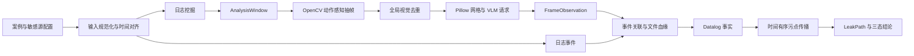

# 项目实现原理

## 1. 实现概览

DataLeakDetector 面向终端数据外泄检测，输入是终端日志、屏幕录制和维护的敏感文件清单，输出是可回溯的敏感文件传播路径与检测结论。项目没有把整段视频直接交给模型裁决，而是采用 **日志引导视觉、模型补全观察、规则完成裁决** 的组合方案：先用日志缩小视频分析范围，再用视觉语言模型（VLM）识别界面中的文件、动作和状态，最后通过文件血缘与确定性污点传播判断敏感数据是否真正到达外部汇聚点。

项目主体使用 **Python 3.10+** 实现。Python 同时承担输入解析、日志挖掘、视频抽帧、VLM 调用、事件关联、Datalog 风格推理、批量调度和报告生成；JavaScript、Shell 与 PowerShell 只用于错例分诊、实验运行和环境管理，不参与核心检测逻辑。

### 1.1 代码量

下表按 2026 年 8 月 19 日的 Git 跟踪文件统计，口径为 `wc -l` 的**物理行数**，包含空行和注释，不包含 Markdown 文档、JSON/TOML/YAML 配置、数据集、第三方依赖、虚拟环境和运行制品。

| 范围 | 语言 | 文件数 | 行数 | 说明 |
| --- | --- | ---: | ---: | --- |
| `main/` | Python | 37 | 15,739 | 核心包 14,789 行，命令行入口 950 行 |
| `tools/` | Python | 8 | 1,796 | 实验、预检、评测与运维工具 |
| `tools/` | JavaScript | 1 | 95 | Release 错例分诊文档生成 |
| `tools/` | Shell | 4 | 445 | Linux/macOS 批量运行与敏感性实验 |
| `tools/` | PowerShell | 3 | 387 | Windows 批量运行与 Neo4j 管理 |
| `tests/` | Python | 3 | 9,419 | 约 322 个 `test_*` 测试函数 |
| **合计** |  | **56** | **27,881** | 全部可执行源码与测试 |

核心包内部包括事件关联 4,741 行、视觉分析 4,632 行、基础模块与流水线编排 4,429 行、泄露推理 500 行和 Neo4j 后端 487 行，另有 950 行命令行入口。因此，项目的**核心产品代码为 15,739 行 Python**；计入运行和实验工具后，实现代码为 18,462 行；再计入测试后，仓库共有 27,881 行可执行源码。其中 Python 共 26,954 行，是绝对主体。

## 2. 总体工作原理

系统围绕“敏感源是否沿着合理的时间顺序传播到外部汇聚点”展开。日志负责提供可靠的时间、进程和文件操作信息，VLM 负责补充日志难以表达的 GUI 状态，事件关联模块负责把两类证据绑定到同一文件及同一操作，推理器只接受结构化事实并输出完整路径。

各阶段通过不可变 `dataclass` 传递数据，主要对象依次为 `LogEvent`、`FrameObservation`、`CorrelatedEvent`、`UploadCandidate`、`DatalogFact`、`LeakPath` 和 `DetectionReport`。这种**显式数据契约**使模块之间传递的是字段确定的证据对象，而不是形状不稳定的字典。

## 3. 输入、案例与规则管理

### 3.1 案例发现和时间对齐

`datasets.py` 将数据组织为 `DataCase` 和 `DataSession`，既支持单段日志与录屏，也支持一个案例下的多个 `session_*`。它递归发现 `logs.json`、优先级更高的 `keyevents.json` 和 MP4 录屏，并从 `INDEX.md` 或录屏文件名中解析录制开始时间。流水线以 `keyevents.json` 为主输入，只从原始 `logs.json` 补入与传输或文件身份有关的事件，以减少底层文件系统噪声。多 session 案例会先为事件和观察结果增加 session 命名空间，再映射到统一的绝对时间轴，避免不同录屏中的相同事件 ID 或相对时间互相冲突。

`io.py` 是输入边界的兼容层，支持 JSON 数组与 JSON Lines，依次尝试 UTF-8 BOM、UTF-8 和 GB18030 编码，并容忍常见的尾逗号和 Windows 反斜杠问题。日志字段随后被规范化为统一的时间戳、视频相对时间、事件类型、文件路径、进程、应用和窗口标题。路径比较先使用完整规范化路径，只有在文件名足够明确时才做 basename 兜底匹配。

### 3.2 敏感源和策略配置

`sensitivity.py` 按数据集 stage 选择 `spec/config/sensitive_files_*.json`，其内容是检测链唯一允许的**初始敏感源**。复制件、导出文件、压缩包、截图和其他派生载体不会被直接加入源清单，而是由后续血缘关系继承敏感性。

`policy.py` 从 `policy.json` 和环境变量读取敏感词、传播动作、外发动作、应用类别、汇聚点类别和风险状态。文本匹配使用 **Unicode NFKC 规范化、`casefold` 和分隔符压缩**，用于兼容中英文、大小写及路径书写差异。`apps.py` 再把应用名称、窗口标题和视觉文本统一映射为浏览器、邮件、聊天、AI、网盘、会议等前端类别。

`groundtruth.py` 与检测链隔离。标注只在检测结束后计算期望结论和评测指标，**不会补充敏感源、文件血缘、VLM 上下文或最终事实**。

## 4. 日志挖掘

日志挖掘的输出不是泄露结论，而是值得检查的 `AnalysisWindow`。默认的 `InMemoryLogMiner` 先按视频时间排序事件，为每个敏感文件构造“打开到关闭”的活动区间，并维护近期敏感上下文和剪贴板污染状态。随后它识别上传、发送、文件选择、复制粘贴、另存、导出、压缩、截图、录屏、屏幕共享和外接设备等动作，只为与敏感上下文有联系的事件建立窗口。

实现上使用了 **时序状态机、有限时间邻域、前台应用会话聚合和优先级预算**。相邻的邮件、聊天、AI、网盘或会议前台事件会被合并为一个会话，窗口中同时保留会话开始、文件身份、动作锚点、动作后状态和会话结束。窗口分为强、活动和弱三个优先级：强动作获得更密集的时间探测和更高帧预算；单纯打开风险应用或显示上传入口不会直接升级为外发事实。系统噪声配置会尽早过滤缓存、临时目录、后台数据库和系统进程抖动。

### 4.1 可选 Neo4j 后端

启用 Neo4j 时，导入器把案例、日志事件、文件、进程和应用写成图节点，并建立唯一约束及 `(case_id, time/path/candidate)` 组合索引。日志内容先计算 **SHA-256 指纹**，结合 schema 版本判断是否可复用已有导入；写入采用 Cypher 的 **`UNWIND + MERGE` 批处理**。查询层用于筛选候选事件、查找邻近活跃应用和敏感活动区间。

**Neo4j 只是可选的日志检索后端，不是最终推理器。** 图查询结果仍交回 Python 构造 `AnalysisWindow`，并与本地规则结果合并；连接失败时，非 strict 模式会自动回退到内存日志挖掘，因此核心语义不依赖图数据库可用性。

## 5. 关键帧提取与视觉去重

`frame_analyzer/frames.py` 使用 **OpenCV `VideoCapture`** 按日志窗口读取录屏。不同动作使用不同的前后探测偏移：例如文件选择需要保留选择前、选择时和附件出现后的状态，粘贴需要覆盖短暂的渲染过程，屏幕共享和派生操作则需要更长的结果观察范围。相近时间点采用顺序解码，只有缺失的证据时间点才重新 seek，以降低频繁随机解码的开销。

候选帧先缩小为 160×90 灰度图，计算相邻帧的**平均像素差**和**灰度信息熵变化**，动作锚点与计划状态帧强制进入候选集，其余静态画面按阈值过滤。窗口预算优先保留动作前、动作发生时、动作后结果和会话上下文，再从普通变化帧中选择时间分布较均衡的补充证据。

窗口内候选组成 `raw_all` 后，还会执行一次全局可追踪去重，形成 `raw`：

- 像素层使用归一化灰度差；
- 哈希层使用 **8×8 average hash（aHash）及 Hamming 距离**；
- 信息量层比较灰度熵差；
- 近重复帧需要上述三项至少两项相似；
- 剪贴板、粘贴、文件选择、动作前状态、相隔较远的动作状态和显式视觉变化受到语义保护。

每个被删除的帧都会记录保留帧 ID、像素差、哈希距离和去重原因，便于复核 `raw_all -> raw` 的过程。

## 6. VLM 视觉分析

### 6.1 请求构造

`vlm_client.py` 使用 **Pillow** 将图片最长边限制在配置值内，并可把同一 `window_id` 的连续帧拼成带单元格和原始帧 ID 的网格。客户端通过 Python 标准库 `urllib` 调用 **OpenAI-compatible `chat/completions` API**，图片以 JPEG Base64 Data URL 发送，温度固定为 `0`，以提高输出稳定性。

提示词要求模型只返回严格 JSON，并为每个事件给出应用、行为类别、操作、原始/派生文件名、汇聚点、动作状态、置信度和 `evidence_frame_ids`。同一窗口的帧被视为一个按时间排列的证据包，因此模型可以用早期帧识别文件身份，再用后续帧确认提交、进度、成功或失败，而不要求所有信息出现在同一张图中。

### 6.2 并发、重试与解析

`vlm_dispatch.py` 以窗口为最小批次，使用进程级共享的 **`ThreadPoolExecutor`** 并发处理不同窗口，并通过 `BoundedSemaphore` 限制端点并发。当前运行路径选择配置中第一个有效端点，不做多端点负载均衡；遇到 429、5xx、超时或连接中断时采用**指数退避重试**，单个批次失败不会抹掉其他批次的结果。

`parser.py` 会剥离 Markdown 代码围栏、提取 JSON、规范化字段和动作状态，并过滤普通阅读、未执行准备、矛盾的屏幕共享、无依据的云同步等观察。调度器还会校验模型引用的帧 ID 是否真实存在；无有效帧引用的事件不会进入后续关联。最终输出统一的 `FrameObservation`，所以 **VLM 提供的是结构化观察，而不是最终泄露结论**。

## 7. 事件关联与文件血缘

`event_correlator/` 将 `LogEvent` 与 `FrameObservation` 融合。关联评分同时考虑时间距离、应用兼容性、完整路径、唯一文件名、窗口标题、敏感词命中和已有帧证据。成功关联后的 `CorrelatedEvent` 会保留 `evidence_refs` 和 `join_reasons`，明确记录结论由哪些日志、帧和匹配规则共同支持。

文件血缘使用一个紧凑的 **`derived -> source` 有向映射**。`Lineage` 提供 `root()`、`chain()` 和 `resolve_artifact()`，可恢复复制、另存、导出、格式转换、压缩、截图、剪贴板跨进程传递以及云同步目录写入等关系。添加边时会拒绝空路径、自环和循环；basename 或 stem 只有唯一匹配时才解析为具体文件，避免同名文件被错误合并。

关联器在血缘基础上构造外发候选，并按 `(original_file, current_file, sink_type)` 去重。邮件附件、聊天上传、AI 对话、网盘同步、网络提交、屏幕共享和可移动介质会映射为不同汇聚点；同一候选存在多条证据时，优先保留更明确的动作状态、更高置信度和日志绑定，同时合并证据引用。解析和关联阶段会抑制未执行的准备界面、无依据的状态与无法绑定敏感源的观察；其余事件的 `selected`、`submitted`、`in_progress`、`completed`、`failed` 或 `unknown` 状态会继续保留到候选和事实规则中处理。

## 8. Datalog 风格事实与污点推理

`event_correlator/facts.py` 把关联结果转换为有限的符号关系：

| 关系 | 含义 |
| --- | --- |
| `OpenFile` | 某进程获得一个敏感源或载体 |
| `TransferFile` | 文件在同一逻辑进程中派生为新载体 |
| `CrossProcessTransfer` | 同一载体跨进程传播 |
| `ClipboardWrite` / `ClipboardRead` | 剪贴板写入与读取，可配对为跨进程传播 |
| `UploadBinding` | 外发动作绑定到原始敏感源和实际载体 |
| `LeakFile` | 已形成明确外部汇聚点事件 |
| `SuspiciousBehavior` | 有敏感源绑定但链路或状态不完整 |

`leak_reasoner/engine.py` 实现的是**纯 Python、自研的 Datalog 风格污点传播引擎**，没有依赖第三方 Datalog 库。引擎以 `(process, data)` 为状态，用 `deque` 维护传播前沿，从 `OpenFile` 出发沿 `TransferFile`、`CrossProcessTransfer` 和配对后的剪贴板边计算闭包。路径搜索施加 case 隔离、时间单调、上传绑定一致和无环约束，只有可达的污点状态与 `LeakFile` 汇合时才生成 `LeakPath`。

输出路径保留操作 ID、源文件、实际外发载体、文件链、汇聚点、时间戳和逐步 `flow_steps`。最终结论遵循以下三态：

- 存在完整 `LeakPath`：`data_leak_risk_detected`；
- 没有完整路径，但存在与敏感源绑定的可疑事实：`suspicious_behavior_detected`；
- 两者都不存在：`no_confirmed_data_leak`。

这实现了项目最重要的边界：**模型观察，规则关联，完整路径裁决**。

## 9. 流水线编排、并发与报告

`pipeline.py` 串联输入规范化、日志挖掘、视觉分析、事件关联、事实生成和泄露推理，并支持单 session 与多 session 案例。视觉预计算文件保存窗口和最终关键帧，并记录原始候选帧数、重复帧数和告警；完整去重映射由独立的 `keyframe_duplicates.json` 保存。预计算缓存带有策略版本，Release 可以先并行完成预计算，再复用缓存调用 VLM，避免重复视频解码。

`main/run_e2e.py` 使用 `argparse` 提供单案例、批量和 Release 入口。批量阶段使用 **`ThreadPoolExecutor` 做 case 级并发**，VLM 内部再做窗口级并发；运行过程通过原子 JSON 写入进度、心跳、最近案例和调度器快照，失败案例会写入可重跑清单。

每个案例会产出关键帧、重复帧映射、VLM 请求/响应/解析记录、关联事件、文件血缘、Datalog 事实、`leak_paths.json` 和 `verdict_check.json`。详细证据与精简总报告分离，既控制 Release 聚合文件大小，又保留逐案审计能力。

## 10. 测试与辅助工具

测试使用 **pytest**，当前有 322 个测试函数，主要覆盖输入修复、时间对齐、日志窗口、关键帧预算和去重、VLM 解析、文件血缘、外发候选、Datalog 路径、批量运行与长视频基准。`tools/` 还提供 VLM 预检、Neo4j 预热、并发基准、长视频实验、Release 裁决和错例分诊工具；Shell 与 PowerShell 脚本负责在不同平台复现相同运行流程。

主要外部依赖保持较少：基础安装使用 Neo4j Python Driver 和 `python-dotenv`；视觉功能按需安装 OpenCV 与 Pillow；长视频 OSS 实验可选 `oss2`。Neo4j 5 Community 可通过 Docker Compose 启动。

## 11. 当前实现边界

- **`raw_all -> raw` 已实现全局视觉去重**，使用像素差、aHash、熵差、时间邻域和动作语义保护。
- **`raw -> VLM` 当前只按总预算进行时间均匀分散采样**；ROI 裁剪、OCR 预筛和语义去重尚未接入当前路径。
- 主抽帧路径使用 OpenCV；代码中的 FFmpeg/CUDA 命令构造函数尚未接入实际选帧流程。
- VLM 只描述屏幕上可见的行为，无法独立证明未出现在画面中的文件血缘；文件身份仍需日志、敏感源配置和血缘规则绑定。
- Neo4j 只加速日志候选检索，最终事实、污点传播和结论始终在本地 Python 中完成。
- ground truth 始终只用于事后评测，不能反向参与检测。

## 12. 代码位置索引

| 模块 | 主要代码位置 |
| --- | --- |
| 数据模型、输入和案例发现 | `main/data_leak_detector/models.py`、`io.py`、`datasets.py` |
| 敏感源、策略和证据语义 | `sensitivity.py`、`policy.py`、`evidence_semantics.py` |
| 日志挖掘 | `main/data_leak_detector/log_mining.py` |
| 关键帧、VLM 和视觉制品 | `main/data_leak_detector/frame_analyzer/` |
| 事件关联、外发候选和文件血缘 | `main/data_leak_detector/event_correlator/` |
| Datalog 风格污点推理 | `main/data_leak_detector/leak_reasoner/` |
| Neo4j 图导入与查询 | `main/data_leak_detector/neo4j/` |
| 流水线与命令行入口 | `main/data_leak_detector/pipeline.py`、`main/run_e2e.py` |
| Ground truth 评测 | `main/data_leak_detector/groundtruth.py` |
| 自动化测试与实验工具 | `tests/`、`tools/` |
