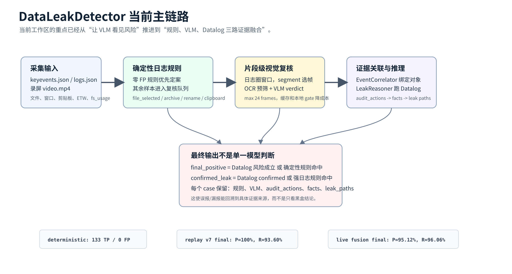
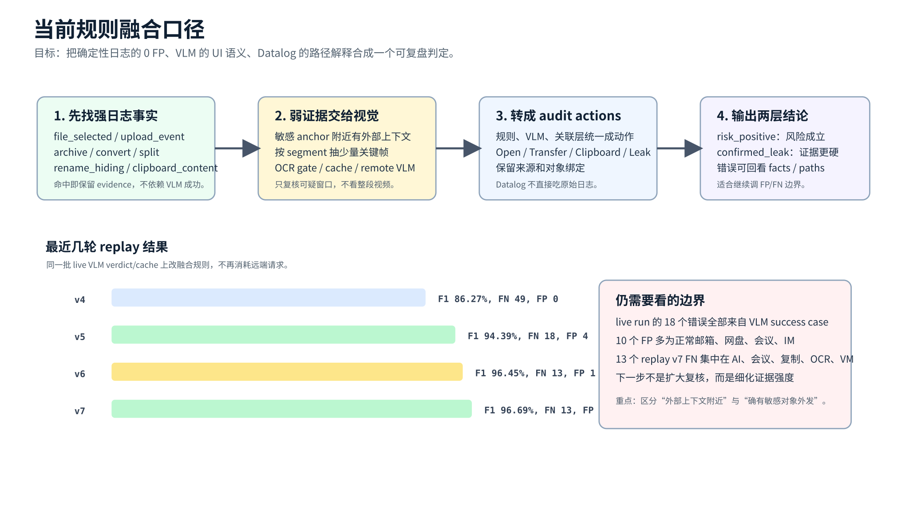
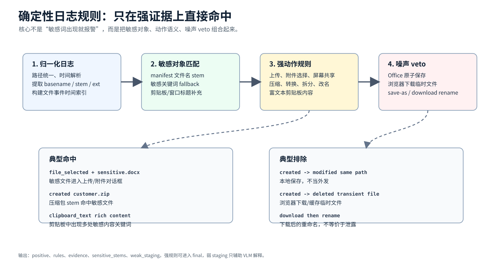
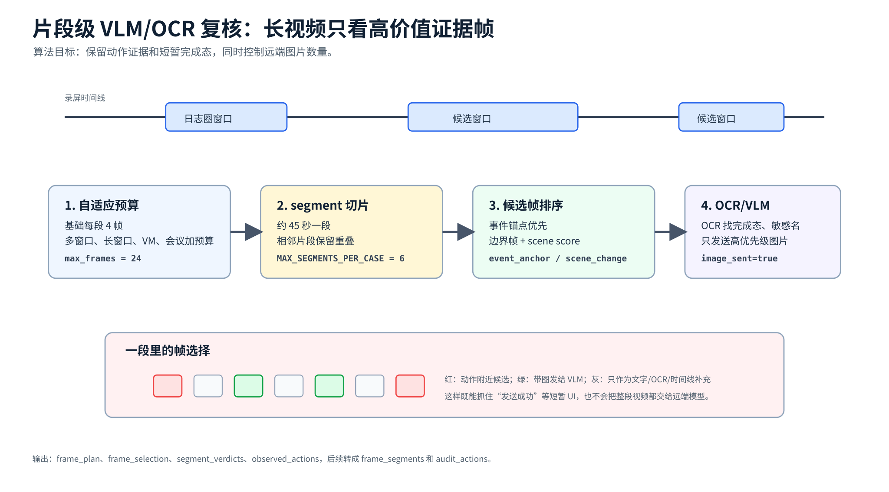
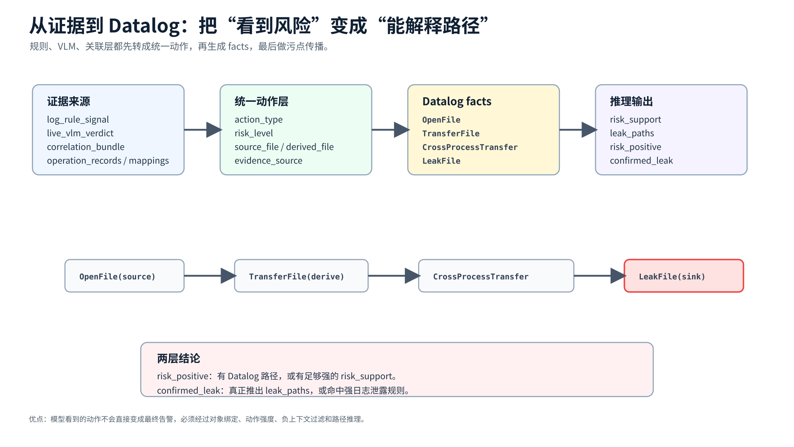

# DataLeakDetector 当前项目报告

生成时间：2026-07-02  
依据范围：当前工作区 `h` 分支，最新提交 `0586267 Add deterministic log rules and tighten VLM evidence fusion`，以及 `spec/output` 中最近一次 live benchmark 和 replay 结果。本文不覆盖旧版 `project_introduction.md`，旧文档仍可作为背景介绍。

---

## 1. 一句话定位

DataLeakDetector 当前已经不是单纯的“视频大模型识别泄露”原型，而是一个以日志为主线、视觉为补证、Datalog 为收束的证据链系统：

```text
采集日志/录屏
  -> 日志规则确定性命中
  -> 可疑窗口片段级 VLM/OCR 复核
  -> 事件、文件 lineage、视觉结论统一成 audit actions
  -> Datalog 推理泄露路径
  -> 输出 risk_positive / confirmed_leak 两层结论
```



核心变化是：最终判定不再直接等于 VLM 的一句 verdict。当前主流程会同时保留确定性日志规则、VLM 视觉观察、EventCorrelator 绑定结果、Datalog facts 和 leak paths，便于继续压 FP/FN。

---

## 2. 当前目录结构

```text
DataLeakDetector/
├── tools/ScreenMonitor/       # Windows/macOS 采集端：日志、剪贴板、窗口、录屏
├── 01-FrameAnalyzer/          # log-first、VLM/OCR 复核、历史 RiskHunter 逻辑
├── 02-EventCorrelator/        # 日志、窗口、VLM segment、文件 lineage 的证据关联
├── 03-LeakReasoner/           # Datalog facts 与泄露路径推理
├── main/                      # 统一包入口和 E2E 编排
├── tools/                     # benchmark、规则验证、错误分析、guarded runner
├── spec/                      # 数据、fixtures、报告、benchmark 输出
└── tests/                     # 回归测试
```

推荐入口仍是 `main/data_leak_detector` 下的统一包路径，历史目录继续保留，避免破坏已有 benchmark 脚本。

---

## 3. 当前检测链路

### 3.1 输入

核心输入是两类：

| 输入 | 作用 |
| --- | --- |
| `keyevents.json` / `logs.json` | 文件操作、窗口标题、进程、剪贴板、上传/发送、屏幕共享等结构化事件 |
| `video.mp4` | 补足日志看不到的 UI 语义，例如是否点击发送、是否显示上传完成、敏感内容是否进入 AI 输入框 |

NAS benchmark 中优先读取 `keyevents.json`，同时会从 `logs.json` 中补入和敏感文件、外部 sink、上传、会议、AI、VM 等相关的上下文日志。

### 3.2 日志优先

当前最重要的新增层是 `tools/log_signal_rules.py` 中的确定性日志规则。它只在经过验证的强模式上直接命中，最近一次完整结果中：

```text
deterministic: TP 133 / FP 0 / TN 43 / FN 70
precision: 100.00%
recall:    65.52%
F1:        79.17%
```

这意味着 246 个有效样本里，有 133 个违规样本可以不用远端 VLM 直接进入后续推理，同时没有把正常样本误判为 deterministic positive。

当前确定性规则覆盖：

| 规则 | 识别对象 |
| --- | --- |
| `file_selected` | 敏感文件进入上传/附件选择流程 |
| `upload_event` | 采集端显式上传、发送、分享事件 |
| `screen_share` / `screen_capture` | 共享屏幕或截图发生在敏感上下文附近 |
| `archive_created` | 敏感文件被打包成压缩包 |
| `convert_created` | 敏感文档转换为 PDF 等新格式 |
| `split_created` | 敏感文件被拆分成 numbered parts |
| `rename_hiding` / `variant_created` | 重命名、伪装副本、新版/最终版等隐藏式派生 |
| `upload_staging` | 浏览器重新读取已有敏感文件，指向上传 staging |
| `clipboard_content` | 剪贴板出现富文本敏感内容，而不是单纯路径 |

同时，规则里显式排除了 Office 原子保存、浏览器下载临时文件、下载后重命名、保存为等常见正常流，避免把“敏感名字出现在本地文件系统”粗暴当成泄露。

### 3.3 VLM/OCR 复核

VLM 只处理确定性规则不能完全定案的样本。当前复核不是全视频均匀抽帧，而是：

1. 用日志找到敏感 anchor 附近的外部上下文。
2. 合并 review window，并按约 45 秒切成 segment。
3. 依据上传、发送、剪贴板、AI、会议、VM、远程桌面等上下文分配帧预算。
4. 先选动作锚点附近帧，再补 segment 边界和 scene-change 帧。
5. OCR 先筛完成态和敏感名，必要时本地 gate，不一定发远端。
6. 所有入选帧保留上下文；只有 `image_sent=true` 的帧带真实图片给 VLM。

相关图可以继续参考旧图 `figures/segment_level_frame_sampling.svg`。当前最新 live run 使用：

```text
--use-vlm
--vlm-gate-mode adaptive
--vlm-workers 10
--max-vlm-frames 24
DLD_VLM_ENABLE_OCR_PREFILTER=1
DLD_VLM_OCR_ENGINE=easyocr
DLD_VLM_REVIEW_CACHE=1
```

### 3.4 EventCorrelator

EventCorrelator 的角色是把零散证据绑定成可推理对象，而不是单独做最终判定。它主要整理：

| 输出 | 含义 |
| --- | --- |
| `analysis_windows` | 后续视觉复核时间窗 |
| `correlated_events` | 日志和视觉片段绑定后的事件 |
| `operation_records` | 报告/推理层使用的动作记录 |
| `upload_candidates` | 可能的外发候选 |
| `file_lineage` | 原始文件、派生文件、压缩/转换/拆分链 |
| `statistics` / `errors` | 复盘统计和可恢复错误 |

当前 benchmark 主链路里，VLM success 时会把 VLM verdict 转为 `frame_segments`，再用过滤后的上下文日志跑关联，避免出现“VLM 看到了风险，但关联层拿不到相关日志”的断链。

### 3.5 LeakReasoner

LeakReasoner 将 audit actions 转为 Datalog facts，再判断污点是否传播到外部 sink。核心关系包括：

```souffle
OpenFile(id, process, file, timestamp)
TransferFile(id, process, src, dst, timestamp)
CrossProcessTransfer(id, from_process, to_process, shared_data, timestamp)
LeakFile(id, process, file, leak_channel, timestamp)
ClipboardWrite(id, process, data, timestamp)
ClipboardRead(id, process, data, timestamp)
```

Windows 或未安装 Souffle 时会使用 `03-LeakReasoner/datalog/python_datalog_engine.py` 的纯 Python fallback。当前实现已经用 `best_tainted` 和 frontier 队列避免循环传播无限膨胀。

---

## 4. 当前融合口径



当前 benchmark 的最终口径可以简化为：

```python
final_positive = datalog_positive or log_rule_positive
confirmed_leak = datalog_confirmed or log_rule_leak
```

也就是说：

- 确定性强日志规则可以直接给出风险。
- VLM 视觉结论会先转成 audit actions 和 frame segments，再交给 EventCorrelator / Datalog。
- `risk_positive` 偏召回，表示风险链条成立。
- `confirmed_leak` 更保守，表示证据更接近已确认泄露。

这种设计比“VLM positive 就 final positive”更适合调试，因为每个 case 都能看到：

| 字段 | 复盘价值 |
| --- | --- |
| `log_rule_signal` | 哪条确定性规则命中，证据日志是什么 |
| `live_vlm_verdict` | VLM 是否 success、risk_level、completed_action、frames_sent |
| `correlation_bundle` | 视觉和日志是否绑定成候选 |
| `audit_actions` | 统一后的动作序列 |
| `datalog_facts` | 实际进入推理引擎的事实 |
| `datalog_leak_paths` | 最终推导出的泄露路径 |

---

## 5. 关键算法与技术细节

这一节按当前代码真实链路展开：先用日志规则拿高精度确定性证据，再用片段级视觉补足 UI 语义，最后把不同来源的证据统一成 Datalog 可推理的事实。

### 5.1 确定性日志规则



确定性日志规则位于 `tools/log_signal_rules.py`。它的设计原则是：只有当“敏感对象 + 外发/派生动作 + 非正常本地流”同时成立时，才直接给出 positive。单独看到敏感文件名、外部应用窗口或浏览器进程，都不够。

核心流程：

1. 归一化日志：统一路径分隔符，解析时间戳，提取 `basename/stem/ext`，建立文件事件的时间索引。
2. 建立敏感对象集合：优先使用 groundtruth/manifest 中的敏感文件 stem，再用合同、工资、客户、财务、confidential、salary 等关键词兜底。
3. 执行动作规则：识别上传、附件选择、压缩、转换、拆分、重命名隐藏、屏幕共享、富文本剪贴板等强信号。
4. 执行 veto：排除 Office 原子保存、浏览器下载临时文件、下载后 rename、save-as 等正常本地流。
5. 输出可审计信号：`positive`、`rules`、`evidence`、`sensitive_stems`、`weak_staging`。

规则分成两种强度：

| 类型 | 示例 | 后续用途 |
| --- | --- | --- |
| 强泄露规则 | `upload_event`、`screen_share`、`file_selected`、`upload_staging` | 可以作为 `log_rule_leak` 支撑 confirmed |
| 风险/派生规则 | `archive_created`、`convert_created`、`split_created`、`rename_hiding`、`clipboard_content` | 进入 risk positive 或辅助 Datalog/VLM 解释 |

这层算法的价值是给系统一个高精度锚点。当前完整 run 中 deterministic 为 `TP 133 / FP 0`，说明一大批样本可以不依赖远端 VLM 直接形成强证据。

### 5.2 可疑窗口与帧预算



VLM 复核的关键不是“多抽几帧”，而是“先决定哪些片段值得看”。相关逻辑主要在 `tools/benchmark_nas_samples.py` 的 `_adaptive_vlm_frame_budget`、`_prepare_review_segments`、`_live_vlm_review_case` 附近。

算法会先从 `fallback_meta` 和日志中取 review windows，再按复杂度调整帧预算：

| 触发条件 | 预算变化 |
| --- | --- |
| 多个 review segment | 增加每段基础帧数 |
| 总窗口超过 60/120 秒 | 增加覆盖范围 |
| candidate event 很多 | 增加少量上下文帧 |
| VM/远程桌面 | 增加预算，因为宿主日志可能不完整 |
| 会议/屏幕共享 | 增加预算，因为风险经常是画面暴露 |

当前常用上限是 `--max-vlm-frames 24`，内部默认按“每段最多 4 帧、最多约 6 个高信号片段”的思路分配。长视频优先增加片段覆盖，而不是把单个片段看得特别密。

### 5.3 事件锚点、场景变化和 OCR 预筛

在每个 review segment 内，候选帧不是均匀采样，而是按优先级产生：

| 候选来源 | 目的 |
| --- | --- |
| `event_anchor_*` | 抓上传、发送、粘贴、剪贴板、共享等动作附近的短暂 UI |
| segment 开头/中点/结尾 | 保证片段边界和上下文连续 |
| scene-change | 捕捉画面发生明显变化的瞬间 |
| OCR hit | 提升“上传完成、发送成功、敏感文件名可见”等帧的优先级 |

OCR 的作用是预筛和降成本，而不是替代 VLM。入选帧都会进入文字上下文，但只有优先级足够高的帧会设置 `image_sent=true`，携带真实 JPEG/base64 发给远端模型。这样做的直接好处是：后续复盘时能知道每一帧为什么入选、是否跑了 OCR、是否真的发给 VLM。

典型帧记录包括：

```json
{
  "selection_reason": "scene_change",
  "ocr_flags": ["completion_keyword"],
  "image_decision_reasons": ["event_anchor", "ocr_risk_hit"],
  "image_sent": true
}
```

### 5.4 VLM verdict 到 frame segment

VLM success 后，系统不会只保留一个布尔值，而是从 `observed_actions` 中提取结构化动作。关键逻辑在 `_frame_segments_from_vlm_verdict`：

1. 只接受 `risk_level` 属于 `attempted`、`in_progress`、`content_exposed`、`completed` 的动作。
2. 从 `evidence_frames` 找到支撑帧和时间戳。
3. 将 `source_file`、`derived_file`、`app`、`action_type`、`confidence`、`description` 写入 frame segment。
4. 如果 VLM 没有给细粒度动作，则退化为一个 `vlm_verdict_0` segment，保留整体 reason 和时间。

frame segment 示例：

```json
{
  "segment_id": "seg_2_action_0",
  "time_range": "2026-06-03 00:41:45 - 2026-06-03 00:42:05",
  "app_name": "Chrome",
  "operation_type": "upload_complete",
  "primary_resource": "客户名单.xlsx",
  "visible_evidence": ["risk_level=completed", "frame_ids=3,5"],
  "confidence": 0.91
}
```

这一步让视觉结果可以被 EventCorrelator 当成普通证据片段处理，而不是悬空的模型判断。

### 5.5 证据关联和对象绑定

EventCorrelator 负责把“看到一个动作”绑定到“哪个敏感对象、哪个派生文件、哪个外部 sink”。它会综合：

| 证据 | 绑定方式 |
| --- | --- |
| 日志事件 | 时间窗口、进程、窗口标题、文件路径 |
| VLM segment | `time_range`、`primary_resource`、`operation_type`、`visible_evidence` |
| 文件 lineage | 原文件、复制件、压缩包、PDF 转换、拆分件 |
| 前台上下文 | 邮箱、AI、网盘、会议、聊天、代码平台等分类 |

输出的 `upload_candidates` 不是最终答案，而是“有足够证据进入推理层的候选外发事件”。这能避免一个常见问题：VLM 看到“上传完成”，但没有绑定到敏感文件；或者日志看到敏感文件被读，却不知道它进入了哪个外部应用。

### 5.6 Audit actions 到 Datalog facts



当前代码会先把不同来源的证据合并成 `audit_actions`：

```python
actions = []
actions.extend(operation_record_actions)
actions.extend(file_mapping_actions)
actions.extend(log_sensitive_open_actions)
actions.extend(detection_actions)
actions.extend(log_rule_actions)
actions.extend(vlm_actions)
actions.extend(correlation_actions)
```

随后 `_audit_actions_to_datalog_facts` 会把动作转换成 Datalog facts：

| action 情况 | 生成事实 |
| --- | --- |
| 敏感源存在 | `OpenFile(sensitive_source, ...)` |
| 动作引用敏感文件 | `OpenFile(action_source, process, file, ts)` |
| 有派生文件 | `TransferFile(process, source, derived, ts)` |
| 跨应用/剪贴板传播 | `CrossProcessTransfer(...)` 或剪贴板读写派生 |
| 动作达到外发强度 | `LeakFile(process, file, channel, ts)` |

生成 `LeakFile` 时会经过多层过滤：未完成动作、历史/入站上下文、云文档只读上下文、VLM parent verdict 阻断、local positive 强度不足等，都不能轻易变成 confirmed leak。

### 5.7 Datalog 污点传播

Datalog 推理层负责回答“敏感对象是否沿着事实链到达外部 sink”。Python fallback 的核心是不动点迭代：

```text
OpenFile -> Tainted(source)
TransferFile -> Tainted(derived)
CrossProcessTransfer -> Tainted(other_process)
ClipboardWrite + ClipboardRead -> CrossProcessTransfer
Tainted + LeakFile -> SearchLeak
```

为了避免循环传播无限增长，当前 Python 引擎维护 `best_tainted[(process, data)]`，同一个进程和数据只保留更短路径；frontier 队列只扩展新增污点。这样即使存在 `orig -> part1 -> orig` 这样的循环，也能收敛。

最终输出分两层：

| 输出 | 含义 |
| --- | --- |
| `risk_positive` | 有 Datalog leak path，或有足够强的 risk support |
| `confirmed_leak` | 真正推出 leak path，或命中强日志泄露规则 |

这也是当前报告中同时展示 final 和 confirmed 的原因：一个偏风险检出，一个偏证据确认。

---

## 6. 最新评测结果

### 5.1 最新 live run

来源：`spec/output/nas_vlm_rules_fusion_20260702_212835/report.json`

运行配置：

```powershell
python tools\run_benchmark_guarded.py `
  --run-name nas_vlm_rules_fusion `
  --use-vlm `
  --vlm-gate-mode adaptive `
  --vlm-workers 10 `
  --max-vlm-cases 0 `
  --max-vlm-frames 24
```

结果：

| 指标 | Precision | Recall | F1 | TP | FP | TN | FN |
| --- | ---: | ---: | ---: | ---: | ---: | ---: | ---: |
| triage | 88.26% | 100.00% | 93.76% | 203 | 27 | 16 | 0 |
| deterministic | 100.00% | 65.52% | 79.17% | 133 | 0 | 43 | 70 |
| final | 95.12% | 96.06% | 95.59% | 195 | 10 | 33 | 8 |
| confirmed | 95.56% | 84.73% | 89.82% | 172 | 8 | 35 | 31 |

统计：

```text
total: 246
deterministic_hits: 133
vlm_reviews: 230
live_vlm_reviews: 97
vlm_remote_requests: 86
vlm_local_resolutions: 4
vlm_cache_hits: 7
datalog_cases: 230
datalog_positive: 184
datalog_confirmed: 129
skipped_cases: 17
```

观察：

- triage 仍保持 100% 召回，说明“要不要进入复核”的漏报已经压住。
- deterministic 从旧的 47 TP 提升到 133 TP，而且 FP 为 0，这是当前最有价值的进展。
- final F1 达到 95.59%，但 live run 中仍有 10 FP 和 8 FN，全部发生在 `vlm=success` 的 case，说明主要问题不在 VLM 调用失败，而在证据解释和融合边界。

### 5.2 replay 规则迭代

为了不反复消耗远端 VLM，当前用已有 `live_vlm_verdict` 做离线 replay，专门评估规则融合变化。

| run | final Precision | final Recall | final F1 | FP | FN |
| --- | ---: | ---: | ---: | ---: | ---: |
| `replay_rules_v4` | 100.00% | 75.86% | 86.27% | 0 | 49 |
| `replay_rules_v5` | 97.88% | 91.13% | 94.39% | 4 | 18 |
| `replay_rules_v6` | 99.48% | 93.60% | 96.45% | 1 | 13 |
| `replay_rules_v7` | 100.00% | 93.60% | 96.69% | 0 | 13 |

`replay_rules_v7` 是当前最干净的离线融合口径：0 FP，13 FN。它说明当前规则和 Datalog 融合本身已经能在缓存 VLM verdict 上做到高精度；live run 的 10 FP 更可能来自 live verdict 细节、缓存差异或 VLM 对正常外部上下文的解释偏积极。

### 5.3 错误分布

最新 live run 的 18 个 final 错误：

| 维度 | 分布 |
| --- | --- |
| bucket | 10 FP，8 FN |
| stage | stage1 16 个，stage2 1 个，stage4 1 个 |
| action | none 9，upload 6，send 2，screen_share 1 |
| vlm | 全部为 success |

典型 FP 是正常外部应用上下文，例如普通邮箱、网盘、会议、IM。典型 FN 则多在“VLM 看到了某些风险，但 Datalog/规则没有足够硬证据”或“local gate 口径不够强”的场景。

`replay_rules_v7` 的 13 个错误全部是 FN：

| 维度 | 分布 |
| --- | --- |
| stage | stage1 6 个，stage2 5 个，stage4 2 个 |
| action | local_gate 7，none 6 |
| vlm | local_positive 7，success 6 |

剩余重点样例包括 AI 输入、会议、工作区/代码平台、复制转移、OCR 内容、VM/远程场景。下一步应优先补这些类别的可解释证据，而不是简单扩大 VLM positive 口径。

---

## 7. 和旧版报告相比的关键变化

| 旧重点 | 当前重点 |
| --- | --- |
| 抽帧、OCR、VLM 如何发现风险 | 规则、VLM、Datalog 如何融合成可复盘判定 |
| VLM 是否能看到“发送成功/上传完成” | VLM 看到之后是否能绑定到敏感对象和外部 sink |
| log-first 主要用于减少 VLM 成本 | 确定性日志规则本身已经成为高精度判定来源 |
| final 主要看 VLM / upload_candidates | final 由 `datalog_positive or log_rule_positive` 收束 |
| 关注远端请求量 | 同时关注 deterministic 0 FP、replay 0 FP、live/replay 差异 |

旧版 `project_introduction.md` 对整体架构仍然有效，但 benchmark 结果、最终判定口径、规则层职责需要按本文更新理解。

---

## 8. 当前技术取舍

| 取舍 | 当前选择 | 原因 |
| --- | --- | --- |
| 先日志还是先视觉 | 先日志 | 日志便宜、可审计，且当前 deterministic 已有 133 TP / 0 FP |
| VLM 是否直接定案 | 不直接等价于 final | VLM 需要和对象绑定、sink、Datalog 路径一起解释 |
| 本地规则是否激进 | 强规则可定案，弱规则只做 staging | 保住 precision，避免正常外部上下文误报 |
| OCR 是否可本地 positive | 只在强证据下允许 | OCR 容易把 UI 文本误当成完成态 |
| Datalog 是否强依赖 Souffle | 不强依赖 | Windows 开发和 benchmark 需要 Python fallback |
| replay 是否重要 | 很重要 | 能隔离规则融合变化，不被远端 VLM 波动干扰 |

---

## 9. 测试与验证材料

主要回归测试仍在 `tests/test_e2e_regressions.py`，覆盖：

- prompt loader 不受同名模块污染。
- VLM 帧数限制和上下文保留。
- Qwen/VLM response 去重、噪声过滤、guardrail。
- log-first fallback gate 对 AI、普通聊天、VM、剪贴板、会议的策略。
- realistic fixture 策略矩阵。
- 曾经漏掉的 log violation case 变 deterministic event。
- 内容粘贴作为 transfer candidate，而不是直接当日志外发。
- 派生文件上传能注入 Datalog connected facts 并形成 leak path。
- EventCorrelator 能回填文件 lineage 和 upload candidates。
- Python Datalog 引擎不会在循环传播中无限扩张。

常用验证命令：

```powershell
python -m unittest tests.test_e2e_regressions
```

常用 benchmark 命令：

```powershell
python tools\run_benchmark_guarded.py `
  --run-name nas_vlm_rules_fusion `
  --use-vlm `
  --vlm-gate-mode adaptive `
  --vlm-workers 10 `
  --max-vlm-cases 0 `
  --max-vlm-frames 24
```

离线 replay 适合验证融合规则，不重复调用远端 VLM：

```powershell
python tools\benchmark_nas_samples.py `
  --use-vlm `
  --vlm-gate-mode adaptive `
  --replay-vlm-report spec\output\nas_vlm_rules_fusion_20260702_212835\report.json `
  --json-output spec\output\replay_rules_next\report.json
```

---

## 10. 后续改进建议

1. 压 live FP：正常邮箱、网盘、会议、IM 需要更明确地区分“外部上下文附近”与“敏感对象确实外发”。
2. 补 replay v7 剩余 FN：重点看 AI 输入、会议、复制/OCR、VM/远程这几类，不要泛化扩大 positive。
3. 把 VLM verdict 状态继续细分：`selected_only`、`content_exposed`、`in_progress`、`completed`、`benign_external_context` 应该有不同证据强度。
4. 加强 object binding：VLM 看到上传/发送时，要尽量绑定到敏感文件名、派生文件、剪贴板内容或 lineage 链。
5. 继续固化数据集 manifest：减少从路径、目录名、case 名推断 stage/app/held-out 信息。
6. 把 live/replay 差异自动汇总：每轮 live 后自动生成“哪些 case 因 VLM verdict 与缓存不同而变错”的报告。

---

## 11. 结论

当前工作区的关键进展是：系统已经形成“确定性规则保精度、VLM 补 UI 语义、Datalog 给路径解释”的融合框架。最新 live run 达到 final F1 95.59%，离线 replay v7 达到 final F1 96.69% 且 0 FP。

下一阶段最值得做的不是继续堆更多 VLM 帧，而是把剩余错误拆成可解释边界：正常外部上下文为什么会被判外发，AI/会议/VM/复制/OCR 为什么还有少量漏报。只要这两类边界继续收紧，项目就能从“能检出”进一步走向“能审计、能复盘、能部署”。
