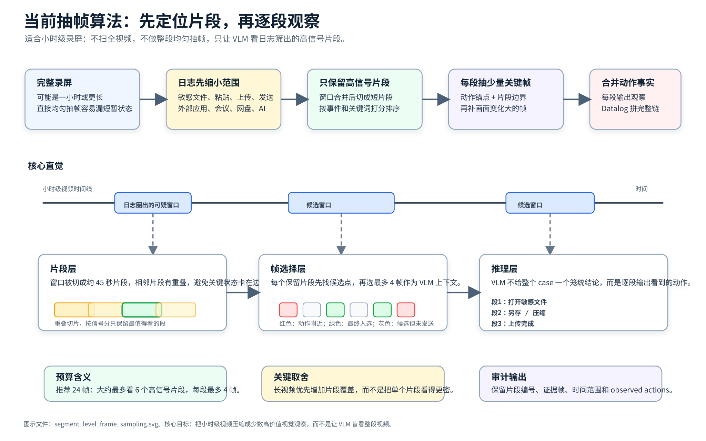

# 当前视频抽帧策略



这份文档说明 NAS live VLM 评测里现在实际使用的抽帧流程。重点不是“从整段视频均匀抽几张图”，而是：

```text
先用日志把小时级视频缩小成若干可疑时间段，
再从这些时间段里选出高信号片段，
最后每个片段单独抽少量关键帧给 VLM 看。
```

这样做的原因很直接：一个录屏可能是一小时甚至更长，真正有意义的动作可能只发生在几十秒内。直接对整段视频均匀抽帧，很容易抽到等待、浏览、切窗口、空白页面，却漏掉“选择文件”“粘贴内容”“上传完成”“发送成功”这些短暂状态。

当前实现主要在：

[tools/benchmark_nas_samples.py](../../tools/benchmark_nas_samples.py)

## 总体流程

当前流程可以理解成五步：

```text
1. 日志先定位可疑窗口
2. 可疑窗口合并、切成短片段
3. 给每个片段打分，只保留信号最强的片段
4. 每个片段内部抽少量代表帧
5. 每个片段单独让 VLM 输出 observed_actions，再合并给 Datalog
```

注意这里的单位已经从过去的“一个 case 一个总判断”变成了“一个 case 里多个片段分别观察”。后续 Datalog 会把多个片段里的动作事实拼成完整链路。

例如一个长视频里分散出现：

```text
片段 1：打开敏感文件
片段 2：另存为 PDF
片段 3：压缩成 zip
片段 4：上传到网盘
片段 5：远端列表出现文件
```

VLM 不应该只给整个 case 一个笼统 verdict，而应该尽量分别输出这些片段里看到的动作。Datalog 再负责把：

```text
原文件 -> PDF -> zip -> 上传完成
```

推成一条泄露链。

## 一、日志如何先缩小视频范围

系统不会从完整视频开始抽帧。它会先根据日志和 fallback 信息得到若干“需要视觉复核的时间窗口”。

这些窗口通常来自：

- 敏感文件附近的操作日志。
- 剪贴板、粘贴、截图、上传、发送、附件、提交等动作。
- 外部前端应用窗口，例如邮箱、网盘、AI 服务、IM、会议、代码托管网站。
- 日志无法直接确认完成态，但值得让 VLM 看一眼的可疑上下文。

如果两个可疑窗口离得很近，当前会先把它们合并。现在的合并阈值是 8 秒。也就是说，两个窗口中间只隔了几秒，就认为它们可能属于同一段连续操作。

这样处理后，小时级视频会先被缩小成若干个候选窗口。后面的抽帧只在这些窗口附近发生。

## 二、窗口如何切成片段

合并后的窗口如果比较长，会被切成短片段。

当前切法是：

```text
每段 45 秒
相邻片段重叠 10 秒
实际步长 35 秒
```

重叠的作用是避免关键状态刚好落在边界上。例如“点击发送”在前一段末尾，“发送成功”在后一段开头，如果完全不重叠，就可能把一个动作链切断。

举例，一个 2 分钟窗口会被切成：

```text
00:00 - 00:45
00:35 - 01:20
01:10 - 01:55
01:45 - 02:00
```

如果视频是一小时，这一步也不会把整小时都送给 VLM。它只切日志筛出的可疑窗口；如果某个可疑窗口本身很长，才会继续切成多个 45 秒左右的片段。

## 三、片段如何排序和保留

切出来的片段不会全部送审。系统会给每个片段打一个信号分。

分数主要来自：

- 片段附近有没有候选事件。
- 候选事件里有没有上传、发送、附件、网盘、邮箱、AI、完成态等关键词。
- 片段附近的普通日志有没有外部应用或传输相关信号。
- 片段自身时长。

简单说，越像“敏感内容进入外部通道”的片段，分数越高。

当前每个 case 最多保留 6 个高信号片段。实际保留多少个，还会受总帧预算影响：

```text
总帧预算 10：通常最多看 2 个片段
总帧预算 24：通常最多看 6 个片段
```

因此，对于小时级视频，关键不是把每个片段多看很多帧，而是让预算能覆盖更多高信号片段。现在推荐用：

```powershell
--max-vlm-frames 24
```

这样大约对应“最多 6 个片段，每段最多 4 帧”。如果还用 10 帧，长视频里通常只会看 2 个片段左右，容易漏掉分散的中间步骤。

## 四、每个片段内部如何找候选帧

每个片段不会直接均匀抽 4 帧，而是先生成一批候选时间点，再从候选帧里选代表帧。

候选时间点有两类。

第一类是动作锚点。系统会从日志里找上传、发送、选择文件、粘贴、剪贴板、提交等动作，然后在这些动作前后补几个时间点。

例如上传、发送、附件、提交类动作，会看：

```text
动作前 3 秒
动作发生时
动作后 5 秒
动作后 12 秒
动作后 25 秒
动作后 45 秒
```

这样是为了抓“完成态”。很多上传或发送不是点击后立刻完成，成功提示、远端文件列表、聊天消息出现，可能要过几秒到几十秒。

剪贴板、粘贴、选择文件类动作，会看：

```text
动作发生时
动作后 3 秒
动作后 8 秒
动作后 15 秒
动作后 30 秒
```

第二类是片段内的均匀补充点。如果日志锚点不够，系统会在片段内补一些普通候选点，避免完全依赖日志。

当前每个片段最多先生成 24 个候选时间点，然后再从里面挑最多 4 帧。

## 五、如何从候选帧里选最终帧

候选时间点会被换算成视频帧号，然后用 OpenCV 直接跳到这些帧读取。系统不会逐帧扫描完整视频。

每个候选帧会计算一个很轻量的画面变化分数：

```text
把帧缩成 96x54 的灰度小图
和上一个候选帧做差
差异越大，说明画面变化越明显
```

最终选代表帧时，优先级是：

```text
1. 优先保留动作锚点帧
2. 保留片段开头、中间、结尾的上下文帧
3. 补充画面变化大的帧
4. 如果还不够，再按变化分数补满
```

所以最终 4 帧通常会包含：

- 动作发生附近的帧。
- 片段边界状态。
- 画面明显变化的帧。

它不是简单的“45 秒里等间隔抽 4 张图”。

## 六、OCR 和图片预算现在怎么用

当前 OCR 只作为辅助信息，不再本地直接判定 positive。

OCR 的作用是：

- 给 VLM 提供文字上下文。
- 帮助判断哪些帧更值得带真实图片。
- 标记可能出现的完成态词，比如“已发送”“上传完成”“提交成功”。
- 标记可能出现的敏感文件名。

每个片段最多对 3 帧跑 OCR。每个片段最多给 VLM 发送 4 张真实图片。

图片会压缩到最长边 960，JPEG 质量为 65。这个是为了控制请求体大小和成本。

选哪些帧带真实图片时，会优先考虑：

- 片段边界帧。
- 动作锚点帧。
- OCR 命中完成态或敏感文件名的帧。
- 画面变化明显的帧。

如果某帧看起来像监控系统自己的 UI，而不是用户实际操作界面，会被降权。

## 七、每个片段如何送给 VLM

现在每个片段单独构造一次 VLM 请求。

每个请求里会包含：

- 片段编号。
- 片段开始和结束时间。
- 敏感文件列表。
- 片段附近的候选日志。
- 入选帧的时间、原始视频帧号、选择原因、OCR 结果。
- 需要发送真实图片的帧。

VLM 需要输出这个片段里观察到的动作，而不是只给整个 case 一个总判断。

输出重点是：

```json
{
  "segment_id": "vlm_seg_01",
  "observed_actions": [
    {
      "action_type": "upload_complete",
      "risk_level": "completed",
      "source_file": "secret.docx",
      "derived_file": "",
      "evidence_frames": [1, 2],
      "description": "..."
    }
  ]
}
```

这样后续可以知道：哪一个动作来自哪一个片段、哪几帧支持这个动作、动作发生在哪个时间范围。

## 八、多个片段如何合并

所有片段的 VLM 结果会被合并成一个 case 级结果，但这个合并结果会保留片段级证据。

合并时会保留：

- 每个片段的 verdict。
- 所有片段的 observed actions。
- 所有入选帧的时间和选择原因。
- 每个动作对应的片段编号和证据帧。

随后系统会把这些动作转成 EventCorrelator 能消费的 frame segments，再交给 Datalog。

Datalog 更适合做这种跨片段拼链。例如：

```text
片段 1：打开 secret.docx
片段 2：另存为 secret.pdf
片段 3：压缩成 secret.zip
片段 4：上传 secret.zip
```

最后推理出：

```text
secret.docx -> secret.pdf -> secret.zip -> upload
```

这也是当前改成 segment-level observation 的核心原因。

## 九、当前策略的边界

当前策略已经避免了“整段视频均匀抽帧”的问题，但仍然有边界：

- 每个 case 最多保留 6 个高信号片段。
- 每个片段最多 4 帧。
- 如果一个小时级视频里有超过 6 个分散关键步骤，当前仍可能漏掉一部分。
- 如果日志没有把可疑窗口圈出来，视觉侧也很难凭空去扫完整视频。
- OCR 只辅助选帧和提供上下文，不负责最终判定。

所以当前设计更适合：

```text
日志先高召回定位可疑时间段，
VLM 负责补足 UI 语义和完成态，
Datalog 负责跨片段拼接证据链。
```

而不是：

```text
把整个小时级视频直接交给 VLM 看。
```

## 十、推荐运行方式

长视频或复杂样例建议使用：

```powershell
python -u tools\run_benchmark_guarded.py `
  --run-name nas_vlm_practical_adaptive `
  --use-vlm `
  --vlm-gate-mode adaptive `
  --vlm-workers 10 `
  --max-vlm-cases 0 `
  --max-vlm-frames 24
```

这里最重要的是最后一项。`24` 的含义可以粗略理解为：

```text
最多看 6 个高信号片段，
每个片段最多 4 帧。
```

如果改回 10，则更省钱，但通常只能覆盖 2 个片段左右，不适合关键动作分散的长视频。
