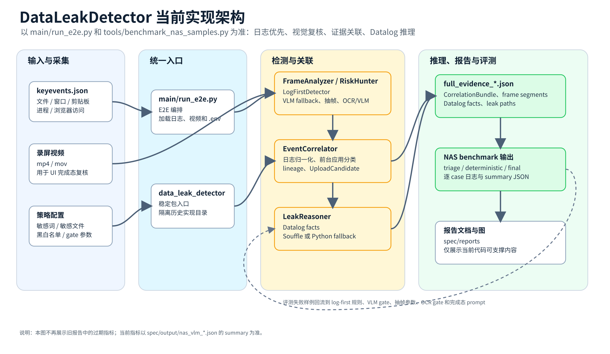
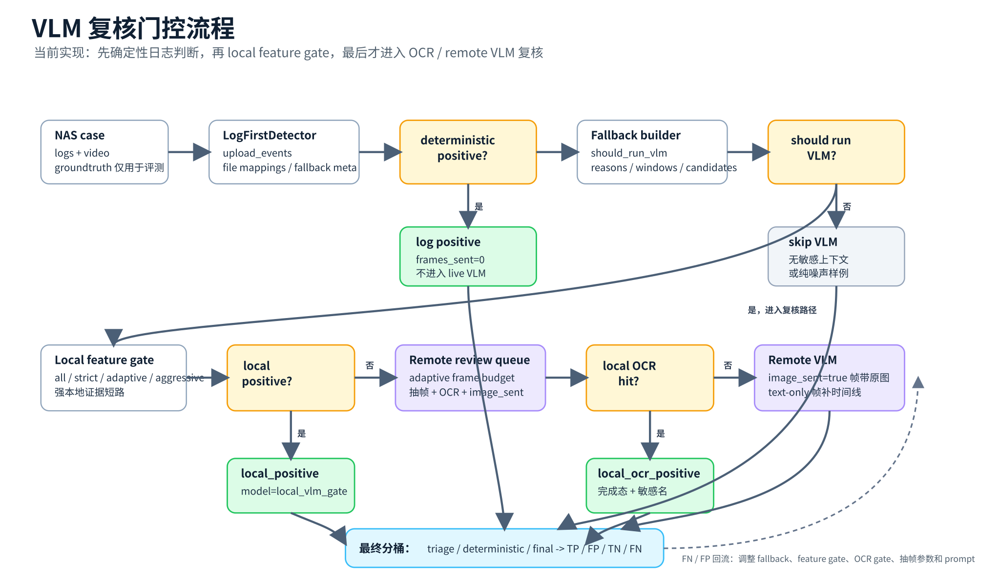
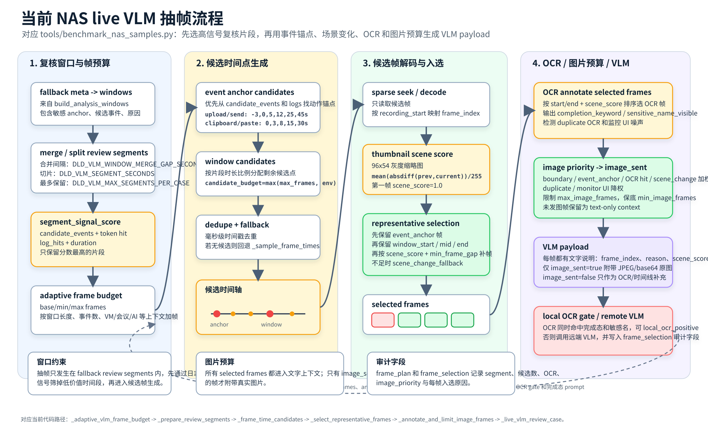
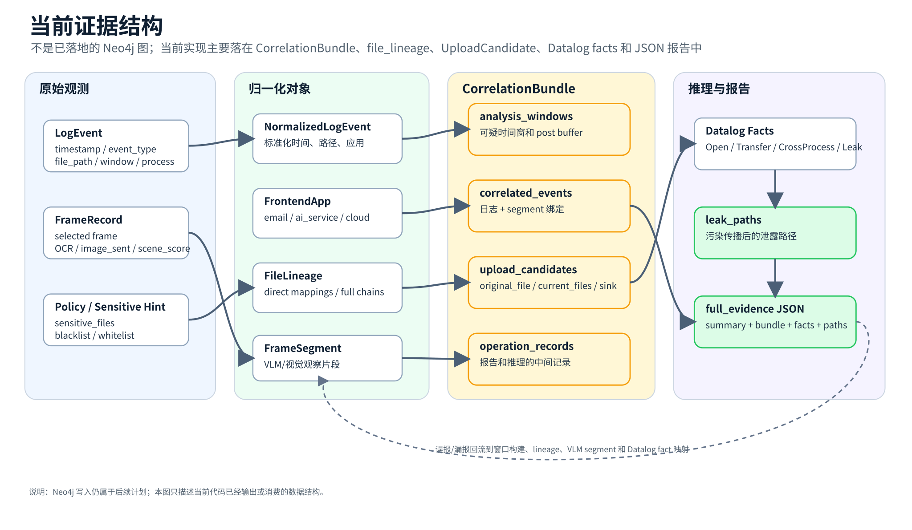

# VLM 抽帧与实时评测日志设计

本文记录 `tools/benchmark_nas_samples.py` 在重构后的 live VLM 评测路径中如何抽帧、如何记录每个样本的中间结果，以及这些设计为什么更适合 DataLeakDetector 的泄露检测任务。

## 背景

全量 NAS live VLM 评测的耗时主要来自两件事：

1. 需要对大量 triage-only case 调用 VLM；
2. 每次 VLM 请求都要上传多张截图，并等待多模态模型判断“是否已经完成泄露”。

因此抽帧目标不是“完整理解整段视频”，而是在日志已经给出可疑时间窗的前提下，把最有可能包含完成态证据的少量画面交给 VLM。完成态证据包括发送成功、上传完成、远端列表出现文件、屏幕共享中暴露敏感内容、VM/远程桌面复制完成等。

## 当前评测流水线



NAS benchmark 中每个 case 按如下顺序处理：

1. `LogFirstDetector` 先基于日志做 deterministic 判断。
2. 如果日志已经能连出敏感文件外发链路，则直接进入 final positive。
3. 如果日志不能直接确认，但出现 AI、上传、剪贴板、会议、VM、远程桌面等可疑上下文，则进入 VLM fallback。
4. VLM fallback 根据 review window 抽取代表帧，调用 live VLM。
5. VLM verdict 进入 EventCorrelator，转成 upload candidate，再形成 final bucket。



## 抽帧策略

重构前的 live VLM 抽帧采用简单均匀采样：在 review window 内按时间平均取 `max_vlm_frames` 个时间点。这个方法实现简单，但有两个问题：

- 可能错过短暂的完成态画面，例如“发送成功”提示、上传完成后的远端列表刷新；
- 对长窗口不够敏感，长视频中几帧均匀点可能都落在静止页面或无关等待阶段。

重构后的抽帧策略改为“候选帧 + 轻量场景变化评分 + 上下文保底”：



步骤如下：

1. 从 fallback meta 得到 VLM review windows。
2. 为每个窗口分配候选帧预算，默认候选数量为 `max(24, max_vlm_frames * 6)`。
3. 只 seek/decode 候选时间点，不全量解码视频。
4. 将候选帧缩放为 `96x54` 灰度缩略图。
5. 计算当前缩略图与上一候选缩略图的平均绝对差，归一化为 `scene_score`。
6. 选择代表帧：
   - `window_start`：保留窗口开头上下文；
   - `window_mid`：保留中段状态；
   - `window_end`：保留完成态或取消态；
   - `scene_change`：补充画面变化最大的候选帧。
7. 对最终入选帧做 resize、JPEG 编码和 base64 封装。
8. VLM prompt 中附带每帧的 `source_frame`、`selection_reason` 和 `scene_score`。

这种策略参考了视频 shot boundary / scene detection 的常见思想：先找画面变化，再从变化附近取代表帧。TransNetV2 使用深度网络做 shot transition detection；PySceneDetect 和 FFmpeg scene detection 也都围绕画面内容变化来定位镜头/场景边界。我们的实现不引入额外深度模型或 FFmpeg 依赖，而是用 OpenCV 缩略图差异作为轻量近似，适合 benchmark 中“日志已经限定可疑窗口”的场景。

## 关键参数

| 参数 | 默认值 | 含义 |
| --- | --- | --- |
| `--max-vlm-frames` | `6` | 每个 live VLM case 最多发送多少张图 |
| `DLD_VLM_REVIEW_CANDIDATE_FRAMES` | `max(24, max_vlm_frames * 6)` | 每个 case 最多扫描多少个候选时间点 |
| `DLD_VLM_REVIEW_MIN_FRAME_GAP` | `12` | 优先挑选 scene-change 帧时的最小帧号间隔 |
| `DLD_VLM_REVIEW_IMAGE_MAX_EDGE` | `960` | 发送给 VLM 的图片最长边 |
| `DLD_VLM_REVIEW_JPEG_QUALITY` | `65` | JPEG 质量 |

如果 VLM 调用很慢，可以先降低帧数：

```powershell
python tools/benchmark_nas_samples.py --use-vlm --max-vlm-cases 5 --max-vlm-frames 3
```

如果担心漏掉短暂 UI 状态，可以增加候选帧数：

```powershell
$env:DLD_VLM_REVIEW_CANDIDATE_FRAMES = "48"
```

## 实时日志

重构后，benchmark 会把每个 case 的中间状态打印到 `stderr`。原来的 PowerShell `2>&1 | Tee-Object` 命令会把这些日志写入 `.log` 文件。

示例：

```text
[VLM 12/all START] case=stage1\0-normal-meeting-feishu-1 progress=35/211 expected=0 reasons=ambiguous_exfil_context_near_sensitive_log max_frames=6
[CASE 35/211] FP case=stage1\0-normal-meeting-feishu-1 expected=0 final=1 det=0 triage=1 vlm=success frames=6 confidence=0.72 action=screen_share reasons=ambiguous_exfil_context_near_sensitive_log
```

字段解释：

| 字段 | 含义 |
| --- | --- |
| `CASE x/y` | 当前 case 进度 |
| `TP/FP/TN/FN` | 当前 case 的 final bucket |
| `expected` | groundtruth 是否为正例 |
| `final` | 最终判定是否为 positive |
| `det` | deterministic 阶段是否命中 |
| `triage` | triage 阶段是否进入 positive/复核 |
| `vlm` | live VLM 状态，如 `success`、`failed`、`triage_only` |
| `frames` | 实际发送给 VLM 的帧数 |
| `confidence` | VLM verdict 置信度 |
| `action` | VLM 判定的完成动作 |
| `reasons` | fallback gate 触发原因 |

## JSON 审计字段

当 live VLM 成功返回时，case 的 `live_vlm_verdict` 中会包含：

```json
{
  "frames_sent": 6,
  "frame_selection": [
    {
      "index": 1,
      "timestamp": "2026-06-03 00:41:51",
      "frame_index": 12,
      "scene_score": 1.0,
      "selection_reason": "window_start"
    }
  ]
}
```

这让后续排查误报/漏报时可以直接定位：VLM 看到的是哪几帧，为什么选中这些帧，是否错过了关键完成态。

## 证据流



重构后的证据流强调两点：

1. 日志规则和 VLM 不是相互替代，而是分工：日志负责缩小时间窗和建立文件/应用线索，VLM 负责确认视觉完成态。
2. 抽帧结果进入 JSON 审计链，避免 live VLM 变成不可解释的黑箱判断。

## 参考资料

- TransNetV2: An effective deep network architecture for fast shot transition detection: https://arxiv.org/abs/2008.04838
- PySceneDetect detector documentation: https://www.scenedetect.com/docs/latest/api/detectors.html
- PySceneDetect CLI documentation: https://www.scenedetect.com/docs/latest/cli.html
- FFmpeg filters documentation, scene/change filters: https://ffmpeg.org/ffmpeg-filters.html
