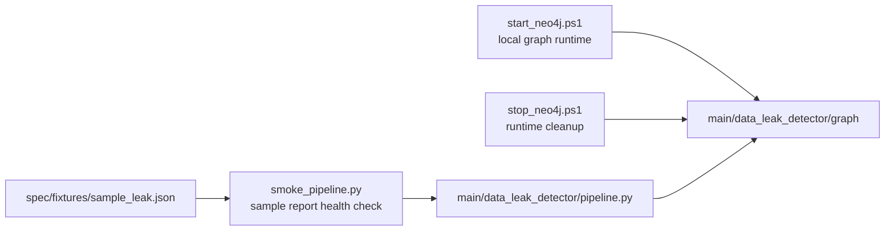

# Tools

This directory now contains only helpers that target the canonical package in
`main/data_leak_detector`.

Use `main/run_e2e.py` for normal execution and `tools/smoke_pipeline.py` for a
quick local health check.

Neo4j helpers:

```powershell
tools\start_neo4j.ps1
python main\run_e2e.py --log spec\fixtures\sample_leak.json --neo4j --neo4j-strict
tools\stop_neo4j.ps1
```

The helper downloads a local JRE and Neo4j Community distribution into
`.runtime/`, then writes local Neo4j settings to `.env`.

## File Roles



`smoke_pipeline.py` confirms the Python pipeline works with the sample fixture.
`start_neo4j.ps1` and `stop_neo4j.ps1` manage only the optional local graph
service; they are not part of detection logic.
